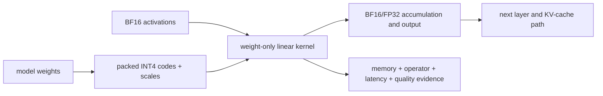

<!-- ai-infra-puzzles-header:start -->
<p align="center">
  
</p>

<h1 align="center">AI Infra Puzzles</h1>

<p align="center">
  <strong>Learn CUDA optimization and LLM inference through hands-on puzzles.</strong>
</p>
<!-- ai-infra-puzzles-header:end -->

# Lesson 01 — 精确格式：INT4，更小但更快？

> **谜题：**减少模型权重至 BF16 到 INT4 使它们变小。为什么
> 结果模型仍然会运行得更慢吗？

[← 第 01 章](../README.md) · [项目主页](../../../README_ZH.md) · [执行的笔记本](../../../chapters/01-mixed-precision-int4/01-precision-formats/lab.ipynb)

## 您的预测

在查看测量结果之前，预测当将一个 Qwen2.5-1.5B 模型从 BF16 转换为权重仅有的 INT4 时会发生什么：

1. 模型存储会减少多少？
2. Will Prefill become faster at 128, 512, and 1,024 input tokens?
3. Decode 的吞吐量会提高吗？
4. 你将如何证明 INT4kernel实际上运行了？

先写下你的答案。然后运行实验或检查已提交的结果。

| 下一步 | 文件 |
|---|---|
| 运行两个路径 | [`support/run.sh`](../../../chapters/01-mixed-precision-int4/01-precision-formats/support/run.sh) |
| 阅读基准测试 | [`support/benchmark.py`](../../../chapters/01-mixed-precision-int4/01-precision-formats/support/benchmark.py) |
| 阅读摘要器 | [`support/summarize.py`](../../../chapters/01-mixed-precision-int4/01-precision-formats/support/summarize.py) |
| 探索结果 | [`lab.ipynb`](../../../chapters/01-mixed-precision-int4/01-precision-formats/lab.ipynb) |
| 检查公共制品 | [`artifacts/rtx5090-result.json`](../../../chapters/01-mixed-precision-int4/01-precision-formats/artifacts/rtx5090-result.json) |

## 1. 精确格式不是速度排名

不要只问哪种格式使用更少的位数。问：

1. 哪些张量使用这种格式？
2. 这些张量是如何存储的？
3. 哪个kernel消耗它们？
4. 内存、延迟和输出行为会发生什么变化？

一次推理过程可能包含以下所有内容：

```text
packed INT4 weights
        ↓ weight-only kernel or dequantization
BF16 activations
        ↓ matrix multiplication
BF16 / FP32 accumulation and output

The KV cache may use a separate format again.
```

调用一个模型“INT4”并不意味着其中的每个张量或操作都是4位。

| 格式 | 典型存储量 | 这个谜题的实际意义 |
|---|---:|---|
| FP32 | 4 字节 | 高精度参考或敏感操作 |
| TF32 | 通常存储为 FP32 | Tensor Core 计算模式适用于合格的 FP32 矩阵乘法 |
| FP16 | 2 字节 | 紧凑浮点数，其指数范围小于 BF16。 |
| BF16 | 2 字节 | 常见LLM基线，具有类似FP32的指数范围 |
| FP8 | 1字节 | 低精度浮点数，依赖于硬件和后端支持 |
| INT8 | 关于 1 字节 + 比例 | 整数量化，带有元数据和kernel要求 |
| INT4 | 关于 0.5 字节 + 比例 | 更强的压缩，更严格的质量和kernel约束 |

TF32 主要改变了 Tensor Cores 内部可执行 FP32 矩阵乘法的方式。它通常不会将存储的 FP32 检查点从每个参数的四个字节压缩到两个字节。INT4 改变了量化操作如何映射、打包、缩放和读取权重的方式。它们解决的是不同的问题。

### 机制概览



### 逐步拆解

1. **从存储的对象开始。**识别哪些权重被压缩了 INT4 哪些层仍然存在 BF16.
2. **遵循运行时数据路径。**跟踪打包代码，分组缩放，BF16 激活值、累积dtype以及任何拆包或去量化工作。
3. **读取四个证据轴。**在单一冻结的工作负载下，独立评估内存、操作符身份、延迟和质量。
4. **对工作负载进行特定决策。** 只在测试路径的容量效益和服务门限能够证明增加kernel工作量的合理性时，才使用 INT4。

## 2. 保持记忆账本

理论重量大小仅是第一个条目：

```text
theoretical weight bytes = parameter count × storage bytes per parameter
```

对于一个7B参数的模型，粗略的理想化尺寸是：

| 权重格式 | 理论大小 |
|---|---:|
| FP32 | ~28GB |
| BF16 / FP16 | ~14GB |
| INT8 | ~7GB plus metadata |
| INT4 | ~3.5GB plus metadata |

真实的推理还包括未量化层、缩放因子、打包元数据、激活值、KV缓存、临时工作区、框架状态以及分配器行为。因此，这个谜题记录了唯一张量存储、CUDA 加载后分配、运行时峰值分配以及 CUDA 预留的单独值。

## 3. 实验设置

### 环境

| 项目 | 已测量配置 |
|---|---|
| GPU | NVIDIA GeForce RTX 5090, 32,607 MiB |
| 计算能力 | 12.0 |
| 驱动程序 | 595.71.05 |
| Python | 3.12.13 |
| PyTorch / CUDA 运行时 | 2.12.0 / 13.0 |
| Transformer | 5.12.0 |
| TorchAO | 0.17.0 |
| 模型 | Qwen2.5-1.5B-Instruct |
| 模型修订 | `989aa7980e4cf806f80c7fef2b1adb7bc71aa306` |

### 受控比较

| BF16 基准 | 候选 INT4 |
|---|---|
| BF16 权重和计算 | TorchAO 仅权重 INT4 |
| batch size 1 | batch size 1 |
| 相同检查点 | 相同检查点 |
| 相同的提示、热身和重复 | 相同条件 |
| 没有 INT4 模块 | 组大小 128, BF16 输入/计算 |

Prefill 使用sequence length 128、512 和 1,024，进行三次warmup运行和十次记录运行。生成使用 128 token提示，对 64 新token进行贪婪解码，进行两次warmup和五次记录运行。

## 4. INT4 真的运行了吗？

是的，但转换是部分的：

- 113层中的197线性层变为`WeightOnlyInt4Linear`层。
- `o_proj`, `gate_proj`, `up_proj`, `down_proj`, and `lm_head` were quantized;
- 84 `q_proj`, `k_proj`, 和`v_proj`层保持不变 BF16;
- 性能分析器记录了`aten::_weight_int4pack_mm`。

这个operator 证据很重要。一个小型模型文件或`int4`标签本身并不能证明预期的kernel被执行。

## 5. 测量

### 内存

| 指标 | BF16 | INT4 | INT4 改变 |
|---|---:|---:|---:|
| 独特的张量存储 | 2.875 GiB | 1.319 GiB | -54.12% |
| CUDA 分配在加载后 | 2.876 GiB | 1.336 GiB | -53.54% |
| 运行时峰值分配 | 3.228 GiB | 1.688 GiB | -47.71% |

INT4 明显减少了稳定的活跃内存。然而，这个实验首先加载了 BF16，然后在线打包了 INT4。这种转换导致了更高的临时峰值，并且缓存分配器保留了更多的内存。直接加载离线量化检查点可能会表现出不同的行为。

### Prefill

| 输入长度 | BF16 中位数 | INT4 中位数 | 结果 |
|---:|---:|---:|---|
| 128 | 9.944 ms | 13.619 ms | INT4 比 36.97 慢了 %。 |
| 512 | 11.318 ms | 43.963 ms | INT4 比 288.42 慢了 %。 |
| 1,024 | 19.783 ms | 85.478 ms | INT4 比 332.08 慢了 %。 |

调度一个真实的 INT4 核心并不能保证该核心在当前批次大小、矩阵形状、模型和软件后端上比当前核心更快。

### 生成和近似 Decode

| 指标 | BF16 | INT4 | 结果 |
|---|---:|---:|---|
| 64-token 生成中位数 | 643.123 ms | 673.642 ms | INT4 比 4.75 慢了 %。 |
| 约 Decode 通量 | 101.077每秒处理的token数 | 96.966每秒处理的token数 | INT4 比 4.07 低 %。 |

Decode这里是一个近似值：总生成中位数减去单独测量的Prefill中位数。它不是严格意义上的按tokenCUDA 事件分解。

### 小型质量探针

| 指标 | 结果 |
|---|---:|
| BF16 问题上的20 准确性已修复。 | 90% |
| INT4 问题上的20 准确性已修复。 | 85% |
| 生成答案的一致性 | 95% |
| 最终位置 top-1 对数似然度一致 | 95% |
| 平均对数余弦相似度 | 0.955426 |

20 固定的中文多项选择题是一个回归探针，而不是一个通用的模型质量基准。

## 6. 解开谜题

证据支持四个独立的陈述：

```text
Real INT4 kernel executed             yes
Stable active memory decreased        yes
Prefill became faster                 no
Decode became faster                  no
General quality is proven acceptable  not established
```

因此，有界的决策是：

> 保持 BF16 作为默认性能路径。将此 TorchAO INT4 配置视为
> 测试配置的内存容量选项。

为什么更小会更慢？权重压缩减少了字节，但性能取决于完整的执行路径：打包和缩放处理、去量化或融合kernel效率、矩阵形状、Tensor Core的利用、启动开销以及量化线性层之外的工作量。在这项实验中，这些成本超过了内存流量的益处。

这不是普遍的断言，INT4 在 RTX 5090 上运行缓慢。不同的 INT4 后端、离线打包的检查点、模型形状、batch size、sequence length或软件版本都可能改变结果。

## 7. 重现它

要在笔记本中运行实际的 BF16 和 INT4 GPU实验：

```bash
python3 -m venv .venv
source .venv/bin/activate
pip install -r requirements-notebook.txt
pip install -r requirements.txt
jupyter lab chapters/01-mixed-precision-int4/01-precision-formats/lab.ipynb
```

使用 **Run All** 重新开始 BF16 和 INT4 的测量，并从该运行中重建比较。保存在公共笔记本中的输出是在记录的 RTX 5090 上生成的。

### 全GPU基准测试

使用支持您的GPU的 PyTorch/CUDA 构建。已测试的包版本记录在[`requirements.txt`](../../../requirements.txt)中。

```bash
python3 -m venv .venv
source .venv/bin/activate
pip install -r requirements.txt
./chapters/01-mixed-precision-int4/01-precision-formats/support/run.sh
```

默认模型是`Qwen/Qwen2.5-1.5B-Instruct`。要使用本地检查点：

```bash
CH1_MODEL=/path/to/model CH1_LOCAL_FILES_ONLY=1 \
  ./chapters/01-mixed-precision-int4/01-precision-formats/support/run.sh
```

## 证据边界

- 紧凑的公共结果存储在[`artifacts/rtx5090-result.json`](../../../chapters/01-mixed-precision-int4/01-precision-formats/artifacts/rtx5090-result.json)中。
- 基准测试和性能分析器在记录的 RTX 5090 环境中执行。
- 公共跑者是实验代码的路径参数化版本。
- 结果仅适用于记录的模型、硬件、版本、batch size和形状。

## 参考资料

- [CUDA 编程指南：替代浮点格式](https://docs.nvidia.com/cuda/cuda-programming-guide/05-appendices/cpp-language-extensions.html#alternate-floating-point)
- [PyTorch 自动混合精度](https://docs.pytorch.org/docs/stable/amp.html)
- [TensorRT量化类型和方案](https://docs.nvidia.com/deeplearning/tensorrt/latest/inference-library/quantized-types-schemes.html)
