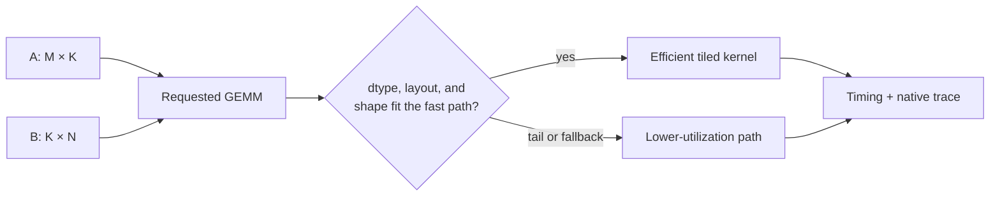

# Lesson 02 — Tensor Core 低精度 GEMM 的约束

> **谜题：** 可以使用低精度dtype，那么矩阵乘法是否会自动成为快速的 Tensor Core 操作？

[← 第 01 章](../README.md) · [项目主页](../../../README_ZH.md) · [执行的笔记本](../../../chapters/01-mixed-precision-int4/02-tensor-core-constraints/lab.ipynb) · [RTX 5090 结果](../../../chapters/01-mixed-precision-int4/02-tensor-core-constraints/artifacts/rtx5090-result.json)

## 为什么这个谜题重要

峰值TFLOPS表描述了芯片的能力，而不是每个矩阵乘法所选路径。在LLM中，相同的名义 BF16 操作可以具有不同的M、N、K维度、步长、转置和batch size。这些细节决定了矩阵乘法块是否能完成有用的工作，还是边缘处理、内存流量和启动开销占主导。

## 阅读结果前，先做出预测

1. 预测 BF16 是否会在所有形状上都击败FP32，然后预测哪个形状会损失更多的效率。
2. 在命名Tensor Core指令之前，说明什么时间点可以证明什么内容，并指出需要额外记录什么信息。
3. 选择必须保留的形状信息，以便其他读者能够重现结果。

## 1. 从具体的张量和状态开始

一个 GEMM 消耗`A[M,K]`和`B[K,N]`。Dtype、strides、transposition、leading dimensions以及三个逻辑大小一起进入调度；单独的单词*BF16*本身不是一个kernel描述。

### 三个推理锚点

| # | 本课需要牢记的判断 |
|---:|---|
| 1 | 一个dtype只是一种调度条件；布局、维度、对齐和后端策略也选择kernel。 |
| 2 | 算术强度将计算密集型 GEMMs与主要受内存流量或启动开销影响的形状区分开来。 |
| 3 | 时间确定形状的性能；操作符或kernel证据确定了运行的内容。 |

## 2. 推导机制

一个有用的初始模型是`FLOPs ≈ 2MKN`和`arithmetic intensity = FLOPs / bytes moved`。大对齐的tile可以摊销负载并为矩阵乘法硬件提供输入；不规则的维度会导致边缘tile、填充或不同的实现。因此，Tensor Core的资格条件是硬件、dtype、形状、布局和库支持的结合。

对于`C[M,N] = A[M,K] @ B[K,N]`，主要的操作计数是`2MKN`。这个数字只是性能故事中的分子。一个初步的屋顶线估计将其除以移动的字节数；一个调度估计还会询问M、N、K、布局、对齐和dtype是否符合库kernel的分块规则。当`N=2055`时，数学工作相对于`N=2048`仅增加约0.34%，但物理实现可能需要尾块或不同的kernel。因此，一个大的时间不连续性是关于形状敏感性的证据，而不是特定指令的证明。

这一区别在注意力层和MLP层中很重要，因为它们的矩阵是不可互换的。Prefill会产生大量的M维度，而Decode通常呈现类似GEMV的操作或非常小的M维度工作。一个在某一阶段表现优秀的kernel可能会在另一阶段使Tensor Cores不满。因此，有用的推理单位是形状家族加上操作跟踪，而不是模型广告的精度。

### 机制概览



### 逐步拆解

1. **编写确切的 GEMM。**记录 M, N, K, dtype, layout 和 strides；模型级别的精度标签是不够的。
2. **估算有用功。**使用2MKN查看不规则形状对数学工作量的影响有多大。
3. **检查调度约束。**请确认对齐、tile边界和Decode或者Prefill形状家族适合一个高效的kernel。
4. **分离观测。**时间戳确定应用行为；需要一个本地跟踪来命名指令路径。

## 3. 把理论转化为实验**实验：**时间 FP32 和 BF16 在同一个GPU上进行对齐且故意不整齐的矩阵乘法。

| 实验角色 | 固定定义 |
|---|---|
| 基准 | FP32 GEMM for the exact aligned and awkward shapes |
| 候选方案 | BF16 相同张量的 GEMM 和计时协议 |
| 保持不变 | GPU, M 和 K, 随机分布, 热身, 重复, CUDA 事件计时 |
| 测量 | 每个 dtype/shape 对应的中位数和 p90 延迟 |
| 证据标签 | `pytorch-gpu` |

实验室更改了dtype和一个对齐条件，同时保持 GPU 和计时方法不变；输出是形状证据，而不是原生kernel断言。

### 代码导读

该笔记本为每个形状分配一次，warmup操作四次，并记录十二个 CUDA 事件样本。同步发生在计时助手内部，因此不会将主机启动延迟误认为已完成的GPU工作。对齐和不规则情况仅在N上有所不同，这使得比较范围足够窄，可以将计时变化归因于形状和调度行为。

代码故意不解析本地kernel名称。PyTorch 级别的计时告诉我们应用程序观察到的情况，而Nsight Systems或Nsight Compute将是下一个证据层，用于`mma`/Tensor Core的使用情况、tile占用率、内存带宽以及尾部效应。

## 4. 解读仓库内的 RTX 5090 实测结果

**录制环境：**NVIDIA GeForce RTX 5090 计算能力12.0; PyTorch 2.12.0; CUDA 运行时13.0.

| 实测字段 | 已提交值 |
|---|---:|
| 对齐 BF16 中位数 | 0.087632 ms |
| 对齐的FP32中位数 | 0.262096 ms |
| 尴尬的 BF16 中位数 | 0.176048 ms |
| 尴尬的FP32中位数 | 0.319312 ms |
| 每例记录的样本数 | 12 |

### 这些数字说明了什么

在已检查的 RTX 5090 运行中，对齐的 BF16 比 FP32 的 0.262096 ms 快了 0.087632 ms，即 2.99x 的比例。仅将 N 从 2048 更改为 2055，将 BF16 的延迟提高到了 0.176048 ms—大约是 BF16 时间的 2.01x。尽管算术计数几乎没有变化。FP32 也变慢了，但比例较小，为 1.22x。

正确的结论不是 `2055` 是普遍糟糕的，也不是遗漏了一个名为 Tensor Core 的kernel。而是 dtype 加速是条件性的，形状不同会导致很大一部分预期收益被抹去。原生分发身份仍然是一个明确的后续测量。

打开[`artifacts/rtx5090-result.json`](../../../chapters/01-mixed-precision-int4/02-tensor-core-constraints/artifacts/rtx5090-result.json)，当需要每个重复样本或教程表中未选中的字段时。

## 5. 解答谜题并做出决策

> 低精度提供机会，而非保证。在决定是否达到Tensor Core路径时，保留精确形状和性能分析证据。

### 验收与回滚门槛

保留确切的`M,N,K`、步长、dtype、热身和重复计时。在命名原生Tensor Corekernel之前，使用操作符跟踪来展示调度和Nsight Compute/System指标。

### 这个结论可能如何失效

误导性的基准测试会比较不同的形状，包括首次调用初始化，报告一个样本，或者从快速的 BF16 结果中推断Tensor Core的使用。填充也不是自动的解决方案：它可能会提高tile利用率，同时增加FLOPs和临时存储。在测量完整的填充操作及其下游布局成本后，才接受填充。

## 复现

从仓库根目录：

```bash
python3 -m venv .venv
source .venv/bin/activate
pip install -r requirements-notebook.txt
jupyter lab chapters/01-mixed-precision-int4/02-tensor-core-constraints/lab.ipynb
```

使用**运行所有**并与已提交的文件进行比较。

## 扩展实验

使用Nsight Compute对两种形状进行分析，并记录选定的kernel、达到的占用率、张量管道利用率、DRAM带宽以及浪费的边缘工作。然后重复使用Decode-like M值，如1、8和32。练习成功时，您应能够通过跟踪和时间分布而非dtype标签来解释逆向操作。

## 证据边界

**证据标签:** [`pytorch-gpu`](../../../chapters/01-mixed-precision-int4/README.md#evidence-labels).

## 参考资料

- [CUDA 编程指南](https://docs.nvidia.com/cuda/cuda-programming-guide/index.html)
- [PyTorch 数值精度注释](https://docs.pytorch.org/docs/stable/notes/numerical_accuracy.html)
- [Nsight Compute 诊断指南](https://docs.nvidia.com/nsight-compute/ProfilingGuide/index.html)
