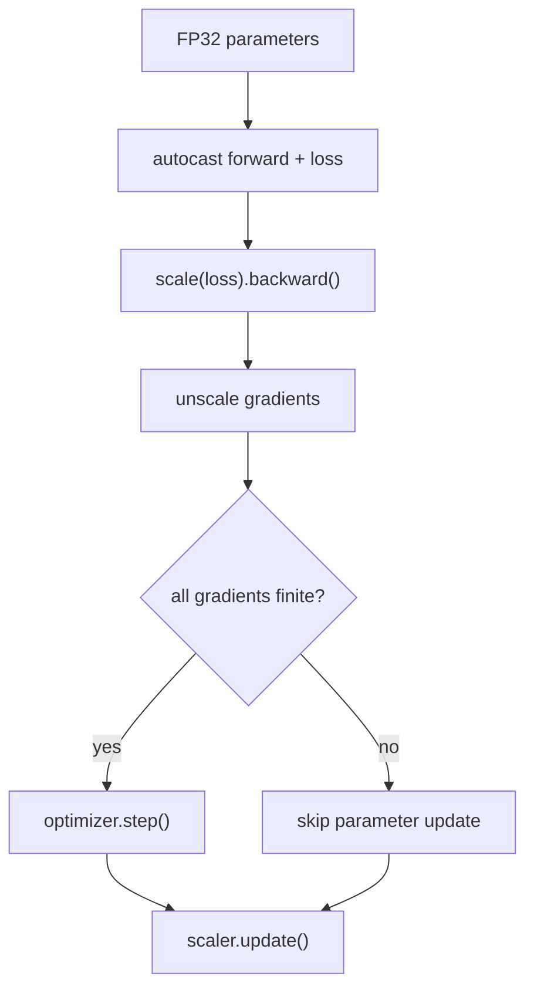

# Lesson 03 — PyTorch AMP: autocast and GradScaler

> **谜题：**混合精度训练是否可以简化为将前向传播包裹在autocast中？

[← 第 01 章](../README.md) · [项目主页](../../../README_ZH.md) · [执行的笔记本](../../../chapters/01-mixed-precision-int4/03-pytorch-amp/lab.ipynb) · [RTX 5090 结果](../../../chapters/01-mixed-precision-int4/03-pytorch-amp/artifacts/rtx5090-result.json)

## 为什么这个谜题重要

混合精度训练是一个反馈系统。Autocast在前向传播过程中选择操作dtype，梯度缩放改变反向传播中看到的数值范围，优化器必须在检查并缩放梯度后才能进行步骤。因此，证明一个 BF16 激活函数远不如证明一个完整的、有限的参数更新。

## 阅读结果前，先做出预测

1. 预测模型参数和 BF16 自动混合精度（autocast）内部前向输出的dtype。
2. 预测当每个梯度保持有限时，GradScaler的缩放因子是否应该改变。
3. 证明是优化器更新而非仅前向传播的观察。

## 1. 从具体的张量和状态开始

AMP循环包含FP32参数和优化器状态、自动混合精度选择的前向激活、梯度、标量损失缩放以及优化器更新。这些对象并不都共享一个dtype或生命周期。

### 三个推理锚点

| # | 本课需要牢记的判断 |
|---:|---|
| 1 | Autocast 选择每个符合条件的操作使用较低精度；它不会永久转换每个张量。 |
| 2 | GradScaler 在反向传播前改变损失的大小，在优化器步骤前对梯度进行反缩放，并调整其缩放比例。 |
| 3 | 优化器状态和通常主参数保持高精度。 |

## 2. 推导机制

如果`g`是真实的梯度，而`S`是损失缩放因子，那么反向传播首先生成`S·g`；在缩放前恢复`g`，然后进行裁剪或优化器步骤。`GradScaler`跳过非有限梯度的步骤，并适应`S`。Autocast独立选择合格的前向操作dtype。

让未缩放的损失为`L`，当前缩放为`S`。反向传播对`S·L`进行求导，产生缩放后的梯度`S·g`。在优化器步骤之前，GradScaler将梯度除以S，并检查是否存在Inf/NaN。如果检查通过，优化器将消耗g；如果检查失败，步骤将被跳过，并且缩放策略将做出反应。这种排序具有语义意义：在未缩放之前对梯度进行裁剪或检查会改变其意义。

Autocast 是一种调度策略，而不是对整个模型进行递归调用 `.to(bfloat16)`。符合条件的计算密集型操作可以在参数和优化器状态仍为 FP32 时发出 BF16。BF16 通常不需要像 FP16 那样进行范围缩放，但使用完整的缩放器 API 仍然很有用，因为课程的重点是控制循环及其证据，而不是单一推荐的dtype配方。

### 机制概览



### 逐步拆解

1. **启用自动转换为向前传播。**符合条件的operator可以在保持主参数为FP32的情况下使用较低的计算dtype。
2. **反向传播前先缩放。**反向传播看到损失的S倍，将微小的梯度移动到可表示的范围内。
3. **不缩放并检查。**梯度裁剪和有限性检查必须使用未缩放的梯度。
4.**条件执行。**只有当梯度为有限值时，优化器才会更新；然后更新缩放策略。

## 3. 把理论转化为实验

**实验：**训练一个小 CUDAMLP withBF16 在记录损失、参数dtype、输出dtype、梯度有限性以及缩放历史时使用 autocast 和 GradScaler。

| 实验角色 | 固定定义 |
|---|---|
| 基准 | FP32 参数和优化器状态在自动混合精度之外 |
| 候选方案 | BF16 自动混合精度前向传播嵌套在完整的缩放/反向传播/步骤/更新循环中 |
| 保持不变 | 相同的 MLP，批次，目标，优化器，种子，以及六个训练步骤 |
| 测量 | 损失历史，输出dtype，参数dtype，梯度有限性，缩放值 |
| 证据标签 | `pytorch-gpu` |

该笔记本打印参数和输出dtype，运行完整的更新循环，并记录梯度的有限性，而不是在一次自动重铸前向传播后停止。

### 代码导读

环境单元验证 CUDA 并修复随机种子。实验构建一个小的 MLP，将其参数保持在 FP32，仅在前向和损失计算时进入自动混合精度上下文，然后执行缩放序列。每一步记录五项状态，以便笔记本可以区分调度、数值健康和优化进度。

一个不断减少的玩具损失不是一个模型质量的声明；它是一个控制流检查。更强的不变量是每个记录的梯度都是有限的，输出在自动混合精度下是 BF16，参数保持FP32，循环在没有错误输出的情况下到达优化器更新。

## 4. 解读仓库内的 RTX 5090 实测结果

**录制环境：**NVIDIA GeForce RTX 5090 计算能力12.0; PyTorch 2.12.0; CUDA 运行时13.0.

| 实测字段 | 已提交值 |
|---|---:|
| 初始损失 | 1.037629 |
| 最终损失 | 0.596515 |
| 自适应输出dtype | torch.bfloat16 |
| 所有记录的梯度有限 | 是的 |
| 参数 dtype | torch.float32 |
| 最终缩放值 | 65536.000000 |

### 这些数字说明了什么

保存的六个步骤将损失从1.0376294降低到了0.5965154。每个输出都是`torch.bfloat16`，每个梯度检查返回为真，并且参数保持为`torch.float32`。缩放保持在65536，因为在这次短暂运行中没有非有限事件迫使策略退缩。

这些字段共同建立了一个在 PyTorch/CUDA 堆栈上的功能混合精度循环。它们没有建立更快的训练、在真实数据集上的收敛性一致，或最佳的缩放增长策略。这些需要更长的运行时间，并且需要重复计时和冻结质量目标。

打开[`artifacts/rtx5090-result.json`](../../../chapters/01-mixed-precision-int4/03-pytorch-amp/artifacts/rtx5090-result.json)，当需要每个重复样本或教程表中未选中的字段时。

## 5. 解答谜题并做出决策

> AMP 是一个在正向、反向、无缩放、步进和更新阶段的控制循环，而不是全局 dtype 切换。

### 验收与回滚门槛

验证订单 `zero_grad -> autocast forward -> scale(loss).backward -> unscale/step -> update`，记录有限梯度并保存历史缩放，保持损失目标与 FP32 基线相同。

### 这个结论可能如何失效

常见的失败包括直接在缩放梯度上调用 `optimizer.step()`，剪裁在 `unscale_` 之前，将主参数移动到 FP16，或者仅从前向dtype判断成功。有限的损失可以与零的小梯度共存，而跳过的优化器步骤除非检查缩放和参数更新，否则是不可见的。

## 复现

从仓库根目录：

```bash
python3 -m venv .venv
source .venv/bin/activate
pip install -r requirements-notebook.txt
jupyter lab chapters/01-mixed-precision-int4/03-pytorch-amp/lab.ipynb
```

使用**运行所有**并与已提交的文件进行比较。

## 扩展实验

添加一个故意溢出的步骤，并验证 GradScaler 跳过更新并改变其缩放。然后在较长的 MLP 上比较相同的验证损失轨迹，同时测量 FP32、FP16+scaler 和 BF16 自动混合精度。保留确切的优化器、种子和批次顺序，以便数值和吞吐量决策不会受到混淆。

## 证据边界

**证据标签:** [`pytorch-gpu`](../../../chapters/01-mixed-precision-int4/README.md#evidence-labels).

## 参考资料

- [PyTorchAMP文档](https://docs.pytorch.org/docs/stable/amp.html)
- [PyTorchAMP示例](https://docs.pytorch.org/docs/stable/notes/amp_examples.html)
- [PyTorch 数值精度注释](https://docs.pytorch.org/docs/stable/notes/numerical_accuracy.html)
