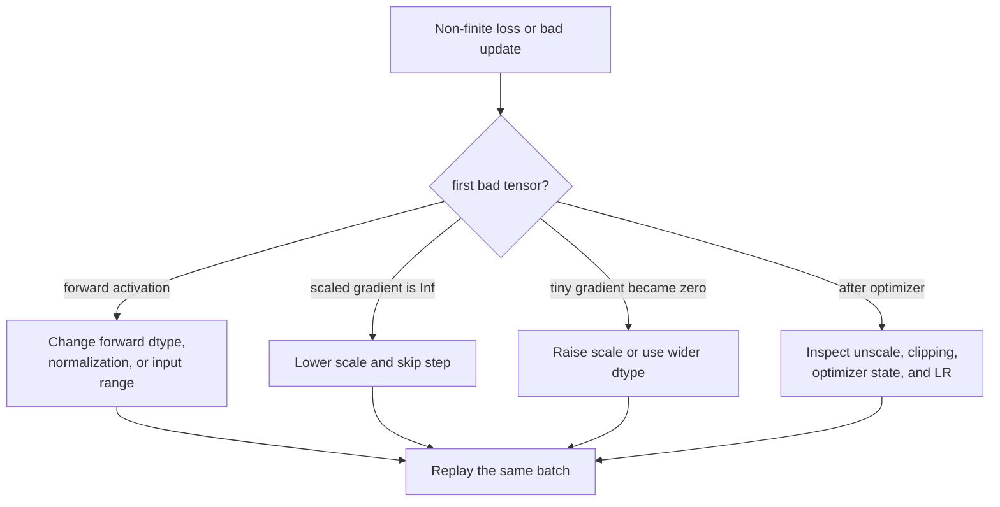

<!-- ai-infra-puzzles-header:start -->
<p align="center">
  
</p>

<h1 align="center">AI Infra Puzzles</h1>

<p align="center">
  <strong>Learn CUDA optimization and LLM inference through hands-on puzzles.</strong>
</p>
<!-- ai-infra-puzzles-header:end -->

# Lesson 05 — 诊断 FP16 溢出和梯度缩放失败

> **谜题：**当损失变为 NaN 时，我们如何区分前向溢出、后向溢出和梯度下溢？

[← 第 01 章](../README.md) · [项目主页](../../../README_ZH.md) · [执行的笔记本](../../../chapters/01-mixed-precision-int4/05-fp16-overflow/lab.ipynb) · [RTX 5090 结果](../../../chapters/01-mixed-precision-int4/05-fp16-overflow/artifacts/rtx5090-result.json)

## 为什么这个谜题重要

一个最终的 NaN 是链中的最后一个症状，而不是诊断。FP16 在前向传播时可能会溢出，在反向传播时可能会在缩放损失后溢出，或者可能会无声地将微小的梯度四舍五入为零。每次失败都需要不同的响应，因此必须在更改缩放器之前找到第一个坏张量。

## 阅读结果前，先做出预测

1. 预测哪些梯度幅度和损失缩放的组合会变为零、有限或无限。FP16.
2. 解释为什么损失缩放可以拯救下溢但无法修复已经为正无穷的前向激活。
3. 选择探针位置，以区分正向、缩放后向、未缩放梯度和参数腐败。

## 1. 从具体的张量和状态开始

诊断四个检查点：前向输出、缩放损失/梯度、未缩放梯度以及后处理参数。最后一个 NaN 已经丢弃了第一次失败的位置。

### 三个推理锚点

| # | 本课需要牢记的判断 |
|---:|---|
| 1 | 溢出会在后续的算术运算中产生 Inf 之前先产生 NaN。 |
| 2 | 小梯度会无声地被四舍五入为零。 |
| 3 | 损失缩放将梯度移动到可表示的区间，但无法修复已经溢出的前向传播。 |

## 2. 推导机制

FP16 正常值结束于附近`6.55e4`非常小的值进入稀疏子正规区域并可能变为零。缩放损失将梯度幅度在存储期间向上移动，但在裁剪和参数更新之前必须进行反缩放。

在损失缩放 S 下，精确梯度 g 在反向传播时表示为 `Sg`。如果 g 小于 FP16 的次规范范围，选择一个适中的 S 可以将其移动到可表示的网格上；后续的反缩放可以恢复其在更宽类型中的数学幅度。如果 `Sg > 65504`，缩放后的梯度变为 Inf。如果一个前向值已经超过了 65504，后续的损失缩放无法重建被丢弃的信息。

这为S创建了一个可行的区间：足够大以确保重要的小梯度得以保留，但又足够小以使最大的缩放梯度保持有限。动态缩放通过观察到的溢出来搜索这个区间。它不能保证每个微小的梯度都被保留，也不能保证前向传播是稳定的。

### 机制概览



### 逐步拆解

1. **定位第一个坏阶段。**按顺序检查前向激活、缩放后的损失、缩放后的梯度、未缩放的梯度和参数。
2. **分类症状。**Inf 表示溢出；尽管每个值都是有限的，但过多的零可能表示下溢。
3. **应用匹配的干预措施。**降低缩放梯度溢出的缩放比例，提高缩放比例以处理下溢，或者改变激活函数溢出时的前向dtype。
4.**重复相同的批次。**诊断只有在干预措施消除了原始第一次失败而没有产生新的失败时才有用。

## 3. 把理论转化为实验**实验：**扫过合成梯度幅度和损失缩放值 FP16 在 CUDA, 计算有限、无限和零梯度值。

| 实验角色 | 固定定义 |
|---|---|
| 基准 | FP16 将四个梯度幅度进行缩放处理。1 |
| 候选方案 | 相同的量级乘以比例因子256和65536 |
| 保持不变 | 张量大小，dtype，GPU，每个量级组内的值 |
| 测量 | 零分数，有限分数，无穷分数，以及一个单独的向前溢出探测器 |
| 证据标签 | `pytorch-gpu` |

CUDA 扫描跨越多个尺度上的微小和大数量级，并记录零和无穷小数分数，使得失败阶段可观察。

### 代码导读

该笔记本扫描笛卡尔积而不是等待随机训练失败。对于每一对大小/尺度，它将缩放值转换为 FP16，并统计零、有限和无限的条目。一个单独的`1e5`前向探测器确认在反向开始之前可能会发生一些损坏。

因为一行中的所有元素共享一个量级，分数可以干净地跳跃到零、有限和无穷。一个真实的模型会产生分布，但合成网格使得表示边界易于观察和调试。

## 4. 解读仓库内的 RTX 5090 实测结果

**录制环境：**NVIDIA GeForce RTX 5090 计算能力12.0; PyTorch 2.12.0; CUDA 运行时13.0.

| 实测字段 | 已提交值 |
|---|---:|
| 1e-8, 将 1 缩放为零分数。 | 100.0000% |
| 1e-8, 将 256 缩放为零分数。 | 0.0000% |
| 1, 按比例缩放 65536: Inf 分数 | 100.0000% |
| 1000, 按比例缩放 256: Inf 分数 | 100.0000% |
| 向前的 1e5 超出范围 | 是的 |

### 这些数字说明了什么

在`1e-8`级数下，缩放因子1将所有值四舍五入为零，而缩放因子256和65536使所有条目变为有限且非零。在1级数下，缩放因子65536使所有值溢出。在1000级数下，缩放因子256已经过大。独立的前向测试证实了 FP16 和`1e5`是非有限的。

因此，同样的工具——更大的规模——会固定一行并破坏另一行。这就是GradScaler适应并跳过不安全优化步骤的主要原因。这也是为什么调整缩放器是解决前向溢出问题的错误方法。

打开[`artifacts/rtx5090-result.json`](../../../chapters/01-mixed-precision-int4/05-fp16-overflow/artifacts/rtx5090-result.json)，当需要每个重复样本或教程表中未选中的字段时。

## 5. 解答谜题并做出决策

> 在改变缩放策略之前，在前向输出、缩放梯度、未缩放梯度和参数处放置有限性检查和零率探针。

### 验收与回滚门槛

记录有限/无穷/零分数以及当前缩放值。如果前向传播已经非有限，更改操作或dtype；如果仅缩放梯度溢出，则调整缩放策略。

### 这个结论可能如何失效

只看`torch.isfinite(loss)`会错过下溢，因为零是有限的。只在未缩放后查看可能会掩盖溢出的开始位置。记录每个张量太昂贵，所以生产诊断通常在损失、选择的激活、缩放后的梯度、未缩放的梯度和参数上放置有针对性的钩子，然后缩小搜索范围。

## 重现

从仓库根目录：

```bash
python3 -m venv .venv
source .venv/bin/activate
pip install -r requirements-notebook.txt
jupyter lab chapters/01-mixed-precision-int4/05-fp16-overflow/lab.ipynb
```

使用**运行所有**并与已提交的文件进行比较。

## 扩展实验

在 FP16 网络中部署一个小型网络，使用钩子在四个阶段报告最小值/最大值、零分数和有限性。分别注入一个激活尖峰和一个微小梯度层。验证降低缩放有助于修复第一个后向溢出情况，提高缩放有助于修复下溢情况，但两者都无法修复注入的前向Inf。

## 证据边界

**证据标签:** [`pytorch-gpu`](../../../chapters/01-mixed-precision-int4/README.md#evidence-labels).

## 参考资料

- [PyTorchAMP文档](https://docs.pytorch.org/docs/stable/amp.html)
- [PyTorchAMP示例](https://docs.pytorch.org/docs/stable/notes/amp_examples.html)
- [PyTorch 数值精度注释](https://docs.pytorch.org/docs/stable/notes/numerical_accuracy.html)
