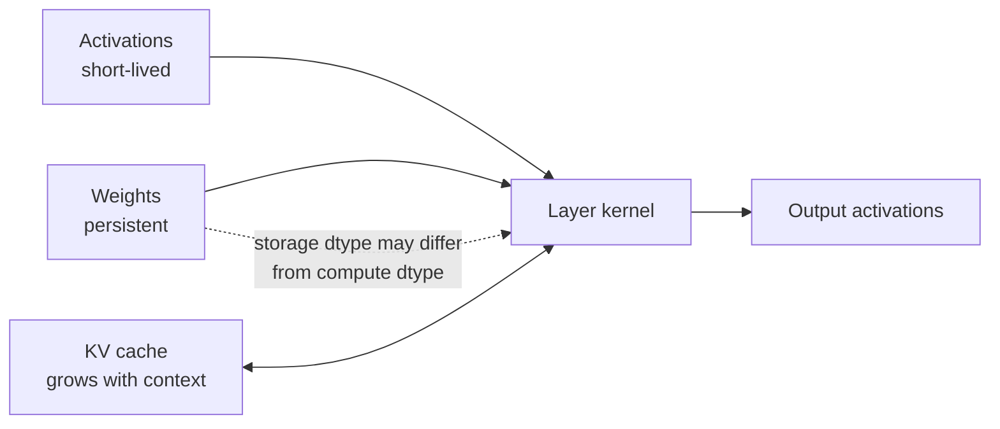

<!-- ai-infra-puzzles-header:start -->
<p align="center">
  
</p>

<h1 align="center">AI Infra Puzzles</h1>

<p align="center">
  <strong>Learn CUDA optimization and LLM inference through hands-on puzzles.</strong>
</p>
<!-- ai-infra-puzzles-header:end -->

# Lesson 07 — 推断精度层：权重、激活值和 KV Cache

> **谜题：**当模型被调用时 INT4 哪些张量实际上是四比特的？

[← 第 01 章](../README.md) · [项目主页](../../../README_ZH.md) · [执行的笔记本](../../../chapters/01-mixed-precision-int4/07-inference-precision-layers/lab.ipynb) · [RTX 5090 结果](../../../chapters/01-mixed-precision-int4/07-inference-precision-layers/artifacts/rtx5090-result.json)

## 为什么这个谜题重要

调用模型 INT4 通常只描述其状态的一部分。权重层可能存储四比特代码，而激活值和累积器使用 BF16。KV缓存随着上下文增长，临时工作区仅在运行时出现。当这些对象被压缩成一个广告精度时，容量规划会失败。

## 阅读结果前，先做出预测

1. 在查看预测值之前，请先编写 KV 缓存字节公式。
2. 预测哪些内存账户会随着sequence length增长，哪些在加载的模型中保持固定。
3. 解释为什么检查点大小本身不能预测峰值 CUDA 分配。

## 1. 从具体的张量和状态开始

推理精度属于独立账本：持久权重、每步激活/工作区、累积器和请求级持久KV缓存。仅权重的 INT4 通常会使得激活和累积格式更宽。

### 三个推理锚点

| # | 本课需要牢记的判断 |
|---:|---|
| 1 | 权重仅量化将激活和累积置于浮点计算dtype中。 |
| 2 | KV 缓存随着层次、sequence length、键/值头、头维度、批次和缓存dtype而增长。 |
| 3 | 峰值内存还包括临时工作区和分配器预留。 |

## 2. 推导机制

对于标准缓存，`bytes = 2 × layers × batch × sequence × kv_heads × head_dim × bytes_per_element`；前两位是键和值。分组查询注意力改变`kv_heads`，而不是查询头的数量。

对于一个批次为 B、层数为 L、sequence length为 S、键值头数为 H、头维度为 D 的解码器缓存，以及两个张量 K 和 V，每个元素占用 b 字节，其主要存储是 `2·B·L·S·H·D·b`。权重存储大致为 `parameters × effective bits/8` 加上缩放因子和未量化张量。激活值取决于执行阶段和活跃性，而工作区和分配器的保留取决于后端行为。

这些术语有不同的生命周期。权重在加载后持久存在，KV缓存按活动请求持久存在，许多激活是临时的。这使得并发是对缓存项的乘法，而不是对模型权重的乘法。账本必须将字节、生命周期和所有权保持在一起。

### 机制概览



### 逐步拆解

1. **分离持久状态与临时状态。**权重在模型生命周期内持久保存；激活值和工作区在运算符或层内存在。
2.**考虑上下文状态。**KV 缓存会随着层数、批次、sequence length、头数和头维度的增长而增长。
3.**命名存储和计算dtype。**A tensor stored inINT4 可以去量化为 FP16/BF16 在kernel之前或之内。
4. **优化主导项。**在工作负载特定的内存账本识别出瓶颈后，再选择权重、激活或KV量化。

## 3. 把理论转化为实验

**实验：**建立一个记忆账本并分配代表者 BF16 并且 INT8KV张量在 CUDA 验证元素计数算术。

| 实验角色 | 固定定义 |
|---|---|
| 基准 | BF16KV-cache 投影和真实 BF16K/V 分配 |
| 候选方案 | INT8 同一模型几何的缓存投影 |
| 保持不变 | 批量处理 1 层，32 层，8 KV 头，头维度 128，相同上下文长度 |
| 测量 | 根据上下文和分配的代表张量对的字节数量预测的缓存大小（以GiB为单位） |
| 证据标签 | `pytorch-gpu` |

实验室通过实时分配验证 KV 元素计数公式，并在不假装分配完整模型的情况下，预测几个上下文长度。

### 代码导读

该笔记本首先计算三个sequence length的公式，然后在 CUDA 上分配代表性的K和V张量，并检查它们的确切元素计数字节。这将算术运算与实时张量对象结合在一起，而无需假装加载完整的模型。

比例、分页碎片、前缀缓存块和临时关注工作区故意不在简单投影中。它们属于在测试命名服务后端时的下一个账本修订。

## 4. 解读仓库内的 RTX 5090 实测结果

**录制环境：**NVIDIA GeForce RTX 5090 计算能力12.0; PyTorch 2.12.0; CUDA 运行时13.0.

| 实测字段 | 已提交值 |
|---|---:|
| BF16 KV 在 2,048 token中 | 0.250 GiB |
| BF16 KV 在 8,192 token中 | 1.000 GiB |
| BF16 KV 在 32,768 token中 | 4.000 GiB |
| INT8 KV 在 32,768 token中 | 2.000 GiB |
| 实时分配探针 | 16,777,216 字节 |

### 这些数字说明了什么

对于固定的32层几何结构，投影的 BF16 KV存储量在2,048token中为0.25 GiB，在8,192中为1.0 GiB，在32,768中为4.0 GiB。INT8 算术投影正好是每个值的一半。实时探针分配了两个形状为`[2, 4096, 8, 128]`的 BF16 张量，总共为16,777,216字节。

从8K到32K的线性四倍增长是重要的系统结果。权重量化不会改变这一点。缓存量化可能会增加可行的上下文或并发，但只有在衡量了规模开销、注意力兼容性、错误和延迟之后。

打开[`artifacts/rtx5090-result.json`](../../../chapters/01-mixed-precision-int4/07-inference-precision-layers/artifacts/rtx5090-result.json)，当需要每个重复样本或教程表中未选中的字段时。

## 5. 解答谜题并做出决策

> 给精度对象命名时，请同时命名对象及其生命周期，例如：weights、activations、accumulators 或 cache。

### 验收与回滚门槛

分别测量分配/预留/峰值内存，并与对象级算术运算进行协调。检查点字节数不是运行时内存结果。

### 这个结论可能如何失效

常见的错误是将权重内存乘以请求计数，或者忘记将缓存乘以层，并且同时乘以 K 和 V。另一个错误是将模型加载前报告的空闲内存视为可部署容量。在设置并发之前，必须将分配器保留、CUDA 图表、kernel和安全余量添加进去。

## 复现

从仓库根目录：

```bash
python3 -m venv .venv
source .venv/bin/activate
pip install -r requirements-notebook.txt
jupyter lab chapters/01-mixed-precision-int4/07-inference-precision-layers/lab.ipynb
```

使用**运行所有**并与已提交的文件进行比较。

## 扩展实验

扩展账本，使用分组查询注意力变体、张量并行分割、缓存块大小、缩放元数据和分配器碎片化。然后运行 vLLM 或TensorRT-LLM服务器，并在2K、8K和32K上下文中比较预测的与观察到的缓存容量。

## 证据边界

**证据标签:** [`pytorch-gpu`](../../../chapters/01-mixed-precision-int4/README.md#evidence-labels).

## 参考资料

- [vLLM 量化文档](https://docs.vllm.ai/en/latest/features/quantization/)
- [vLLM 缓存配置](https://docs.vllm.ai/en/stable/api/vllm/config/cache/)
- [vLLM 量化 KV 缓存](https://docs.vllm.ai/en/latest/features/quantization/quantized_kvcache/)
