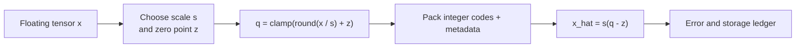

<!-- ai-infra-puzzles-header:start -->
<p align="center">
  
</p>

<h1 align="center">AI Infra Puzzles</h1>

<p align="center">
  <strong>Learn CUDA optimization and LLM inference through hands-on puzzles.</strong>
</p>
<!-- ai-infra-puzzles-header:end -->

# Lesson 08 — 量化数学：缩放、零点、组大小和误差

> **谜题：** 为什么改变组大小会同时改变模型大小和重构误差？

[← 第 01 章](../README.md) · [项目主页](../../../README_ZH.md) · [执行的笔记本](../../../chapters/01-mixed-precision-int4/08-quantization-math/lab.ipynb) · [RTX 5090 结果](../../../chapters/01-mixed-precision-int4/08-quantization-math/artifacts/rtx5090-result.json)

## 为什么这个谜题重要

标签 INT4 隐藏了决定四比特含义的参数。缩放选择代码覆盖的实数区间，零点选择实数零点的位置，分组大小选择多少个值共享一个范围估计。这些选择都会改变重建误差和元数据，甚至在部署kernel进入之前。

## 阅读结果前，先做出预测

1. 推导对称的 INT4 量化和反量化方程，代码范围为 [-8, 7]。
2. 预测 RMSE、缩放计数以及每权重的有效位数如何随着组大小缩小而变化。
3. 解释为什么饱和分数本身不能对量化器进行排名。

## 1. 从具体的张量和状态开始

均匀量化存储整数代码加上缩放元数据，对于非对称方案，还存储零点。粒度可以是按张量、行/通道或组/块。

### 三个推理锚点

| # | 本课需要牢记的判断 |
|---:|---|
| 1 | 缩放将浮点区间映射到有限的代码范围。 |
| 2 | 对称量化将零点固定在零；非对称量化可以更有效地为偏移数据分配代码。 |
| 3 | 较小的group适应本地范围，但需要更多的scale 元数据。 |

## 2. 推导机制

一种常见的映射是`q = clamp(round(x/s)+z, qmin, qmax)`和`x_hat = s(q-z)`。对称的 INT4 通常使用`z=0`和`[-8,7]`附近的有符号范围。较小的group估计局部范围并减少异常值共享。

对于对称符号b位量化，使用`qmax = 2^(b-1)-1`、`s = max(|x|)/qmax`、`q = clamp(round(x/s), -qmax-1, qmax)`和`x̂ = s·q`。对于非对称量化，零点z会移动代码网格：`q = clamp(round(x/s)+z, qmin, qmax)`和`x̂=s(q-z)`。分组在局部切片上重复此计算，而不是整个张量。

如果每个组存储一个 FP16scale，其元数据成本是`16/group_size`每权重位数。名义值。INT4 因此变得5.0有效位数在组大小时16, 4.25在64, 和4.125在128在填充或零点元数据之前。较小的组可以隔离异常值，但可能与最快的后端kernel不兼容。

### 机制概览



### 逐步拆解

1. **选择一个量化范围。**从校准范围中推导缩放因子，并且对于非对称量化，推导零点。
2. **映射到整数代码。**将每个值四舍五入并将其限制在可用的码本中。
3. **重建以供比较。**使用相同的元数据进行去量化解码，并与原始张量测量误差。
4.**一次改变一个粒度。**保留元数据字节的同时调整扫描组大小，以保持准确性和有效存储量的可比性。

## 3. 把理论转化为实验

**实验：**将包含异常值的矩阵量化 INT4 组大小16, 64, 和128并比较错误加上元数据开销。

| 实验角色 | 固定定义 |
|---|---|
| 基准 | 一个包含固定异常值的1024×1024权重矩阵 |
| 候选方案 | 对称 INT4，组大小为 16, 64, 和 128。 |
| 保持不变 | 相同的代码，缩放dtype假设，分组轴，种子，以及错误参考。 |
| 测量 | RMSE/cosine误差，饱和分数，缩放计数，每权重的有效位数 |
| 证据标签 | `numerical-model` |

该笔记本保持权重矩阵不变，仅改变组大小，并记录每个权重的误差和有效位数。

### 代码导读

该笔记本保持矩阵和量化公式不变，仅改变组大小。每个候选值在测量误差之前被反量化回浮点数。元数据是从尺度数量计算得出的，使得存储比较诚实，而不是重复名义上的四比特标签。

这是一个数值模型。它不打包字节，不实例化生产量化线性层，也不测量 INT4kernel。这种分离让实验室在回答数学问题时不会夸大后端性能。

## 4. 解读仓库内的 RTX 5090 实测结果

**录制环境：**NVIDIA GeForce RTX 5090 计算能力12.0; PyTorch 2.12.0; CUDA 运行时13.0.

| 实测字段 | 已提交值 |
|---|---:|
| Group 16 RMSE | 0.200316 |
| 组 16 有效位 | 5.000比特/权重 |
| Group 64 RMSE | 0.384361 |
| 组 64 有效位 | 4.250比特/权重 |
| Group 128 RMSE | 0.508112 |
| 组 128 有效位 | 4.125比特/权重 |

### 这些数字说明了什么

组大小16产生的最低值为 RMSE、0.200316和余弦值0.992188，但需要65,536的缩放比例和5.0的每权重有效位数。在组大小128时，缩放比例降至8,192，有效存储降至4.125位，而 RMSE 升至0.508112，余弦值降至0.950873。组大小64介于它们之间。

饱和分数随着更大组的增加而减少，因为共享最大值在每步大小上都变宽；落在极端代码上的值更少，但重建变得粗糙。这就是为什么较低的饱和计数并不自动意味着更好的量化器。

打开[`artifacts/rtx5090-result.json`](../../../chapters/01-mixed-precision-int4/08-quantization-math/artifacts/rtx5090-result.json)，当需要每个重复样本或教程表中未选中的字段时。

## 5. 解答谜题并做出决策

> 组大小是一个错误–元数据–kernel兼容性的决定，而不是一个美观配置值。

### 验收与回滚门槛

报告名义位数、缩放/零点开销、裁剪率、重构误差、组轴以及与kernel兼容的组大小。

### 这个结论可能如何失效

只比较权重 RMSE 忽略了输入对不同列的权重。只比较有效位忽略了对齐、填充和缩放加载。最后，如果后端没有为该布局提供融合kernel，一个具有良好数值行为的组大小在生产中可能会失去优势。

## 复现

从仓库根目录：

```bash
python3 -m venv .venv
source .venv/bin/activate
pip install -r requirements-notebook.txt
jupyter lab chapters/01-mixed-precision-int4/08-quantization-math/lab.ipynb
```

使用**运行所有**并与已提交的文件进行比较。

## 扩展实验

为偏移分布添加非对称零点，比较行内和列内分组，并通过保留的激活权重误差。然后每字节打包两个 INT4 代码，并测试一个兼容的原生kernel，以便表示数值、存储和操作门。

## 证据边界

**证据标签:** [`numerical-model`](../../../chapters/01-mixed-precision-int4/README.md#evidence-labels).

## 参考资料

- [TensorRT量化方案](https://docs.nvidia.com/deeplearning/tensorrt/latest/inference-library/quantized-types-schemes.html)
- [TensorRT量化工作流](https://docs.nvidia.com/deeplearning/tensorrt/latest/inference-library/quantized-types-workflows.html)
- [PyTorch 量化基础](https://docs.pytorch.org/ao/stable/contributing/quantization_overview.html)
