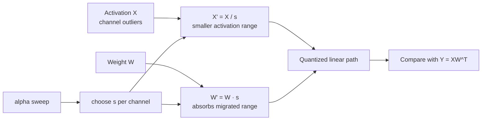

# 第 10 课 — INT8 SmoothQuant 和激活离群值

> **谜题：** 我们能否在不改变浮点线性层的情况下，使激活值更容易量化？

[← 第 01 章](../README.md) · [项目主页](../../../README_ZH.md) · [执行的笔记本](../../../chapters/01-mixed-precision-int4/10-smoothquant/lab.ipynb) · [RTX 5090 结果](../../../chapters/01-mixed-precision-int4/10-smoothquant/artifacts/rtx5090-result.json)

## 为什么这个谜题重要

LLM激活通常包含持久的通道异常值，这些异常值使得整个张量范围内的 INT8 缩放浪费了大部分代码。SmoothQuant不会删除这些异常值；它通过一个完全等价的浮点重参数化将它们的部分范围移动到相应的权重通道中，然后量化这对更容易的值。

## 阅读结果前，先做出预测

1. 证明在量化之前，互逆通道缩放不会改变`XWᵀ`。
2. 预测为什么接近两端的alpha值会损害联合W8A8误差。
3. 选择校准后应选择 alpha 的验证指标。

## 1. 从具体的张量和状态开始

SmoothQuant 在线性层`Y=XWᵀ` 的激活输入通道`X` 和权重`W` 上进行操作。

### 三个推理锚点

| # | 本课需要牢记的判断 |
|---:|---|
| 1 | SmoothQuant 对激活值和权重应用互逆通道缩放，保留浮点数乘积。 |
| 2 | alpha 参数分配量化难度给激活通道和权重通道。 |
| 3 | 最佳的 alpha 值取决于观察到的激活值和权重范围。 |

## 2. 推导机制

对于正通道缩放`s`和`(X / s)(W · s)ᵀ = XWᵀ`，选择`s_j`从激活和权重最大值中移动通道难度而不改变浮点函数。指数`alpha`决定了范围如何向权重移动。

对于正通道尺度 s，定义 `X' = X / s` 和 `W' = W · s` 并沿匹配输入通道。然后 `X'W'ᵀ = (X/s)(W·s)ᵀ = XWᵀ`。一种常见的 SmoothQuant 形式通过指数 α 从激活值和权重最大值构建 s，因此 α 控制了分配给每一边的范围大小。

量化前等式成立。经过W8A8四舍五入后，缩小激活值异常值减少激活步长，而扩大权重通道增加权重步长。目标是复合量化线性输出的误差，而不是单独的激活amax。

### 机制概览



### 逐步拆解

1. **测量通道范围。**在校准数据上收集激活值和权重的最大值，以便匹配输入通道。
2. **选择互逆缩放因子。**使用 alpha 来决定每个激活通道有多少范围移动到其权重通道。
3. **验证浮点数等价性。**在四舍五入之前，确认 (X/s)(W·s)^T 仍然等于 XW^T。
4.**量化并验证。**选择 alpha 通过留出输出或任务质量，然后验证命名的 W8A8 运行时路径。

## 3. 把理论转化为实验

**实验：**对一个异常值较多的线性层应用SmoothQuant风格的通道缩放，验证浮点数等价性，并比较在不同alpha值下的W8A8重建误差。

| 实验角色 | 固定定义 |
|---|---|
| 基准 | W8A8 量化，不做 activation-to-weight 迁移（`alpha=0`） |
| 候选方案 | alpha 0.25, 0.5, 0.75, and 1.0 的互逆通道缩放 |
| 保持不变 | 相同的X和W，per-tensor INT8 参考量化器，保持形状 |
| 测量 | 浮点数等价最大误差和量化输出 RMSE/cosine by alpha |
| 证据标签 | `numerical-model` |

该笔记本在量化前后检查代数不变量，并比较不同alpha值下的输出误差。

### 代码导读

该笔记本首先在浮点数中评估每个 alpha 的不变量。只有在完成这个检查后，才会对转换后的张量进行量化，并将输出与原始的 FP32 线性层进行比较。这种顺序可以防止将代数或广播错误误认为量化错误。

该扫描使用一个类似校准的张量，并报告一个数值模型，而不是TensorRT-LLM SmoothQuant kernel。生产实验会冻结校准数据上的缩放值，评估保留的任务，并测量命名的W8A8后端。

## 4. 解读仓库内的 RTX 5090 实测结果

**录制环境：**NVIDIA GeForce RTX 5090 计算能力12.0; PyTorch 2.12.0; CUDA 运行时13.0.

| 实测字段 | 已提交值 |
|---|---:|
| Alpha 0 RMSE | 3.298184 |
| Alpha 0.25 RMSE | 1.663379 |
| Alpha 0.5 RMSE | 1.151840 |
| Alpha 0.75 RMSE | 1.634807 |
| Alpha 1 RMSE | 3.224155 |
| 最差的浮点数等价误差 | 0.000061 |

### 这些数字说明了什么

浮点数等价性在每个 alpha 下保持在大约 `6.1e-5` 以内。量化后的 RMSE 随着 alpha 的变化呈现 U 形：在 alpha 0 时达到 3.298184，然后在 0.25 时达到 1.663379，最低值为 1.151840 在 0.5 时出现，之后在 0.75 时达到 1.634807，最后在 1.0 时达到 3.224155。余弦相似度在 alpha 0.5 时达到峰值 0.999785。

这种合成分布的中间值平衡激活和权重难度。端点移动了过多的误差到一边。这支持了迁移机制，同时保留了最佳的alpha模型和层依赖性。

打开[`artifacts/rtx5090-result.json`](../../../chapters/01-mixed-precision-int4/10-smoothquant/artifacts/rtx5090-result.json)，当需要每个重复样本或教程表中未选中的字段时。

## 5. 解答谜题并做出决策

> 异常迁移只有在结合激活加权重量化路径在冻结校准协议下改进时才有用。

### 验收与回滚门槛

首先验证浮点数等价性，冻结校准统计，对校准数据进行alpha扫描，最后接受使用留出输出/质量加上原生W8A8证据。

### 这个结论可能如何失效

从用于最终质量报告的留出集选择 alpha 会泄露测试。减少激活范围而不量化权重可能会带来虚假胜利。另一种失败是将缩放因子折叠到权重中，但忘记了相应的激活变换或其运行时/融合成本。

## 复现

从仓库根目录：

```bash
python3 -m venv .venv
source .venv/bin/activate
pip install -r requirements-notebook.txt
jupyter lab chapters/01-mixed-precision-int4/10-smoothquant/lab.ipynb
```

使用**运行所有**并与已提交的文件进行比较。

## 扩展实验

冻结一个张量集的通道统计信息，并在单独的验证集上选择 alpha，然后在第三个集上报告任务质量。比较每层 alpha 和全局 alpha，并检查哪些层保留异常值。最后运行原生 W8A8 后端，并验证缩放变换是否按预期折叠或融合。

## 证据边界

**证据标签:** [`numerical-model`](../../../chapters/01-mixed-precision-int4/README.md#evidence-labels).

## 参考资料

- [SmoothQuant 论文](https://arxiv.org/abs/2211.10438)
- [SmoothQuant 论文实现](https://github.com/mit-han-lab/smoothquant)
- [TensorRT量化方案](https://docs.nvidia.com/deeplearning/tensorrt/latest/inference-library/quantized-types-schemes.html)
