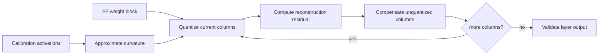

# Lesson 11 — GPTQ: 第二阶直觉与层重构

> **谜题：** 为什么两个具有相同大小的权重会接受不同的量化处理？

[← 第 01 章](../README.md) · [项目主页](../../../README_ZH.md) · [执行的笔记本](../../../chapters/01-mixed-precision-int4/11-gptq/lab.ipynb) · [RTX 5090 结果](../../../chapters/01-mixed-precision-int4/11-gptq/artifacts/rtx5090-result.json)

## 为什么这个谜题重要

最近权重量化假设每个权重误差同等重要。线性层反驳了这一假设：输入可以强烈激发某些列，而几乎不触动其他列，因此相同的权重扰动可以产生非常不同的输出误差。GPTQ 使用近似二阶信息在单次量化过程中组织这种敏感性。

## 阅读结果前，先做出预测

1. 预测原始权重 RMSE 或保留层输出 RMSE 是否更符合GPTQ的目标。
2. 解释输入协方差如何使两个等量级的权重在重要性上有所不同。
3. 解释为什么笔记本的灵敏度降级是一个直觉模型而不是GPTQ实现。

## 1. 从具体的张量和状态开始

GPTQ 逐层重建，使用层权重和代表性的输入激活量。它针对输出失真，而非原始权重和四舍五入权重之间的无加权距离。

### 三个推理锚点

| # | 本课需要牢记的判断 |
|---:|---|
| 1 | 层重构旨在最小化代表性输入下的输出误差，而不仅仅是单独的权重误差。 |
| 2 | 输入协方差矩阵近似表示哪些方向敏感。 |
| 3 | 生产环境GPTQ使用结构化的二阶更新；玩具敏感性模型不是库的实现。 |

## 2. 推导机制

对于权重误差`ΔW`和输入`X`，层误差大约为`||XΔWᵀ||²`；输入Gram/Hessian近似`XᵀX`权重对敏感方向敏感。GPTQ使用逆Hessian信息补偿剩余权重，因为列被量化。

对于层`Y=XWᵀ`，权重扰动ΔW产生`ΔY=XΔWᵀ`。平方重构损失与`||XΔWᵀ||²`成正比，可以使用输入的Gram矩阵`XᵀX`来表示。该矩阵是局部曲率信号：沿频繁激活方向的误差比沿安静方向的误差成本更高。GPTQ使用近似逆Hessian进行量化以补偿剩余权重。

该笔记本没有重现那种顺序更新。它使用输入加权的误差分数来识别敏感列，并保留一定比例的高精度数据。这种较小的构造隔离了核心思想——优化层的行为，而不是W的视觉接近度——而不声称与生产GPTQ等效。

### 机制概览



### 逐步拆解

1. **冻结一层及其校准输入。**GPTQ重构层输出，使其符合由这些输入表示的分布。
2.**估计输入曲率。**激活Gram或Hessian近似权重在影响层输出的方向上存在误差。
3. **量化一列或多列。**选择代码，计算引入的舍入残差，并保持量化列固定。
4. **补偿剩余的列。**在移动到下一个块之前，通过逆曲率近似传播残差。

## 3. 把理论转化为实验**实验：**比较朴素的 INT4 基于GPTQ启发的敏感性回退的权重量化，保留输入权重误差较大的列。

| 实验角色 | 固定定义 |
|---|---|
| 基准 | naive group-wise INT4 以统一方式应用于层权重 |
| 候选方案 | INT4 加上 12.5% 输入敏感列的后备 |
| 保持不变 | 同一层，校准输入，保留输入，量化器，以及后备预算 |
| 测量 | 留出输出 RMSE，MAE，余弦，最大误差，保留分数 |
| 证据标签 | `numerical-model` |

实验室故意模仿GPTQ：它使用输入权重敏感性，并在必要时退回到目标，但明确不声称执行GPTQModel。

### 代码导读

实验生成代表性的输入，计算一个朴素的量化层，估计哪些列会产生最大的输入-权重重构成本，并仅恢复排名最高的列。然后，两个候选方案在保留的输入上进行评估，而不是在用于排名的校准张量上进行评估。

这使得因果变量成为固定精度预算的分配。它仍然省略了块状海森矩阵逆运算、误差传播、操作顺序变体、打包以及GPTQ运行时kernel，所有这些对于端到端后端声明都是必需的。

## 4. 解读仓库内的 RTX 5090 实测结果

**录制环境：**NVIDIA GeForce RTX 5090 计算能力12.0; PyTorch 2.12.0; CUDA 运行时13.0.

| 实测字段 | 已提交值 |
|---|---:|
| 朴素的 INT4 RMSE | 2.324805 |
| 敏感性回退 RMSE | 1.597145 |
| 朴素余弦 | 0.994488 |
| 默认余弦 | 0.997389 |
| 保留列 | 12.5000% |

### 这些数字说明了什么

朴素的 INT4 产生了输出 RMSE、2.324805和余弦值0.994488。保留了由输入加权灵敏度选择的12.5%的列，将 RMSE 减少到1.597145，并将余弦值提高到0.997389；平均绝对误差（MAE）从1.842271下降到1.269206。

该减少证明了当有激活证据时，可以更智能地分配等量的存储位。它没有表明这种启发式方法与GPTQ的质量、量化时间或推理速度相匹配。其价值在于在小型实验室中使第二目标可观察。

打开[`artifacts/rtx5090-result.json`](../../../chapters/01-mixed-precision-int4/11-gptq/artifacts/rtx5090-result.json)，当需要每个重复样本或教程表中未选中的字段时。

## 5. 解答谜题并做出决策

> 二阶信息将目标从最近权重更改为忠实层输出。

### 验收与回滚门槛

记录校准激活、阻尼、块/组大小、排序、层重构损失、端任务回归以及部署的运算符。

### 这个结论可能如何失效

最终测试输入的排名泄露了评估并夸大了鲁棒性。保留列也会改变平均位宽，因此公平比较必须报告精度预算。一个低层 RMSE 层在非线性变换后或在整个模型中仍然可能失败，而一个好的检查点在没有兼容的压缩kernel时仍然可能很慢。

## 复现

从仓库根目录：

```bash
python3 -m venv .venv
source .venv/bin/activate
pip install -r requirements-notebook.txt
jupyter lab chapters/01-mixed-precision-int4/11-gptq/lab.ipynb
```

使用**运行所有**并与已提交的文件进行比较。

## 扩展实验

将启发式方法替换为小型顺序的Hessian感知量化器，并比较量化顺序、阻尼和块大小。然后逐层评估误差，然后在堆叠多层后评估误差。最后在服务后端加载一个兼容GPTQModel的检查点，并将量化质量与operator吞吐量分开。

## 证据边界

**证据标签:** [`numerical-model`](../../../chapters/01-mixed-precision-int4/README.md#evidence-labels).

## 参考资料

- [GPTQ 论文](https://arxiv.org/abs/2210.17323)
- [GPTQ 参考实现](https://github.com/IST-DASLab/gptq)
- [GPTQModel 文档](https://github.com/ModelCloud/GPTQModel)
