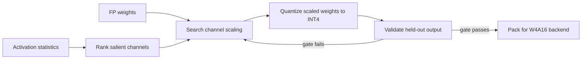

<!-- ai-infra-puzzles-header:start -->
<p align="center">
  
</p>

<h1 align="center">AI Infra Puzzles</h1>

<p align="center">
  <strong>Learn CUDA optimization and LLM inference through hands-on puzzles.</strong>
</p>
<!-- ai-infra-puzzles-header:end -->

# Lesson 12 — AWQ: 保护 W4A16 中的关键权重

> **谜题：** 激活统计能否告诉我们哪些权重通道需要更多的保护？

[← 第 01 章](../README.md) · [项目主页](../../../README_ZH.md) · [执行的笔记本](../../../chapters/01-mixed-precision-int4/12-awq/lab.ipynb) · [RTX 5090 结果](../../../chapters/01-mixed-precision-int4/12-awq/artifacts/rtx5090-result.json)

## 为什么这个谜题重要

AWQ 从观察到的结论开始，即当与大激活通道配对时，一小部分权重可以主导模型行为。它不是通过最小化平均权重误差来工作，而是使用激活统计来搜索每个通道的缩放，以保护关键权重并保留硬件友好的权重仅布局。

## 阅读结果前，先做出预测

1. 预测仅凭最大的权重幅度是否足以确定保护的最佳通道。
2. 解释为什么AWQ在保留的激活值上评估层输出，而不是仅对权重重建进行评估。
3. 随着缩放强度从零增加到一，预测错误形状的变化。

## 1. 从具体的张量和状态开始

AWQ 研究了在观察到的激活下哪些权重通道是显著的，并在权重仅有的 W4A16 部署路径中保护它们。

### 三个推理锚点

| # | 本课需要牢记的判断 |
|---:|---|
| 1 | AWQ 通过激活感知证据识别显著权重。 |
| 2 | 等效缩放可以移动量化难度，同时保持原始浮点函数不变。 |
| 3 | W4A16 描述了权重和激活精度；这并不意味着整个图是四比特。 |

## 2. 推导机制

通道缩放可以保持浮点线性变换，同时改变权重范围共享的方式，直到 INT4 舍入。激活统计指导缩放搜索，因为经常被激活的通道可以放大小权重误差。

对于线性层，等效通道缩放可以变换权重并逆变换激活值，而不改变浮点结果。AWQ 通过激活值大小来搜索缩放强度，以便量化能更有效地对显著通道进行分辨率处理。W4A16 标签意味着四比特权重存储和浮点激活值；累积和其他层仍然需要明确的dtype。

缩放不足会导致显著权重暴露。缩放过于激进会扩展其他通道，并使它们的共享量化范围变得粗糙。因此，最佳缩放是经验性的，取决于校准覆盖范围、组大小、层分布以及保留的目标。

### 机制概览



### 逐步拆解

1. **观察激活感知的显著性。**一个小的权重在乘以一个持续较大的激活通道时可能会变得重要。
2. **搜索缩放强度。**将选定通道重新缩放，使重要权重占据更多的有用量化级别。
3. **将比例尺折叠成相邻的操作。**在量化之前保留浮点函数，并避免添加未解释的运行时转换。
4. **判断量化输出。**使用保留层或任务错误，而不是仅使用权重重构误差来选择候选。

## 3. 把理论转化为实验**实验：**搜索针对玩具 W4A16 层的激活感知通道缩放强度，并与朴素方法比较输出误差。INT4.

| 实验角色 | 固定定义 |
|---|---|
| 基准 | 均匀 W4A16 参考量化在 alpha 0 处 |
| 候选方案 | alpha 0.25–1.0 通道的激活感知缩放 |
| 保持不变 | 相同权重，校准/保留分割，分组量化器，激活分布 |
| 测量 | 留出输出层输出 RMSE，MAE，余弦值和选定的 alpha 值。 |
| 证据标签 | `numerical-model` |

该笔记本冻结校准激活，搜索缩放强度，并通过保留层输出误差而不是权重误差来选择。

### 代码导读

该笔记本冻结校准激活张量，推导通道重要性，搜索五个缩放强度，并在保留的激活上评估每个候选者。最佳的alpha是从输出误差中选择的，而不是权重误差。

代码是一个受AWQ启发的数值模型。它没有实现论文的完整搜索，不完全保护相同的显著集，不重新排序或打包权重，也不调度AWQ CUDAkernel。这些遗漏是为了避免将机制教学与后端复现混淆。

## 4. 解读仓库内的 RTX 5090 实测结果

**录制环境：**NVIDIA GeForce RTX 5090 计算能力12.0; PyTorch 2.12.0; CUDA 运行时13.0.

| 实测字段 | 已提交值 |
|---|---:|
| 选定的阿尔法 | 0.250000 |
| Alpha 0 RMSE | 2.771756 |
| Alpha 0.25 RMSE | 2.273520 |
| Alpha 0.5 RMSE | 2.562305 |
| Alpha 1 RMSE | 5.898383 |

### 这些数字说明了什么

保留下来的 RMSE 在alpha为0时从2.771756提升到了2.273520，然后随着alpha增加到0.25，逐渐下降到2.562305、3.748475和5.898383。余弦相似度也遵循同样的模式，并在alpha为0.25时达到峰值0.996096。

非单调曲线是教训：激活感知保护可以有所帮助，但一旦转移过多的范围压力到其他地方，更多的扩展并不会提供更多的保护。选择的值仅适用于这个冻结的玩具分布。

打开[`artifacts/rtx5090-result.json`](../../../chapters/01-mixed-precision-int4/12-awq/artifacts/rtx5090-result.json)，当需要每个重复样本或教程表中未选中的字段时。

## 5. 解答谜题并做出决策

> 激活感知保护是一种模型质量方法；部署速度仍需兼容 W4A16 核心。

### 验收与回滚门槛

将搜索/校准与保留的评估分开，报告受保护的分数和组大小，并在做出速度声明之前证明W4A16operator执行了操作。

### 这个结论可能如何失效

使用一个激活批次同时用于搜索和最终评估可能会过度拟合规模。报告W4存储而不包含更高精度的激活路径会错误地表示内存和计算。数值改进并不意味着延迟改进；必须存在为选定形状选择的在线去量化和打包 GEMM 路径。

## 复现

从仓库根目录：

```bash
python3 -m venv .venv
source .venv/bin/activate
pip install -r requirements-notebook.txt
jupyter lab chapters/01-mixed-precision-int4/12-awq/lab.ipynb
```

使用**运行所有**并与已提交的文件进行比较。

## 扩展实验

在多个校准域中重复搜索，并报告所选alpha的稳定性。比较仅基于幅度、仅基于激活以及联合排名在相等平均位宽下的表现。然后在服务运行时使用operator 证据和批次/序列扫描测试官方AWQ检查点。

## 证据边界

**证据标签:** [`numerical-model`](../../../chapters/01-mixed-precision-int4/README.md#evidence-labels).

## 参考资料

- [AWQ 论文](https://arxiv.org/abs/2306.00978)
- [AWQ 参考实现](https://github.com/mit-han-lab/llm-awq)
