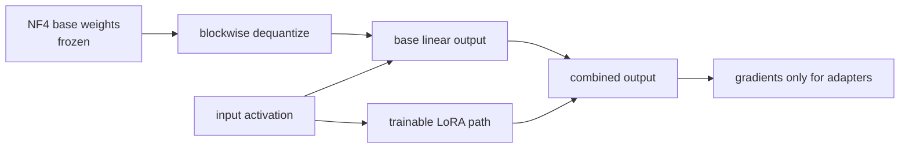

<!-- ai-infra-puzzles-header:start -->
<p align="center">
  
</p>

<h1 align="center">AI Infra Puzzles</h1>

<p align="center">
  <strong>Learn CUDA optimization and LLM inference through hands-on puzzles.</strong>
</p>
<!-- ai-infra-puzzles-header:end -->

# Lesson 13 — NF4 and QLoRA: A 4-Bit Fine-Tuning Memory Ledger

> **谜题：**如果冻结的基模型是四比特的，微调内存仍然会去哪里？

[← 第 01 章](../README.md) · [项目主页](../../../README_ZH.md) · [执行的笔记本](../../../chapters/01-mixed-precision-int4/13-nf4-qlora/lab.ipynb) · [RTX 5090 结果](../../../chapters/01-mixed-precision-int4/13-nf4-qlora/artifacts/rtx5090-result.json)

## 为什么这个谜题重要

QLoRA 使得基础模型足够便宜，可以保持冻结状态，但并不使其微调免费。激活值、适配器参数、梯度、优化器状态、临时去量化以及sequence length仍然保留在内存账本上。一个有用的可行性计算将每个对象命名，而不是将参数计数乘以四比特并停止。

## 阅读结果前，先做出预测

1. 估计 BF16 并在打开结果前为七亿参数计算理想 INT4 存储。
2. 识别 LoRA 更新中哪些张量需要梯度，哪些保持冻结。
3. 解释为什么即使基础权重是四位数，激活点检查仍然重要。

## 1. 从具体的张量和状态开始

QLoRA 冻结了一个四比特基底，通过更宽的dtype进行计算，并训练 LoRA 矩阵。内存账本仍然包括适配器、梯度、优化器状态、激活值、临时去量化以及分配器预留。

### 三个推理锚点

| # | 本课需要牢记的判断 |
|---:|---|
| 1 | QLoRA 冻结量化基础模型并训练小型低秩适配器。 |
| 2 | 优化器状态和梯度应用于可训练适配器，而激活函数仍然是主要的运行时成本。 |
| 3 | NF4 是一种针对正态分布权重设计的非均匀码本。 |

## 2. 推导机制

一个rank-`r`的适配器将`ΔW = A·B`与大约`r(in+out)`个可训练参数结合，而不是`in×out`。NF4提供了一个非均匀的16值代码本，适用于正态分布的预训练权重；双量化压缩了缩放元数据。

一次 LoRA 更新会写入`ΔW = BA`，其中A和B的秩r远小于全矩阵的维度。QLoRA 保持W在量化表示中冻结，根据计算需求进行解量化，并仅在A和B中进行反向传播。NF4使用为大致正常权重分布设计的非均匀码本；双量化压缩了缩放元数据，而分页优化器解决内存峰值问题。

账本将持久存储与训练时的活跃状态分开。理想的基字节数是`P·4/8`，但适配器权重、适配器梯度、两个Adam动量、激活值和工作区各自有其dtype和数量。sequence length可能占主导地位，因为保存的激活值随标记数量增加，而基存储不会。

### 机制概览



### 逐步拆解

1. **冻结量化基础模型。**TheNF4基础权重是前向计算的存储，不是可训练优化器参数。
2. **解量化用于计算。**块在层执行时被重构为配置的计算dtype。
3. **只训练适配器。**LoRA 矩阵、它们的梯度以及它们的优化器状态构成了主要可训练参数预算。
4.**保持完整的内存账本。**添加量化权重、缩放因子、适配器、梯度、优化器状态、激活函数以及临时工作空间。

## 3. 把理论转化为实验**实验：**构建一个7B类内存账本并运行一个 CUDA 低秩适配器在冻结的假量化基矩阵上的正向/反向传播。

| 实验角色 | 固定定义 |
|---|---|
| 基准 | 7B BF16 基础权重算术加一个冻结的 CUDA 参考层 |
| 候选方案 | 理想 INT4 基础账本，带有可训练的低秩适配器 |
| 保持不变 | 参数数量，适配器排名假设，优化器状态规则，玩具层形状 |
| 测量 | 基础 GB, LoRA/Adam MiB, 梯度有限性, 冻结基础标志, 玩具损失 |
| 证据标签 | `pytorch-gpu` |

实验室结合了一个7B类算术账本与一个真实的 CUDA 反向传播过程，其中只有低秩适配器张量接收梯度。

### 代码导读

该笔记本首先计算一个透明的7B账本。然后运行一个小的正向/反向传递，在此过程中，假量化基矩阵有`requires_grad=False`只有低秩适配器矩阵接收梯度。有限梯度检查证明预期的训练路径存在。CUDA.

假量化器解释了内存所有权，但并不bitsandbytes NF4。账本还排除了全模型激活，因为它们依赖于架构、微批量、sequence length、检查点和注意力实现。

## 4. 解读仓库内的 RTX 5090 实测结果

**录制环境：**NVIDIA GeForce RTX 5090 计算能力12.0; PyTorch 2.12.0; CUDA 运行时13.0.

| 实测字段 | 已提交值 |
|---|---:|
| 7B BF16 基础 | 13.039 GiB |
| 7B理想 INT4 基础 | 3.260 GiB |
| LoRA 可训练状态 | 8.000 MiB |
| 亚当说 | 32.000 MiB |
| 基础冻结 | 是的 |
| 适配器梯度有限 | 是的 |

### 这些数字说明了什么

算术账本在13.039 GiB处放置了一个7B BF16 基础，并在3.260 GiB处放置了理想的四比特存储。在玩具适配器假设下，可训练的 LoRA 权重占据了8 MiB，而两个Adam时刻则占据了32 MiB。基础保持冻结，适配器梯度是有限的。

这些小的适配器线解释了QLoRA 的吸引力，但缺失的激活线可能仍然比长上下文的可训练状态更大。结果证明了所有权模式和一个玩具 CUDA 的反向传播，而不是7B端到端微调能力的数字。

打开[`artifacts/rtx5090-result.json`](../../../chapters/01-mixed-precision-int4/13-nf4-qlora/artifacts/rtx5090-result.json)，当需要每个重复样本或教程表中未选中的字段时。

## 5. 解答谜题并做出决策

> 四位基础权重减少一条账本行；序列激活和适配器训练状态仍控制可行性。

### 验收与回滚门槛

校准理论值与测量值的峰值内存，确认基线无梯度，列出计算dtype和优化器，并验证下游质量与冻结基线一致。

### 这个结论可能如何失效

调用基础的 '四位' 而在生成完整的 BF16 复制时会破坏账本。计算冻结权重的优化器状态会高估内存，而忽略适配器时刻会低估内存。仅基于参数的内存适配在保存激活和临时缓冲区峰值时可能会导致 OOM。

## 复现

从仓库根目录：

```bash
python3 -m venv .venv
source .venv/bin/activate
pip install -r requirements-notebook.txt
jupyter lab chapters/01-mixed-precision-int4/13-nf4-qlora/lab.ipynb
```

使用**运行所有**并与已提交的文件进行比较。

## 扩展实验

运行一个真实的 QLoRA 步骤，使用 bitsandbytes 或其他支持的后端，并通过sequence length、微批处理、排名和检查点策略来测量 `max_memory_allocated`。比较预测的持久字节与观察到的峰值，并使用分配器快照和激活活跃度来解释残留。

## 证据边界

**证据标签:** [`pytorch-gpu`](../../../chapters/01-mixed-precision-int4/README.md#evidence-labels).

## 参考资料

- [QLoRA 论文](https://arxiv.org/abs/2305.14314)
- [Transformer bitsandbytes 指南](https://huggingface.co/docs/transformers/main/quantization/bitsandbytes)
- [QLoRA 参考实现](https://github.com/artidoro/qlora)
