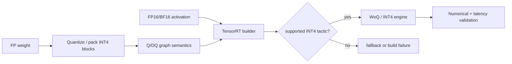

# 第 16 课 — TensorRT INT4 块量化：Q/DQ，打包和WoQ

> **谜题：** 在 TensorRT 能够消费 INT4 权重之前，图和序列化权重缓冲区中必须包含什么？

[← 第 01 章](../README.md) · [项目主页](../../../README_ZH.md) · [执行的笔记本](../../../chapters/01-mixed-precision-int4/16-tensorrt-int4/lab.ipynb) · [RTX 5090 结果](../../../chapters/01-mixed-precision-int4/16-tensorrt-int4/artifacts/rtx5090-result.json)

## 为什么这个谜题重要

TensorRT INT4 不仅仅是张量转换。图必须表达量化/反量化语义，权重必须使用支持的块级缩放因子，且带符号的四位码必须按预期顺序每字节打包两个。正确的参考打包器是先决条件，而不是证明引擎已构建的证据。

## 阅读结果前，先做出预测

1. 写出签名的 INT4 代码范围，并计算 512×1024 矩阵的压缩字节数。
2. 预测块大小64的元数据和错误影响。
3. 将 Q/DQ 正确性、打包正确性、引擎构建、operator跟踪和时间间隔分别放入不同的门控中。

## 1. 从具体的张量和状态开始

显式量化（TensorRT）表示量化选择使用Q/DQ语义，并在支持的块/布局约束下消耗压缩的低比特权重加上缩放因子。

### 三个推理锚点

| # | 本课需要牢记的判断 |
|---:|---|
| 1 | 显式量化用量化/反量化语义表示缩放决策。 |
| 2 | 签名的 INT4 代码在打包时每字节占用两个半字节。 |
| 3 | TensorRT 支持具有特定的块大小和放置规则，这些规则是通用的假量化实验无法证明的。 |

## 2. 推导机制

对于有符号的 INT4，两个4位的补码代码占用一个字节。块Q/DQ对支持的组应用一个缩放因子，为消费操作重建浮点值或启用融合权重唯一实现。

对于TensorRT风格的对称 INT4，代码位于`[-8,7]`，并且去量化时乘以每个块的缩放因子。两个四位的补码字节可以容纳在一个字节中；解码时必须正确恢复符号。使用524,288权重，理想情况下在缩放和对齐之前，压缩代码存储需要262,144字节。

Graph Q/DQ 节点在导出时保留缩放决策，允许编译器放置量化边界。TensorRT 当前将 INT4 处理为权重仅模式，并限制块大小/轴。Python Q/DQ 张量可以测试数学，但只有序列化引擎和检查层实现才能确定 TensorRT 的执行。

### 机制概览



### 逐步拆解

1. **图中的表达量化。**Q/DQ节点及其轴、块大小和缩放因子必须描述预期的表示。
2.**为命名目标构建。**TensorRT在引擎构建过程中验证dtype、形状、硬件和策略约束。
3.**检查所选实现。**A successful build does not prove that the intendedINT4 战术被选中。
4. **验证数值和性能。**在相同的输入和定时协议下，比较引擎与冻结的基准线。

## 3. 把理论转化为实验

**实验：**执行块 INT4Q/DQ 和 nibble 包装 CUDA, 验证精确解包，并单独探测TensorRT包。

| 实验角色 | 固定定义 |
|---|---|
| 基准 | 浮点数 512×1024 权重张量 |
| 候选方案 | block-64 INT4 Q/DQ 加上显式字节打包/解包 |
| 保持不变 | 权重张量，分组轴，缩放规则，代码顺序，CUDA 数值参考 |
| 测量 | 压缩字节，精确代码往返传输，RMSE/cosine，TensorRT 包探测 |
| 证据标签 | `pytorch-gpu` |

CUDA 实验室验证块 Q/DQ 和精确的 nibble 往返，同时独立的包探针防止 TensorRT 引擎的虚假声明。

### 代码导读

该笔记本对块进行量化，将相邻的有符号代码打包到低/高半字节中，然后解包，恢复符号，并断言与原始代码完全相等。然后进行去量化以测量误差。一个单独的导入探针记录TensorRT是否可用。

这种排序区分了序列化错误和数值损失。即使去量化后的 RMSE 看起来合理，也需要精确的代码来回转换，因为位序或符号错误可能会被聚合统计值掩盖。

## 4. 解读仓库内的 RTX 5090 实测结果

**录制环境：**NVIDIA GeForce RTX 5090 计算能力12.0; PyTorch 2.12.0; CUDA 运行时13.0.

| 实测字段 | 已提交值 |
|---|---:|
| 权重形状 | 512 × 1024 |
| 组大小 | 64 |
| 压缩代码字节 | 262,144 字节 |
| 精确打包/解包 | 是的 |
| Q/DQ RMSE | 0.107706 |
| TensorRT 已安装 | 否 |

### 这些数字说明了什么

512×1024 矩阵产生了恰好 262,144 个压缩字节，并且每个代码都成功地进行了打包/解包。Block-64 Q/DQ 产生了 RMSE 个 0.107706 和余弦 0.994257。由于未安装 TensorRT，因此不存在引擎、TensorRT 层或延迟结果。

结果验证了语义参考和序列化代码布局。它没有验证TensorRT支持的具体ONNX图的轴规则，也没有验证 INT4 WoQkernel的性能。

打开[`artifacts/rtx5090-result.json`](../../../chapters/01-mixed-precision-int4/16-tensorrt-int4/artifacts/rtx5090-result.json)，当需要每个重复样本或教程表中未选中的字段时。

## 5. 解答谜题并做出决策

> 验证图语义、打包、缩放、引擎检查和时间作为单独的门。

### 验收与回滚门槛

往返检查每个压缩代码，验证缩放轴/块大小和ONNX Q/DQ放置，检查构建的引擎，然后将引擎与相同的基准进行基准测试。

### 这个结论可能如何失效

错误包括将无符号字节视为有符号值、颠倒高低字节顺序、丢弃缩放布局，或声称每字节0.5的权重没有元数据和填充。成功的引擎构建仍然可能插入破坏预期收益的去量化工作，因此需要引擎检查。

## 复现

从仓库根目录：

```bash
python3 -m venv .venv
source .venv/bin/activate
pip install -r requirements-notebook.txt
jupyter lab chapters/01-mixed-precision-int4/16-tensorrt-int4/lab.ipynb
```

使用**运行所有**并与已提交的文件进行比较。

## 扩展实验

导出一个最小的 Q/DQ ONNX 图表，块大小为 64，基于固定的 TensorRT 版本构建，检查引擎层，并与参考打包器比较输出。然后对多个 M 维度进行性能分析，以确定 WoQ 成为有益的点。

## 证据边界

**证据标签:** [`pytorch-gpu`](../../../chapters/01-mixed-precision-int4/README.md#evidence-labels).

## 参考资料

- [TensorRT量化方案](https://docs.nvidia.com/deeplearning/tensorrt/latest/inference-library/quantized-types-schemes.html)
- [TensorRT 功能](https://docs.nvidia.com/deeplearning/tensorrt/latest/inference-library/capabilities.html)
- [TensorRT量化工作流](https://docs.nvidia.com/deeplearning/tensorrt/latest/inference-library/quantized-types-workflows.html)
