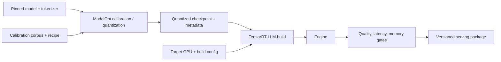

<!-- ai-infra-puzzles-header:start -->
<p align="center">
  
</p>

<h1 align="center">AI Infra Puzzles</h1>

<p align="center">
  <strong>Learn CUDA optimization and LLM inference through hands-on puzzles.</strong>
</p>
<!-- ai-infra-puzzles-header:end -->

# Lesson 17 — ModelOpt to TensorRT-LLM Quantization Pipelines

> **谜题：** 当一个量化检查点从一个工具传递到另一个工具时，丢失了哪些证据？

[← 第 01 章](../README.md) · [项目主页](../../../README_ZH.md) · [执行的笔记本](../../../chapters/01-mixed-precision-int4/17-modelopt-tensorrt-llm/lab.ipynb) · [RTX 5090 结果](../../../chapters/01-mixed-precision-int4/17-modelopt-tensorrt-llm/artifacts/rtx5090-result.json)

## 为什么这个谜题重要

量化管道跨越工具边界：校准可能发生在 ModelOpt 中，检查点导出在一种模式下，而引擎构建在 TensorRT-LLM 中。如果模型修订、食谱、缩放因子、构建标志和回滚标识没有一起携带，那么无法快速重现或安全地与基线进行比较。

## 阅读结果前，先做出预测

1. 列出用于重现量化检查点到引擎交接所需的字段。
2. 解释为什么校验和在引擎身份验证中是有用但不充分的。
3. 预测当既未安装 ModelOpt 也未安装 TensorRT-LLM 时的决策。

## 1. 从具体的张量和状态开始

ModelOpt-to-TensorRT-LLM 手动包括基础修订、校准语料库、食谱、逐层排除、量化张量元数据、分词器、构建器/运行时版本、引擎标志以及回滚目标。

### 三个推理锚点

| # | 本课需要牢记的判断 |
|---:|---|
| 1 | 一个管道需要不可变的模型修订、校准配方、量化元数据、构建标志和引擎身份。 |
| 2 | FP8, INT4 和 FP4 是不同的配方，不能互换压缩级别。 |
| 3 | 可用性包只是兼容性门限的第一步。 |

## 2. 推导机制

模型优化选择并序列化一个数值表示；引擎构建者将其降低到硬件策略。在边界处丢失组轴、缩放dtype或食谱版本可能会改变语义，即使文件加载时也是如此。

一个管道制品是一个有向链：基础模型修订 → 校准样本清单 → 量化食谱和缩放因子 → 导出的检查点 → 构建器版本/标志 → 引擎 → 质量和性能报告。哈希在边界上确定字节的身份；语义域确定这些字节应该如何被解释。

FP8, INT4, 和 FP4 是不同的图和缩放食谱，而不是一个可互换滑块上的点。因此，清单应明确列出格式、组/块大小、校准、交接状态和回滚目标。缺失的阶段应保持为假，而不是从数值探针中推断出来。

### 机制概览



### 逐步拆解

1. **固定源模型。**记录模型修订、分词器和基线质量，然后进行转换。
2. **校准或优化。**ModelOpt 生成缩放值、配方或与校准数据和目标格式相关的量化检查点。
3. **构建运行时引擎。**TensorRT-LLM消耗支持的artifact，针对命名的GPU、形状范围和并行配置。
4.**将元数据带入服务中。**最终包必须保留所有需要重现质量和性能的修订和命令。

## 3. 把理论转化为实验**实验：**生成并验证一个由种子生成的量化交接清单。CUDA 数值探针，同时检查 ModelOpt 和TensorRT-LLM独立可用性。

| 实验角色 | 固定定义 |
|---|---|
| 基准 | 版本化 BF16 撤销修订 |
| 候选方案 | INT4 手交表单与缩放指纹 |
| 保持不变 | 固定合成尺度张量，模式要求，基/回滚标识符 |
| 测量 | manifest完整性，SHA-256指纹，包可用性，数值Q/DQ误差 |
| 证据标签 | `compatibility-probe` |

该笔记本创建了一个完整的交接清单，并生成了一个 CUDA 数值指纹，同时明确标记了ModelOpt和TensorRT-LLM的可用性。

### 代码导读

该笔记本生成一个小型的 CUDA 量化指纹，对缩放字节进行哈希处理，并构建一个包含所需字段的清单。它独立地探测ModelOpt和TensorRT-LLM，并记录两者的手交标志。验证检查的是模式完整性，而不是引擎的成功。

这是一个故意设计的管道合同实验室。合成的 Q/DQ 错误可以捕捉到意外的配方更改，而哈希则可以捕捉到字节更改；两者都不能替代加载导出的检查点或构建引擎。

## 4. 解读仓库内的 RTX 5090 实测结果

**录制环境：**NVIDIA GeForce RTX 5090 计算能力12.0; PyTorch 2.12.0; CUDA 运行时13.0.

| 实测字段 | 已提交值 |
|---|---:|
| Manifest complete | 是的 |
| 格式/分组 | INT4 |
| 组大小 | 64 |
| ModelOpt 手交 | 否 |
| TensorRT-LLM 手交 | 否 |
| 数值 RMSE | 0.107446 |

### 这些数字说明了什么

清单通过了必填字段检查，并记录了缩放SHA-256 `4fc993…d117e`。数值探针有 RMSE 0.107446和余弦0.994265。模型优化和TensorRT-LLM交接标志都为假，因为包不可用。

那组组合是一个有效的可重复性特征，并且是一个明确的停止点。它支持准备交接方案，而不是关于 FP8/INT4/FP4引擎质量或吞吐量的声明。

打开[`artifacts/rtx5090-result.json`](../../../chapters/01-mixed-precision-int4/17-modelopt-tensorrt-llm/artifacts/rtx5090-result.json)，当需要每个重复样本或教程表中未选中的字段时。

## 5. 解答谜题并做出决策

> 将每个工具边界视为一个带有明确验证和回滚元数据的版本化数据传递。

### 验收与回滚门槛

在每次交接时验证模式和哈希值，运行确定性的烟雾样本，检查引擎层，并将质量和性能门保持分开。

### 这个结论可能如何失效

使用 `latest` 模型或容器标签会使 manifest 无法复现。哈希缩放但省略分组轴可以保留字节同时改变含义。另一个失败是将使用不同调度器、张量并行或插件设置构建的引擎进行比较，并将差异归因于量化。

## 复现

从仓库根目录：

```bash
python3 -m venv .venv
source .venv/bin/activate
pip install -r requirements-notebook.txt
jupyter lab chapters/01-mixed-precision-int4/17-modelopt-tensorrt-llm/lab.ipynb
```

使用**运行所有**并与已提交的文件进行比较。

## 扩展实验

在隔离的钉住容器中运行 ModelOpt 校准，导出检查点和元数据表，构建 TensorRT-LLM 引擎，添加引擎哈希、构建器标志、层检查、质量套件和 SLO 报告。测试回滚文件在相同的部署接口下加载。

## 证据边界

**证据标签:** [`compatibility-probe`](../../../chapters/01-mixed-precision-int4/README.md#evidence-labels).

## 参考资料

- [TensorRT量化方案](https://docs.nvidia.com/deeplearning/tensorrt/latest/inference-library/quantized-types-schemes.html)
- [NVIDIA Transformer Engine 文档](https://docs.nvidia.com/deeplearning/transformer-engine/user-guide/index.html)
- [NVIDIA Model Optimizer 文档](https://nvidia.github.io/Model-Optimizer/)
- [TensorRT-LLM 文档](https://nvidia.github.io/TensorRT-LLM/)
