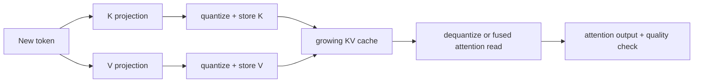

<!-- ai-infra-puzzles-header:start -->
<p align="center">
  
</p>

<h1 align="center">AI Infra Puzzles</h1>

<p align="center">
  <strong>Learn CUDA optimization and LLM inference through hands-on puzzles.</strong>
</p>
<!-- ai-infra-puzzles-header:end -->

# Lesson 19 — KV-Cache Quantization for Long Contexts

> **谜题：**当上下文长度翻倍时，为什么即使进行了权重量化，KV 缓存仍然可以占据主导地位？

[← 第 01 章](../README.md) · [项目主页](../../../README_ZH.md) · [执行的笔记本](../../../chapters/01-mixed-precision-int4/19-kv-cache-quantization/lab.ipynb) · [RTX 5090 结果](../../../chapters/01-mixed-precision-int4/19-kv-cache-quantization/artifacts/rtx5090-result.json)

## 为什么这个谜题重要

一旦权重被压缩，KV 缓存可能成为长上下文和并发请求中主导的内存项。量化它不仅仅改变容量：缩放因子必须存储或计算，键和值在注意力中重建，微小的扰动可以改变 softmax 加权输出。

## 阅读结果前，先做出预测

1. 在读取该实体之前，计算 K 和 V 的 BF16 字节，并且它们的形状为 `[1,4096,8,128]`。
2. 预测理想的 INT8 减少量，并确定为什么测量的减少量小于50%。
3. 选择一个比单独的 K/V 张量 RMSE 更具信息量的输出级别指标。

## 1. 从具体的张量和状态开始

KV 缓存按层和请求存储键和值。量化缓存还按选定的token/头/块粒度存储缩放因子（有时还存储零点）。

### 三个推理锚点

| # | 本课需要牢记的判断 |
|---:|---|
| 1 | KV字节线性地与批次、层数、序列、KV头数、头维度以及两个张量相关。 |
| 2 | 缓存量化需要缩放，并且经常改变注意力输入误差。 |
| 3 | 更多的缓存容量可能会增加并发性，即使单个请求的延迟没有改善。 |

## 2. 推导机制

缓存字节遵循 `2LBTHD·bytes`，而注意力使用 `softmax(QKᵀ/√D)V`；量化误差可以通过 `K` 影响 logits，并通过 `V` 影响加权和。

Cache storage is `2·B·S·Hkv·D·bytes`, multiplied by layers in a full model. Quantization adds scale metadata whose granularity may be per tensor, head, token, or block. Attention consumes `softmax(QKᵀ/√D)V`; errors in K affect logits and softmax weights, while errors in V affect the weighted sum. Their consequences are therefore not captured by one raw cache-error number.

只有当后端以量化形式持久存储数据而非解量化完整副本时，性能才会提升。延迟可能会提升、保持不变或恶化，这取决于融合注意力的支持和规模处理。

### 机制概览



### 逐步拆解

1. **写缓存形状。**考虑层数、批次、sequence length、KV 头数、头维度、K 和 V，以及每个元素的字节数。
2.**选择一个生命周期比例。**按字数、按节点或按区块比例调整交易元数据和kernel工作以应对错误。
3. **对实时缓存张量进行量化。**包括缩放字节和任何暂存缓冲区，而不是仅报告名义元素宽度。
4.**注意力和行为服务。**验证注意力输出错误、长上下文质量、延迟和并发能力。

## 3. 把理论转化为实验**实验：**将代表性的KV张量量化到 INT8 在 CUDA, 比较字节和注意力输出误差，并在上下文长度上投影容量。

| 实验角色 | 固定定义 |
|---|---|
| 基准 | BF16K 和 V 张量用于一个代表性的长上下文注意力切片 |
| 候选方案 | INT8K/V 加上显式缩放存储 |
| 保持不变 | 批次，序列 4096，8 键值头，头维度 128，查询，注意力计算 |
| 测量 | 总字节数包括缩放和注意力输出 RMSE/cosine |
| 证据标签 | `pytorch-gpu` |

该笔记本对实数 CUDA K/V 张量进行量化，包括缩放字节，并比较注意力输出，而不是仅报告压缩。

### 代码导读

该笔记本创建真实的 CUDA K/V 张量，对其进行量化，计算代码和缩放字节，并使用相同的查询张量将注意力输出与 BF16 参考进行评估。在 softmax 值路径之后进行测量，将数值误差归因于缓存的消费者。

这仍然是一个参考实现。它不使用 vLLM 的 FP8 缓存格式、分页块分配器、按头扩展，或融合量化注意kernel，因此服务延迟不在其声明范围内。

## 4. 解读仓库内的 RTX 5090 实测结果

**录制环境：**NVIDIA GeForce RTX 5090 计算能力12.0; PyTorch 2.12.0; CUDA 运行时13.0.

| 实测字段 | 已提交值 |
|---|---:|
| BF16 缓存 | 16,777,216 字节 |
| INT8 缓存加权扩展 | 8,650,752 字节 |
| 内存减少 | 48.4375% |
| 注意输出 RMSE | 0.000231 |
| 注意力输出余弦 | 0.999958 |

### 这些数字说明了什么

BF16 缓存存储是16,777,216字节。INT8 代码和使用的比例尺8,650,752字节，一个48.4375% 减少而非理想50% 因为元数据仍然存在。注意输出 RMSE 是0.00023131使用余弦相似度0.999958最大绝对误差0.00070267.

这个随机切片的误差很小，但它不是一个语言模型质量的结果。有用的结论是，元数据感知的容量和消费者级别的数值误差都被测量了；端到端的质量和融合kernel的成本仍然存在疑问。

打开[`artifacts/rtx5090-result.json`](../../../chapters/01-mixed-precision-int4/19-kv-cache-quantization/artifacts/rtx5090-result.json)，当需要每个重复样本或教程表中未选中的字段时。

## 5. 解答谜题并做出决策

> KV量化主要是容量决策，直到端到端延迟和质量被测量。

### 验收与回滚门槛

测量实际缓存分配、元数据、上下文相关注意力或任务错误、量化/反量化成本、长上下文质量以及端到端服务指标。

### 这个结论可能如何失效

忽略规模字节会高估容量，而比较不考虑注意力的缓存张量会低估行为影响。一个随机上下文会错过依赖于层和长距离的敏感性。另一个失败是将额外的容量计为吞吐量，而没有测试调度器并发性和注意力延迟是否实际改善。

## 复现

从仓库根目录：

```bash
python3 -m venv .venv
source .venv/bin/activate
pip install -r requirements-notebook.txt
jupyter lab chapters/01-mixed-precision-int4/19-kv-cache-quantization/lab.ipynb
```

使用**运行所有**并与已提交的文件进行比较。

## 扩展实验

逐层/每个头和上下文长度重复测试，比较每张张量与每个头的缩放比例，并在小型模型中评估logit/序列质量。然后运行支持的 vLLM FP8 KV-cache配置，并在相同的请求集中测量最大token数、并发请求数、TTFT、ITL 和准确性。

## 证据边界

**证据标签:** [`pytorch-gpu`](../../../chapters/01-mixed-precision-int4/README.md#evidence-labels).

## 参考资料

- [vLLM 量化文档](https://docs.vllm.ai/en/latest/features/quantization/)
- [vLLM 量化 KV 缓存](https://docs.vllm.ai/en/latest/features/quantization/quantized_kvcache/)
- [LLM Compressor KV-cache 示例](https://docs.vllm.ai/projects/llm-compressor/en/latest/examples/quantization_kv_cache/)
