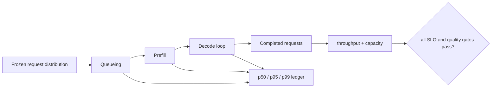

# Lesson 24 — 基准设计：吞吐量、延迟、并发和内存

> **谜题：**如何在同一GPU路径上提高吞吐量同时恶化延迟？

[← 第 01 章](../README.md) · [项目主页](../../../README_ZH.md) · [执行的笔记本](../../../chapters/01-mixed-precision-int4/24-benchmark-design/lab.ipynb) · [RTX 5090 结果](../../../chapters/01-mixed-precision-int4/24-benchmark-design/artifacts/rtx5090-result.json)

## 为什么这个谜题重要

吞吐量、延迟、并发和内存是耦合的，但不可互换。一个更大的批次可以提高每秒示例数量，同时增加每次请求的等待时间和峰值内存。一个有用的基准从一个SLO和请求分布开始，然后报告足够的轴来解释为什么一种配置胜出。

## 阅读结果前，先做出预测

1. 预测从批次1到128时operator延迟、每秒示例数以及峰值分配如何变化。
2. 解释为什么这个操作符基准测试不能报告第一个token的时间或队列延迟。
3. 选择百分位数和用于服务比较所需的加载信息。

## 1. 从具体的张量和状态开始

基准测试输出包括延迟分布、吞吐量、并发、队列、TTFT、token延迟、内存、功耗/成本以及工作负载形状。它们不能被合并成一个数字。

### 三个推理锚点

| # | 本课需要牢记的判断 |
|---:|---|
| 1 | 延迟是每请求的；吞吐量是单位时间内完成的工作量。 |
| 2 | 批量处理可以摊销开销，但会增加队列和内存需求。 |
| 3 | 中位数本身隐藏了尾部行为；必须记录热身和重复样本。 |

## 2. 推导机制

对于固定的运算符，吞吐量是`batch / latency`；批量处理可以提高吞吐量，但每个项目需要等待更长的时间。在服务中，到达率和排队会增加GPU执行之外的延迟。

对于一个同步批次 B，带有测量操作时间 T，理想的吞吐量是 `B/T`。该计算排除了到达、批次延迟、调度器开销、token到token Decode 以及响应流。在服务中，增加并发可以提高 GPU 利用率，直到队列和内存压力驱动尾部延迟或拒绝。

延迟分布也很重要：中位数描述了一个典型的温暖请求，而 p95/p99 则暴露了干扰和队列。峰值 CUDA 分配不是总进程内存，而应该在评估部署适应性时与保留内存和缓存容量一起考虑。

### 机制概览



### 逐步拆解

1. **冻结服务工作负载。**指定提示/输出长度、到达模式、并发度、批处理策略和缓存状态。
2. **测量延迟作为阶段。**分离队列，Prefill, 词间Decode, 和总请求延迟。
3. **报告分布和吞吐量一起。**当 p95 或 p99 违反服务目标时，吞吐量的提升是不完整的。
4.**归因结果。**将端到端性能指标与内存和operator 证据关联起来，以便于观察瓶颈的转移。

## 3. 把理论转化为实验

**实验：**基准测试 CUDA 多批次大小的MLP，记录中位数、p90、每秒实例数和峰值分配内存。

| 实验角色 | 固定定义 |
|---|---|
| 基准 | 批量-1 BF16 两层MLPoperator工作负载 |
| 候选方案 | 相同的操作在批次8、32和128中。 |
| 保持不变 | 模型，隐藏层大小，dtype，GPU，warmup五次，重复二十次 |
| 测量 | 中位数/p90 操作器延迟，导出示例/s，峰值分配 MiB |
| 证据标签 | `pytorch-gpu` |

实验室扫过批次大小并报告中位数、p90、每秒实例数和峰值分配内存；它将结果标记为operator工作负载，而非服务器测试。

### 代码导读

该笔记本构建了一个固定的 BF16 MLP，分配每个批次输入，重置峰值内存统计，并在热身之后记录二十个 CUDA 事件样本。吞吐量通过批次除以设备时间中位数来计算，使其简化假设显式化。

没有请求调度器、分词器、KV缓存、网络或输出循环。证据是一条operator批处理曲线，用于教授度量关系，而不是在线服务基准。

## 4. 解读仓库内的 RTX 5090 实测结果

**录制环境：**NVIDIA GeForce RTX 5090 计算能力12.0; PyTorch 2.12.0; CUDA 运行时13.0.

| 实测字段 | 已提交值 |
|---|---:|
| 批处理 1 中位数 | 0.046176 ms |
| 批量1吞吐量 | 21,656.27 例子/s |
| 批处理 32 中位数 | 0.045968 ms |
| 批量32吞吐量 | 696,136.44 例子/s |
| 批处理 128 中位数 | 0.049024 ms |
| 批量128吞吐量 | 2,610,966.06 例子/s |
| 批量 128 峰值分配 | 67.000 MiB |

### 这些数字说明了什么

中位数操作延迟在批次1到批次32期间保持在0.046毫秒左右，因此导出的吞吐量从21,656增加到696,136每秒实例数。批次128将中位数提高到0.049024毫秒，但仍达到2.61百万每秒实例数。分配的最大内存从64.023增加到67.000MiB。

该表展示了为什么吞吐量可以显著提高，而延迟几乎不变，内存却上升。它不包括请求等待加入批次的时间，这在交互式SLO中可能占据主导地位。

打开[`artifacts/rtx5090-result.json`](../../../chapters/01-mixed-precision-int4/24-benchmark-design/artifacts/rtx5090-result.json)，当需要每个重复样本或教程表中未选中的字段时。

## 5. 解答谜题并做出决策

> 选择一个候选方案来衡量服务水平目标，而不是单一的最大吞吐量数字。

### 验收与回滚门槛

在查看候选方案之前，请先声明工作负载分布、warmup、重复次数、同步、并发、百分位方法、精度和SLO。

### 这个结论可能如何失效

比较不同输出长度或延迟百分位的token/秒是不公平的。从单一operator推导服务吞吐量忽略了非量化层和调度。另一个陷阱是仅在OOM或拒绝前报告最佳并发，而没有安全余量和持续负载时间。

## 复现

从仓库根目录：

```bash
python3 -m venv .venv
source .venv/bin/activate
pip install -r requirements-notebook.txt
jupyter lab chapters/01-mixed-precision-int4/24-benchmark-design/lab.ipynb
```

使用**运行所有**并与已提交的文件进行比较。

## 扩展实验

运行一个真实的推理工作负载，使用冻结的提示/输出长度分布和到达过程。记录 TTFT、token间的延迟、端到端的p50/p95/p99、tokens/秒、requests/秒、队列深度、拒绝情况、功率以及每个并发级别上的峰值/预留内存。

## 证据边界

**证据标签:** [`pytorch-gpu`](../../../chapters/01-mixed-precision-int4/README.md#evidence-labels).

## 参考资料

- [vLLM 量化文档](https://docs.vllm.ai/en/latest/features/quantization/)
- [vLLM 基准 CLI](https://docs.vllm.ai/en/latest/cli/bench/serve.html)
- [CUDA 事件计时 API](https://docs.nvidia.com/cuda/cuda-runtime-api/group__CUDART__EVENT.html)
