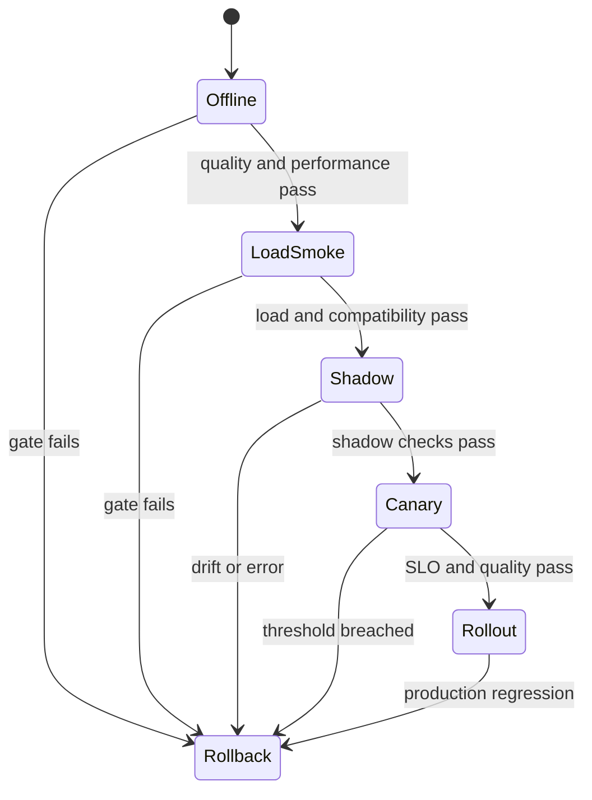

# Lesson 27 — 生产部署、版本控制与回滚

> **谜题：** 量化发布如何确保安全可逆？

[← 第 01 章](../README.md) · [项目主页](../../../README_ZH.md) · [执行的笔记本](../../../chapters/01-mixed-precision-int4/27-production-rollout/lab.ipynb) · [RTX 5090 结果](../../../chapters/01-mixed-precision-int4/27-production-rollout/artifacts/rtx5090-result.json)

## 为什么这个谜题重要

量化产物在转换完成后尚未准备好；当版本化候选通过冻结门并存在测试回滚路径时，它才准备好。发布决策应基于证据确定，因此相同的清单应产生相同的提升或回滚结果，而不是依赖于操作者的乐观态度。

## 阅读结果前，先做出预测

1. 预测候选者是否通过10%的延迟门和 RMSE≤0.5的门。
2. 解释为什么即使延迟改善了，两个门控器仍然需要。
3. 在将`rollback`更改为生产金丝雀之前，请列出所需的所有额外证据。

## 1. 从具体的张量和状态开始

一个发布单元包括不可变的模型/分词器/食谱/运行时/容器身份、指标、金丝雀策略、可观测性以及已验证的回滚目标。

### 三个推理锚点

| # | 本课需要牢记的判断 |
|---:|---|
| 1 | 模型、分词器、量化食谱、运行时和GPU兼容性形成一个发布单元。 |
| 2 | 金丝雀网关需要质量、延迟、错误率和容量阈值。 |
| 3 | 回滚必须引用一个已验证的不可变基线。 |

## 2. 推导机制

推广是一个状态机：离线闸门 -> 加载/冒烟测试 -> 阴影测试 -> 金丝雀测试 -> 更广泛的滚动部署。每次转换消耗固定证据，并且有自动停止/回滚条件。

发布清单绑定候选和基准修订、环境、量化食谱、质量阈值、性能SLO、所有者、可观测性、金丝雀比例和回滚目标。每个闸门评估一个命名的产物；决策是关键闸门的合取，而不是平均得分。

回滚必须恢复一个可加载、兼容的基础线，并在提升前进行演练。本地合成决策可以验证门控机制，同时明确指出没有执行任何容器、流量或服务健康信号。

### 机制概览



### 逐步拆解

1. **绑定不可变的元数据。**模型、分词器、食谱、运行时、容器和 GPU 兼容性形成一个发布单元。
2.**跳过离线门。**质量、数值、负载和性能检查在任何流量暴露之前进行。
3. **逐步增加曝光。**影子和金丝雀阶段消耗预定义的健康和质量阈值。
4. **使回滚可执行。**每个阶段都指向一个负载测试基准，并且具有自动或由operator触发的停止条件。

## 3. 把理论转化为实验**实验：**对合成候选者进行评估，与冻结的门控器进行比较，并根据测量结果发布释放决策和回滚清单。CUDA 输出错误和时间。

| 实验角色 | 固定定义 |
|---|---|
| 基准 | 版本化的 BF16 矩阵路径 `bf16-v1` |
| 候选方案 | 参考 INT4-去量化路径 `reference-int4-v1` |
| 保持不变 | 相同的张量，十五次采样，固定 RMSE/延迟阈值 |
| 测量 | 基准/候选中位数和p90，输出误差，个体门布尔值，发布决策 |
| 证据标签 | `capacity-model` |

该笔记本将测量到的 CUDA 错误和时间转换为确定性的合成发布决策和回滚清单，而不声称涉及实时流量。

### 代码导读

该笔记本测量两条路径，计算误差，评估两个预声明的布尔值，并仅在所有门通过的情况下写入一个决定为`promote_to_canary`的清单。即使候选失败，回滚目标也会被存储。

这是一个确定性的发布策略测试。它不是容器构建、模型卡审计、影子部署或与实时流量的金丝雀测试。

## 4. 解读仓库内的 RTX 5090 实测结果

**录制环境：**NVIDIA GeForce RTX 5090 计算能力12.0; PyTorch 2.12.0; CUDA 运行时13.0.

| 实测字段 | 已提交值 |
|---|---:|
| 基准中位数 | 0.019360 ms |
| 候选中位数 | 0.018848 ms |
| 候选 RMSE | 5.317538 |
| 延迟门 | 是的 |
| 质量门 | 否 |
| 决策 | 回滚 |

### 这些数字说明了什么

候选中位延迟为0.018848毫秒，而基准为0.019360毫秒，因此≤10%的回归门通过。但输出 RMSE 为5.317538，远高于0.5阈值，因此质量门失败，最终选择`rollback`。

一个小的性能提升无法弥补关键质量门失败的结果。这个结果说明了为什么在候选产品被观察之前，发布标准必须是合取的且冻结的。

打开[`artifacts/rtx5090-result.json`](../../../chapters/01-mixed-precision-int4/27-production-rollout/artifacts/rtx5090-result.json)，当需要每个重复样本或教程表中未选中的字段时。

## 5. 解答谜题并做出决策

> 在暴露流量之前自动化决策和回滚元数据；永远不要在回滚后临时决定回滚。

### 验收与回滚门槛

对每个组件进行版本控制，定义质量/延迟/错误/容量阈值，监控切片，并在进行金丝雀流量之前测试回滚命令。

### 这个结论可能如何失效

更改阈值后看到结果会将门转换为证明。没有验证的补丁的回滚标识符不是一个回滚计划。生产推广还需要持续负载、错误率、GPU健康、输出监控以及人/operator决策路径。

## 复现

从仓库根目录：

```bash
python3 -m venv .venv
source .venv/bin/activate
pip install -r requirements-notebook.txt
jupyter lab chapters/01-mixed-precision-int4/27-production-rollout/lab.ipynb
```

使用**运行所有**并与已提交的文件进行比较。

## 扩展实验

将基准和候选包打包并固定到容器中，验证冷加载和热重启，运行离线质量套件和影子流量，然后进行小规模金丝雀测试并设置自动回滚触发器。排练回滚并记录恢复时间，然后扩大流量。

## 证据边界

**证据标签:** [`capacity-model`](../../../chapters/01-mixed-precision-int4/README.md#evidence-labels).

## 参考资料

- [vLLM 量化文档](https://docs.vllm.ai/en/latest/features/quantization/)
- [Hugging Face 模型卡片](https://huggingface.co/docs/hub/model-cards)
- [NVIDIA Triton 模型管理](https://docs.nvidia.com/deeplearning/triton-inference-server/user-guide/docs/user_guide/model_management.html)
