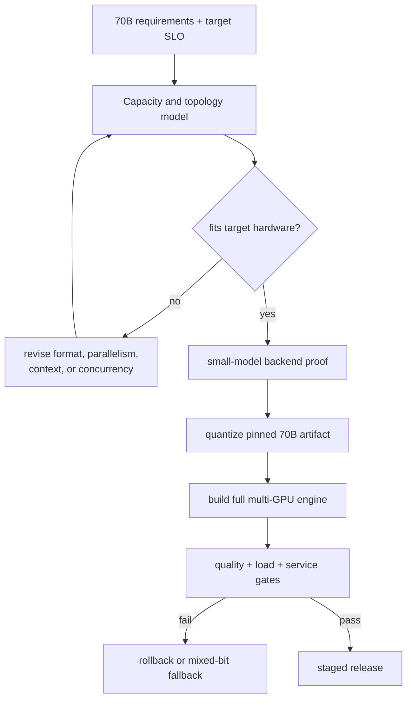

<!-- ai-infra-puzzles-header:start -->
<p align="center">
  
</p>

<h1 align="center">AI Infra Puzzles</h1>

<p align="center">
  <strong>Learn CUDA optimization and LLM inference through hands-on puzzles.</strong>
</p>
<!-- ai-infra-puzzles-header:end -->

# Lesson 30 — End-to-End Project: A Serviceable INT4 Plan for a 70B-Class Model

> **谜题：** 要从四比特检查点迁移到可部署的70B计划，需要哪些证据？

[← 第 01 章](../README.md) · [项目主页](../../../README_ZH.md) · [执行的笔记本](../../../chapters/01-mixed-precision-int4/30-end-to-end-70b-plan/lab.ipynb) · [RTX 5090 结果](../../../chapters/01-mixed-precision-int4/30-end-to-end-70b-plan/artifacts/rtx5090-result.json)

## 为什么这个谜题重要

一个可运行的70B INT4 项目是一系列门，而不是转换命令。重量匹配使引擎工作；引擎身份确保质量与负载测试；通过质量、SLO、容量、可观测性、金丝雀和回滚门使项目进入生产。任何未执行的关键门将决策保持在`not ready`。

## 阅读结果前，先做出预测

1. 预测理想中的70B INT4 权重在 RTX 5090 上是否适合。
2. 评估哪些部署闸门可以用玩具混合位矩阵回答，哪些需要真实引擎。
3. 写出使最终决策向金丝雀方向移动的最小反转条件。

## 1. 从具体的张量和状态开始

一个可运行的70B计划包括模型修订、量化/校准、硬件拓扑、引擎、缓存策略、质量套件、工作负载/SLO、容量/成本、可观测性、所有权和回滚。

### 三个推理锚点

| # | 本课需要牢记的判断 |
|---:|---|
| 1 | 该计划结合了内存可行性、后端兼容性、质量门、性能SLO、可观测性和回滚。 |
| 2 | 70B算术账本不是成功的模型加载。 |
| 3 | 每一种未支持或未测量的门电路保持明确，而不是充满乐观。 |

## 2. 推导机制

项目是一个门图，而不是一个转换命令：内存可行性使引擎构建；引擎证据使质量/性能测试；只有通过所有关键门才能启用金丝雀。

门图从不可变的模型/食谱身份和容量算术开始。然后需要支持的后端构建和operator跟踪，冻结的质量套件，代表性的服务负载，成本/容量余量，可观测性，所有者，金丝雀计划，以及测试的回滚。依赖关系很重要：服务SLO在可加载的引擎存在之前是未定义的。

一个玩具混合位探针可以验证回退和数值阈值的概念，但不能回答70B任务质量的问题。同样，理想的`P/2`字节忽略缩放元数据和未量化层。在最终决策中标记这些区别是交付内容的一部分。

### 机制概览



### 逐步拆解

1. **早期拒绝不可行的容量计划。**在选择量化器之前，先估算权重、KV缓存、运行时和并发内存。
2.**构建一个具有代表性的较小证明。**验证模型的精确格式、后端、质量套件和工作负载，以适应可用的硬件。
3. **创建完整的模型元数据。**将固定好的70B检查点进行可再现的量化，并包含包装元数据。
4. **仅凭全系统证据进行推广。**需要多GPU引擎，加载、质量、长上下文、吞吐量和回滚结果从目标拓扑结构中。

## 3. 把理论转化为实验

**实验：**结合实时GPU容量，一个小 CUDA 混合位质量探针，以及一个门阵列用于产生一个有界的70B部署决策。

| 实验角色 | 固定定义 |
|---|---|
| 基准 | BF16 回滚概念和未执行的生产门 |
| 候选方案 | 理想70B INT4 容量加上一个玩具混合位数数值探针 |
| 保持不变 | 实时GPU 内存，70B参数计数，10%保留，固定玩具阈值 |
| 测量 | 理想体重（GiB），适合（boolean），玩具（RMSE/cosine），六个门（booleans），最终决定 |
| 证据标签 | `capacity-model` |

最终的实验结合了实时容量计算和一个小型混合比特的 CUDA 探针，然后返回`not_ready_for_service`，因为70B引擎、质量和服务门没有被执行。

### 代码导读

该笔记本读取实时容量，计算理想 INT4 字节，运行一个小型 CUDA 混合位矩阵探测，并构建一个门字典。它将引擎、质量套件和服务 SLO 门设置为假，因为这些实验没有运行。最终决策是基于所有门，而不是乐观地写入。

这使得笔记本成为可执行的部署计划框架。它不是70B负载测试、量化检查点或成本基准。

## 4. 解读仓库内的 RTX 5090 实测结果

**录制环境：**NVIDIA GeForce RTX 5090 计算能力12.0; PyTorch 2.12.0; CUDA 运行时13.0.

| 实测字段 | 已提交值 |
|---|---:|
| 实时GPU总量 | 31.358 GiB |
| 理想 INT4 权重 | 32.596 GiB |
| 单 GPU理想匹配 | 否 |
| 玩具混合位 RMSE | 3.720175 |
| 质量套件通过 | 否 |
| 服务SLO通过 | 否 |
| 决策 | not_ready_for_service |

### 这些数字说明了什么

理想的 INT4 权重是 32.596 GiB 对应 31.358 GiB 总 GPU 内存，因此单 GPU 权重拟合在元数据或预留之前失败。玩具混合位探针产生了 RMSE 3.720175，超过了其阈值 2，尽管余弦值是 0.993368。回滚身份被定义，但引擎构建、质量套件和服务 SLO 都是假的。推导出的决定是 `not_ready_for_service`。

这是正确的结果：算术压缩和一个玩具探针无法填补缺失的生产证据。门阵列告诉下一个工程师到底还剩下什么，而不是将缺失转换为成功声明。

打开[`artifacts/rtx5090-result.json`](../../../chapters/01-mixed-precision-int4/30-end-to-end-70b-plan/artifacts/rtx5090-result.json)，当需要每个重复样本或教程表中未选中的字段时。

## 5. 解答谜题并做出决策

> 一个可辩护的计划在生产优化开始之前，会暴露每一个门、所有者、实体和逆向条件。

### 验收与回滚门槛

未执行的门应明显为假。需要真实的70B加载、原生operator跟踪、冻结质量套件、服务加载SLO、容量余量、成本模型、金丝雀计划以及部署前的测试回滚。

### 这个结论可能如何失效

将理想体重拟合成功负载忽略了最大的不确定性。允许一个高余弦值覆盖任务失败也会削弱门图。一个没有所有者、产品、截止日期、可观测性和回滚演习的计划可能在纸上是完整的，但在事件中却是不可用的。

## 复现

从仓库根目录：

```bash
python3 -m venv .venv
source .venv/bin/activate
pip install -r requirements-notebook.txt
jupyter lab chapters/01-mixed-precision-int4/30-end-to-end-70b-plan/lab.ipynb
```

使用**运行所有**并与已提交的文件进行比较。

## 扩展实验

选择一个可行的多GPU或更大内存的目标，构建一个固定的本地引擎，并捕获层/操作符的证据。运行冻结质量套件和代表性的负载，填充容量/成本的余量，定义监控和所有者，然后进行回滚演练。只有所有通过的关键门应该改变决策，使其进入金丝雀准备状态。

## 证据边界

**证据标签:** [`capacity-model`](../../../chapters/01-mixed-precision-int4/README.md#evidence-labels).

## 参考资料

- [TensorRT量化方案](https://docs.nvidia.com/deeplearning/tensorrt/latest/inference-library/quantized-types-schemes.html)
- [vLLM 量化文档](https://docs.vllm.ai/en/latest/features/quantization/)
- [NVIDIA Transformer Engine 文档](https://docs.nvidia.com/deeplearning/transformer-engine/user-guide/index.html)
- [NVIDIA Model Optimizer 文档](https://nvidia.github.io/Model-Optimizer/)
- [TensorRT-LLM 文档](https://nvidia.github.io/TensorRT-LLM/)
- [vLLM 基准 CLI](https://docs.vllm.ai/en/latest/cli/bench/serve.html)
