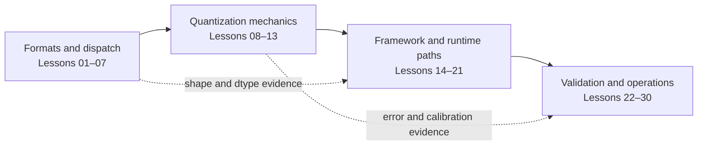

<!-- ai-infra-puzzles-header:start -->
<p align="center">
  
</p>

<h1 align="center">AI Infra Puzzles</h1>

<p align="center">
  <strong>Learn CUDA optimization and LLM inference through hands-on puzzles.</strong>
</p>
<!-- ai-infra-puzzles-header:end -->

# 第 01 章 — 混合精度与 INT4 量化

> 了解数值格式如何落实为存储 layout、GPU operator、内存成本、
> latency 变化、质量权衡和生产决策。

[← 中文首页](../../README_ZH.md) · [English chapter](../../chapters/01-mixed-precision-int4/README.md)

## 如何学习本章

每节课包含一个理论 `README.md`，一个可执行的 `lab.ipynb`，带有保存的 RTX 5090 输出，以及一个紧凑的 JSON artifact。遵循相同的循环：

```text
Predict → Run → Inspect → Explain
```

这些笔记使用了一致的五部分推理路径：

```text
Concrete object → Mechanism/equation → Engineering trade-off
               → Reproducible evidence → Acceptance or rollback
```

教训 02–30 是完整的教程，而不是索引。每个教程都从具体的张量中推导出其机制，冻结一个基线/候选协议，将选定的 RTX 5090 测量直接放在笔记中，解释这些数字，浏览笔记本代码，并以特定教训的失败分析和扩展结束。笔记本保留完整的原始 GPU 代码和输出，执行前后用理论包围它们。

这保留了研究课程的有用概念路径，同时用课程特定的公式、张量对象、故障模式和实验取代了通用的叙述。数值模型可以解释机制，但它不能替代TensorRT、vLLM、CUTLASS、bitsandbytes、ModelOpt或Transformer Engine的执行。

## 学习路径概览



## 如何阅读一节课

1. 在打开保留结果之前进行预测。
2. 将图表和推导映射到基准和候选`lab.ipynb`。
3. 在比较指标之前，请验证环境和冻结变量。
4. 将笔记本输出与 JSON artifact对齐，然后应用接受门限。

## 证据标签

| 标签 | 它所建立的内容 |
|---|---|
| `pytorch-gpu` | 通过 PyTorch 执行 CUDA，不推断出一个未命名的本地kernel。 |
| `numerical-model` | 受控机制，而非完整论文或生产复制品 |
| `compatibility-probe` | 包或API的可用性及其确切的成功/失败边界 |
| `capacity-model` | 基于测量的 CUDA 事实的透明规划算术 |

## 教训：理论转化为证据

这不仅仅是一个文件索引。中间列陈述了每个实验室如何转化为可观测对象、不变量或决策门的理论概念。

| # | 课 | 理论 → 实验桥梁 | 证据 |
|---:|---|---|---|
| 01 | [精度格式：FP32, TF32, FP16, BF16, FP8, INT8, 和 INT4](01-precision-formats/README.md) | 分离存储位、计算dtype、累加器、执行的操作符和速度；在单一模型上测试完整的账本。 | `native-backend` |
| 02 | [Tensor Core低精度 GEMM 的约束](02-tensor-core-constraints/README.md) | 将dtype、layout、alignment和tile shape视为联合调度条件；比较对齐和不规则 GEMMs。 | `pytorch-gpu` |
| 03 | [PyTorch AMP: 自动混合精度和GradScaler](03-pytorch-amp/README.md) | 将模型AMP视为一个前向-后向-反向-缩放-更新控制循环，而非全局dtype切换。 | `pytorch-gpu` |
| 04 | [为什么 BF16 经常是第一个低精度选择](04-bf16-first/README.md) | 对比指数范围和分数精度，然后分别测量溢出、误差和延迟。 | `pytorch-gpu` |
| 05 | [诊断 FP16 溢出和梯度缩放失败](05-fp16-overflow/README.md) | 找到第一个非有限或零梯度阶段，并测试损失缩放能修复什么，不能修复什么。 | `pytorch-gpu` |
| 06 | [混合精度分析与调度验证](06-mixed-precision-profiling/README.md) | 将重复的计时与operator 证据配对；不要仅从速度变化推断kernel。 | `pytorch-gpu` |
| 07 | [推理精度层：权重、激活值和KV Cache](07-inference-precision-layers/README.md) | 为权重、激活值、累积器、缓存和工作空间分别建立独立的内存账户。 | `pytorch-gpu` |
| 08 | [量化数学：缩放、零点、组大小和误差](08-quantization-math/README.md) | 推导量化/反量化方程，并展示误差-元数据权衡随组大小变化的情况。 | `numerical-model` |
| 09 | [PTQ 校准数据：采样和覆盖](09-ptq-calibration/README.md) | 冻结校准数据的范围，并在保留域、尾部和裁剪率上进行判断。 | `numerical-model` |
| 10 | [INT8 SmoothQuant 和激活离群值](10-smoothquant/README.md) | 验证互逆通道缩放是否保留 `XWᵀ`，然后测试结合 W8A8 错误是否有所改善。 | `numerical-model` |
| 11 | [GPTQ第二阶直觉与层重构](11-gptq/README.md) | 将原始权重误差替换为输入加权层输出误差和敏感性感知的后备。 | `numerical-model` |
| 12 | [AWQ保护 W4A16 中的关键权重](12-awq/README.md) | 使用激活证据来保护关键通道，同时保持 W4A16 存储和计算独立。 | `numerical-model` |
| 13 | [NF4 和 QLoRA：4-Bit 精调内存账本](13-nf4-qlora/README.md) | 为冻结的基础、LoRA 权重、梯度、优化器状态和激活值分别进行处理。 | `pytorch-gpu` |
| 14 | [bitsandbytes 4-Bit Loading: NF4, Compute Dtype, and Nested Quantization](14-bitsandbytes-4bit/README.md) | 在探查后端之前，分别存储代码本、存储表示、计算dtype和嵌套元数据。 | `numerical-model` |
| 15 | [TorchAO INT4 仅权重量化](15-torchao-int4/README.md) | 要求将转换、压缩存储、操作符身份、数值误差和延迟作为单独的门。 | `compatibility-probe` |
| 16 | [TensorRT INT4 块量化：Q/DQ，打包和WoQ](16-tensorrt-int4/README.md) | 将块缩放和 Q/DQ 语义与精确的两字节打包关联起来，但不要声称没有 TensorRT 引擎。 | `pytorch-gpu` |
| 17 | [ModelOpt to TensorRT-LLM 量化管道](17-modelopt-tensorrt-llm/README.md) | 将每个工具边界转换为包含校准、格式、构建和回滚身份的版本化清单。 | `compatibility-probe` |
| 18 | [使用 vLLM 提供 INT4 服务](18-vllm-int4-serving/README.md) | 将检查点兼容性和kernel调度分离，与调度程序、KV 缓存、批处理和请求负载效应分开。 | `compatibility-probe` |
| 19 | [KV-Cache 量化用于长上下文](19-kv-cache-quantization/README.md) | 从层、序列、KV头部、头部大小、批次和dtype中推导缓存字节；单独测量注意力误差。 | `pytorch-gpu` |
| 20 | [FP8, FP4, NVFP4, 和 Hardware Boundaries](20-fp8-fp4-nvfp4/README.md) | 区分格式、硬件指令、库配方和框架kernel；仅执行可用的 FP8 路径。 | `pytorch-gpu` |
| 21 | [量化视觉和多模态模型](21-multimodal-quantization/README.md) | 暴露模态特定的激活分布，并测试为什么仅文本校准无法涵盖视觉路径。 | `pytorch-gpu` |
| 22 | [打包 INT4 推理交付物](22-int4-inference-package/README.md) | 将权重、缩放、分词器、配置、哈希值以及加载时验证视为一个可部署的合约。 | `pytorch-gpu` |
| 23 | [量化模型的回归精度测试](23-accuracy-regression/README.md) | 将平均相似度转换为任务、尾部、层和确定性接受门的套件。 | `pytorch-gpu` |
| 24 | [基准设计：吞吐量、延迟、并发和内存](24-benchmark-design/README.md) | 将延迟分布、到达负载、批处理、吞吐量和内存与冻结服务SLO关联。 | `pytorch-gpu` |
| 25 | [故障模式：异常值、长上下文、MoE 和小批次](25-quantization-failure-modes/README.md) | 不通过平均掉异常值、路由不平衡、长上下文和小批次来消除应力独立的失败轴。 | `pytorch-gpu` |
| 26 | [混合位策略和敏感层回退](26-mixed-bit-fallback/README.md) | 按输出敏感度对层进行排序，并在减少误差最多的地方花费固定的高精度预算。 | `pytorch-gpu` |
| 27 | [生产部署、版本控制与回滚](27-production-rollout/README.md) | 将编码模型、量化器、引擎、硬件、金丝雀、可观测性和回滚作为不可变的发布清单。 | `capacity-model` |
| 28 | [GPU 内存、并发和成本估算](28-gpu-capacity-cost/README.md) | 从名义重量位移至带有缓存、工作区、预留、并发和成本假设的容量账本。 | `capacity-model` |
| 29 | [自定义kernel：打包、去量化和CUTLASS边界](29-custom-int4-kernels/README.md) | 跟踪包 → 加载 → 解包/去量化 → MMA → 结尾并比较融合数据与实际数据的移动。 | `pytorch-gpu` |
| 30 | [端到端项目：一个适用于70B级模型的 INT4 计划](30-end-to-end-70b-plan/README.md) | 将连接可行性、引擎、质量、SLO、成本、可观测性、金丝雀和回滚整合到门限图中。 | `capacity-model` |

## 第章 环境政策

每次GPU实验报告GPU、计算能力、PyTorch 和 CUDA 的运行时长、形状、warmup策略、重复次数、单位和有限的结论。提交的参考输出来自NVIDIA GeForce RTX 5090，但它们不是通用性能排名。

从仓库根目录运行所有轻量级实验室：

```bash
python3 scripts/execute_chapter_notebooks.py --chapter 01
python3 scripts/validate_chapter.py 01
python3 scripts/audit_chapter01_delivery.py
```

Lesson 01 is a full Qwen/TorchAO comparison and may download a model. Lessons 02–30 use synthetic tensors so readers can isolate each mechanism without downloading 70B-class checkpoints.
