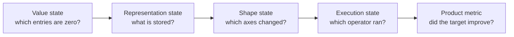

<!-- ai-infra-puzzles-header:start -->
<p align="center">
  
</p>

<h1 align="center">AI Infra Puzzles</h1>

<p align="center">
  <strong>Learn CUDA optimization and LLM inference through hands-on puzzles.</strong>
</p>
<!-- ai-infra-puzzles-header:end -->

# 第 01 课 — 剪枝目标、约束和交付边界

> **谜题：**如果一半的权重变为零，是否实现了移动部署目标？

[← 第 02 章](../README.md) · [项目主页](../../../README_ZH.md) · [执行的笔记本](../../../chapters/02-sparsity-structured-pruning/01-pruning-objectives/lab.ipynb) · [RTX 5090 结果](../../../chapters/02-sparsity-structured-pruning/01-pruning-objectives/artifacts/rtx5090-result.json)

## 为什么这个谜题重要

精简是一种工程变更，可能有多个目标：包大小、驻留内存、第一token或第一帧延迟、稳态吞吐量、能耗和硬件成本。单独的稀疏度百分比并不能回答其中任何一个。因此，第一个交付物是一个目标卡，它将一个模型修订版和工作负载连接到可测量的部署门和回滚条件。

## 阅读结果前，先做出预测

1. 预测一个掩码的50%稀疏矩阵是否会在普通密集矩阵 GEMM 中显著优于其密集副本。
2. 预测窄层如何改变参数，FLOPs，并输出形状。
3. 为一个以延迟驱动的项目编写一个验收门和一个回滚门。

## 1. 从具体的张量和状态开始

具体的对象包括一个密集线性层、一个形状相同的掩码层、一个物理上更窄的层、它们的参数张量、运行时输入形状以及延迟分布。掩码会改变值；物理上更窄的层会改变维度以及向库呈现的密集工作量。

### 三个推理锚点

| # | 本课需要牢记的判断 |
|---:|---|
| 1 | 逻辑零并不意味着指令更稀疏。 |
| 2 | 物理维度的变化在图表和运行时都能看到。 |
| 3 | 接受度量必须与部署目标和工作负载相匹配。 |

## 2. 推导机制

对于密集矩阵乘法，主要工作量大约为 `2MKN`。将 W 的一半替换为零，当操作符仍然调度密集 GEMM 时，M、N 和 K 保持不变。物理上减少输出宽度会改变 N，从而改变算术运算和输出存储。一个有效的目标卡区分逻辑稀疏性、序列化表示、物理形状、kernel路径和端到端度量。这就是为什么参数计数目标和 80 毫秒的首帧 SLO 相关但不可互换的原因。

### 机制概览



### 逐步拆解

1. **命名产品目标。**选择包大小、内存、延迟、吞吐量、能耗或成本，并附上可测量的门限。
2. **定位结构变化。**区分张量中的零值与变化后的tensor shape或存储表示。
3. **定位执行变更。**确认是否调度了较小的密集算子或支持的稀疏算子。
4. **接受原始目标。**候选者只有当质量和命名的部署指标都通过时才成功。

## 3. 把理论转化为实验

**实验：**比较密集的、形状相同的掩码以及物理上更窄的。CUDA 在单一计时协议下的线性层。

| 实验角色 | 固定定义 |
|---|---|
| 基准 | 在原始形状上使用密集的 BF16 线性层 |
| 候选方案 | 50% 同形状掩码和一个50% 物理上更窄的密集层 |
| 保持不变 | GPU, 输入批次, 输入宽度, dtype, warmup, 重复次数, 和随机种子 |
| 测量 | 逻辑稀疏性，物理参数，中位数/95百分位延迟，以及输出宽度 |
| 证据标签 | `pytorch-gpu` |

### 代码导读

实验室从一个基础权重张量构建了所有三个候选者。掩码候选者保持密集形状，而狭窄候选者复制选定行的子集。CUDA 事件仅在warmup后重复前向调用时有效。一起读取这些行显示了哪些优化改变了值，哪些优化改变了暴露给运行时的工作。

## 4. 解读仓库内的 RTX 5090 实测结果

**录制环境：**NVIDIA GeForce RTX 5090 计算能力12.0; PyTorch 2.12.0; CUDA 运行时13.0.

| 实测字段 | 已提交值 |
|---|---:|
| 密集参数 | 4,194,304 |
| 掩码逻辑稀疏性 | 50.00% |
| 窄参数 | 2,097,152 |
| 密集中位数 | 0.020192 ms |
| 掩码中位数 | 0.020112 ms |
| 窄中位数 | 0.019808 ms |

### 这些数字说明了什么

创建的掩码50.0保持了逻辑稀疏性，但保留了4,194,304的密集参数和2048宽的输出。其中位数为0.020112毫秒，而0.020192毫秒。物理候选者将参数减少到2,097,152，输出宽度减少到1024，并测量到0.019808毫秒。这些数字仅回答了这个 CUDAoperator的工作负载；它们不建立移动设备的首帧延迟。

## 5. 解答谜题并做出决策

> 零权重满足稀疏统计；只有支持的表示和实测部署路径满足性能目标。

### 验收与回滚门槛

接受剪枝路径，仅在冻结工作负载下部署指标改善且质量门通过时才接受；否则保留密集修订作为显式回滚。

### 这个结论可能如何失效

一个狭窄的微基准测试仍然可能误导，如果第一帧的设置、预处理、内存分配或移动运行时占据了主导地位。相反，压缩可能在磁盘上压缩得很好，即使它没有加速测量的密集运算符。永远不要将一个目标的成功转移到另一个目标，除非有新的证据。

## 复现

从仓库根目录：

```bash
python3 -m venv .venv
source .venv/bin/activate
pip install torch jupyterlab nbclient nbformat
jupyter lab chapters/02-sparsity-structured-pruning/01-pruning-objectives/lab.ipynb
```

## 扩展实验

添加模型序列化和实际部署运行时，然后分别进行冷启动和稳态测试。在延迟表旁边记录图维度和operator跟踪。

## 证据边界

**证据标签:** [`pytorch-gpu`](../../../chapters/02-sparsity-structured-pruning/README.md#evidence-labels).

## 参考资料

- [PyTorch 采样器文档](https://docs.pytorch.org/docs/stable/profiler.html)
- [深度压缩](https://arxiv.org/abs/1510.00149)
