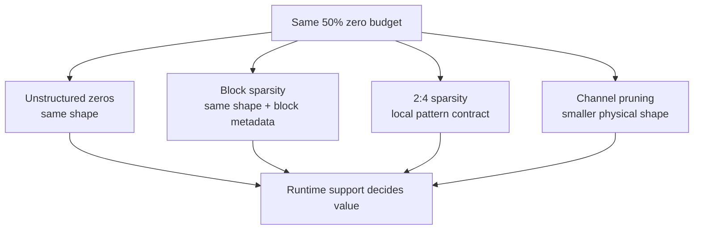

# 课程 02 — 稀疏性粒度谱：权重、通道、块和 N:M

> **谜题：**Can two tensors with exactly50% 零需求是否需要不同的kernel和部署格式？

[← 第 02 章](../README.md) · [项目主页](../../../README_ZH.md) · [执行的笔记本](../../../chapters/02-sparsity-structured-pruning/02-sparsity-granularity/lab.ipynb) · [RTX 5090 结果](../../../chapters/02-sparsity-structured-pruning/02-sparsity-granularity/artifacts/rtx5090-result.json)

## 为什么这个谜题重要

稀疏性隐藏了一个布局合同。无序的零、连续块、删除的通道以及2:4组可以共享相同的全局非零率，同时暴露非常不同的元数据、向量化和库机会。因此，选择粒度是一个算法-运行时的共同决策，而不是在训练后做出的外观选择。

## 阅读结果前，先做出预测

1. 预测哪个50%面罩将通过精确的2:4合规检查。
2. 预测普通密集矩阵乘法是否注意到无序或块零。
3. 选择一个粒度，当自定义kernel被禁止时。

## 1. 从具体的张量和状态开始

实验室使用一个权重矩阵，并推导出四种表示：无结构幅度零、块零、精确 2:4 组以及物理上窄化的矩阵。它跟踪全局稀疏性、2:4 遵守情况、形状以及密集路径延迟。

### 三个推理锚点

| # | 本课需要牢记的判断 |
|---:|---|
| 1 | 非零计数相等并不意味着布局相等。 |
| 2 | N:M合规性是一个局部不变量，而不是全局百分比。 |
| 3 | 通道移除可以使用较小的密集操作符而无需稀疏元数据。 |

## 2. 推导机制

全球速率`1 - nnz/numel`在非零值的位置上进行丢弃。对于2:4稀疏性，沿压缩维度的每连续四组必须包含恰好两个保留值；50%其他位置放置的零值不符合要求。块稀疏性增加了块形状和索引结构。通道剪枝会移除一个完整的轴，并可以在较小的维度上重用密集kernel。运行时值来自将这些合同匹配到一个实现中。

### 机制概览



### 逐步拆解

1. **保持零预算不变。**在同一全局稀疏度下比较布局，粒度是独立变量。
2. **检查本地合约。**块和N:M布局需要局部分组规则，而全局百分比无法表达。
3. **检查物理形状。**通道移除会改变维度，并且可以在较小的尺寸上重用普通的密集核。
4. **匹配目标运行时。**只选择在部署栈中实现了加载器、操作符和受支持形状的格式。

## 3. 把理论转化为实验

**实验：**构建四个50预算表示并比较合规性、形状和普通密集度。CUDA 时间。

| 实验角色 | 固定定义 |
|---|---|
| 基准 | 原始密集矩阵和无结构的50%幅度掩码 |
| 候选方案 | block mask, exact 2:4 mask, and a physically narrowed dense matrix |
| 保持不变 | 源权重，输入批次，dtype，目标零预算，以及计时方法 |
| 测量 | 全局稀疏度，2:4一致性，物理形状，以及中位延迟 |
| 证据标签 | `pytorch-gpu` |

### 代码导读

每个掩码都是显式生成的，以便检查其局部结构。实验故意通过普通的密集 PyTorch 路径对掩码张量进行乘法操作；它不声称会触发cuSPARSELt调度。狭窄的候选者改变了合同的工作量，并为声称kernel看到的不是零计数，而是结构提供了一个有用的控制。

## 4. 解读仓库内的 RTX 5090 实测结果

**录制环境：**NVIDIA GeForce RTX 5090 计算能力12.0; PyTorch 2.12.0; CUDA 运行时13.0.

| 实测字段 | 已提交值 |
|---|---:|
| 无结构稀疏性 | 50.00% |
| 2:4 合规 | 100.00% |
| 密集中位数 | 0.017920 ms |
| 无序中位数 | 0.017888 ms |
| 2:4 密集路径中位数 | 0.018384 ms |
| 窄中位数 | 0.018480 ms |

### 这些数字说明了什么

所有三个掩码都接近 50% 稀疏，但精确的 2:4 遵守性对于无结构掩码而言是 100.0% 对比 37.5%。普通密集路径测量值为 0.017920 ms 对于密集，0.017888 ms 对于无结构，以及 0.018384 ms 对于遵守值。只有狭窄的控制改变了矩阵形状；从这些计时中无法推断出稀疏kernel调度。

## 5. 解答谜题并做出决策

> 稀疏性粒度是优化与执行之间的接口；全局零率只是该接口的一个字段。

### 验收与回滚门槛

在目标运行时支持的模式和模型的准确性敏感性都记录下来之后，再选择粒度。

### 这个结论可能如何失效

2:4兼容的张量在未压缩到所需后端格式、dtype、对齐方式或构建标志时，仍可使用密集策略。通道剪枝的张量在不寻常的宽度下也可能较慢。合规性对于某些路径是必要的，但从来不足以保证速度。

## 复现

从仓库根目录：

```bash
python3 -m venv .venv
source .venv/bin/activate
pip install torch jupyterlab nbclient nbformat
jupyter lab chapters/02-sparsity-structured-pruning/02-sparsity-granularity/lab.ipynb
```

## 扩展实验

将合规矩阵通过 cuSPARSELt 或 TensorRT 运行，捕获其战术日志，并在保持非零预算不变的情况下在对齐边界周围扫过维度。

## 证据边界

**证据标签:** [`pytorch-gpu`](../../../chapters/02-sparsity-structured-pruning/README.md#evidence-labels).

## 参考资料

- [NVIDIA cuSPARSELt 文档](https://docs.nvidia.com/cuda/cusparselt/)
- [PyTorch 剪枝教程](https://docs.pytorch.org/tutorials/intermediate/pruning_tutorial.html)
