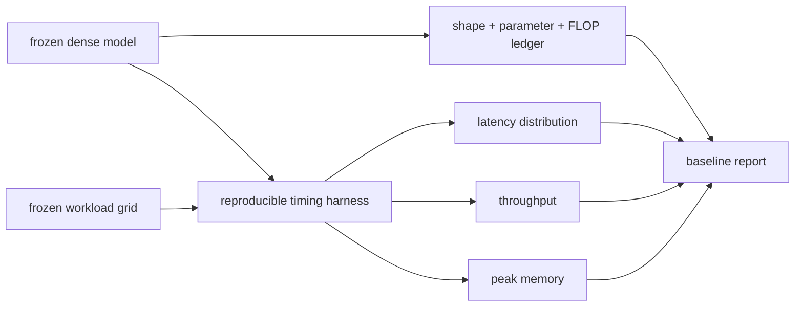

# Lesson 03 — 基线测量：参数，FLOPs，延迟和吞吐量

> **谜题：** 在解读剪枝结果之前，需要哪些基准数字？

[← 第 02 章](../README.md) · [项目主页](../../../README_ZH.md) · [执行的笔记本](../../../chapters/02-sparsity-structured-pruning/03-baseline-measurement/lab.ipynb) · [RTX 5090 结果](../../../chapters/02-sparsity-structured-pruning/03-baseline-measurement/artifacts/rtx5090-result.json)

## 为什么这个谜题重要

没有基准的剪枝百分比不是一个比较。参数和分析FLOPs描述模型结构；中位数和尾部延迟描述一个工作负载在一个堆栈上的表现；吞吐量和峰值内存回答不同的问题。有用的基准在改变模型之前冻结所有这些指标。

## 阅读结果前，先做出预测

1. 预测批次1和批次64的延迟变化和每秒实例数。
2. 解释为什么更低的FLOPs并不保证更低的p95延迟。
3. 列出所有环境字段，以便比较后续的精简运行。

## 1. 从具体的张量和状态开始

具体的系统是一个三层的 CUDA MLP，两个batch size，已知的dtype，固定随机输入，参数计数器，分析的线性-FLOP账本，重复的 CUDA 事件样本，以及峰值分配的内存。

### 三个推理锚点

| # | 本课需要牢记的判断 |
|---:|---|
| 1 | 结构度量对于冻结图是确定性的。 |
| 2 | 延迟和吞吐量取决于工作负载和定时协议。 |
| 3 | 尾部统计需要重复的样本，而不是一个同步调用。 |

## 2. 推导机制

对于线性层，参数是 `in_features × out_features` 加偏置，且前导乘加操作是 `2 × batch × in × out`。这些值是所选形状的确定性属性。延迟受热身、同步和批次影响，吞吐量是 `batch / elapsed_time`，不能从单个请求的计时中推断出来。峰值分配内存必须重置并在相同的测量窗口内采样。

### 机制概览



### 逐步拆解

1. **在测量之前冻结图。**在改变模型之前记录每一层的形状、dtype、参数数量和分析操作数量。
2.**定义工作负载点。**batch size、输入形状、sequence length和并发性属于基础身份，而不是脚注。
3. **测量分布。**warmup堆栈，同步设备工作，保留重复的延迟样本，并重置内存窗口。
4. **保持度量含义分开。**参数和FLOPs描述结构；延迟、吞吐量和峰值内存描述一个执行路径。

## 3. 把理论转化为实验

**实验：**在批次中记录完整的密集MLP基线1和批次64带有结构和运行时度量。

| 实验角色 | 固定定义 |
|---|---|
| 基准 | 相同的密集MLP在批次1时评估 |
| 候选方案 | 相同的密集MLP在批次64时评估 |
| 保持不变 | 模型权重、隐藏层大小、dtype、GPU、warmup、重复次数和输入分布 |
| 测量 | 参数、分析 FLOPs、中位数/95%延迟、吞吐量和峰值分配内存 |
| 证据标签 | `pytorch-gpu` |

### 代码导读

该笔记本直接从模块形状计算结构账本，然后使用相同的定时助手对两个批次进行操作。CUDA 同步发生在事件对之后，结果保留了每个样本，以便可以重新计算p95。批次比较不是候选胜利；它展示了为什么服务工作负载属于基线身份。

## 4. 解读仓库内的 RTX 5090 实测结果

**录制环境：**NVIDIA GeForce RTX 5090 计算能力12.0; PyTorch 2.12.0; CUDA 运行时13.0.

| 实测字段 | 已提交值 |
|---|---:|
| 参数 | 4,459,776 |
| 批量-1 FLOPs | 8,912,896 |
| 批处理-1 中位数 | 0.056288 ms |
| 批量-1 p95 | 0.059221 ms |
| 批处理-64 中位数 | 0.056608 ms |
| 批量64吞吐量 | 1,130,582.3/s |
| 峰值内存 | 41.133 MiB |

### 这些数字说明了什么

冻结的MLP包含4,459,776参数和8,912,896前导线性FLOPs在批次
1. 批次1的中位数/95百分位数为0.056288/0.059221毫秒，而批次64测量了0.056608毫秒和1130582.3实例/秒。因此，批次字段即使参数相同，也改变了性能基准的含义。

## 5. 解答谜题并做出决策

> 参数、FLOPs、延迟、吞吐量和内存是互补的基础字段，不是可互换的压缩评分。

### 验收与回滚门槛

在相同的硬件和软件堆栈上，拒绝任何无法在预定义的容差范围内重现密集基准的剪枝比较。

### 这个结论可能如何失效

热身前的计时可以包括分配器和kernel初始化。不进行同步就将批次除以主机墙时长可能会高估吞吐量。早期操作的峰值内存可能会污染窗口。基准报告应使这些失败模式可审计。

## 复现

从仓库根目录：

```bash
python3 -m venv .venv
source .venv/bin/activate
pip install torch jupyterlab nbclient nbformat
jupyter lab chapters/02-sparsity-structured-pruning/03-baseline-measurement/lab.ipynb
```

## 扩展实验

添加功率、冷启动和operator跟踪，然后在批次/序列网格上重复。当接受度差值接近噪声时，使用置信区间或重复运行。

## 证据边界

**证据标签:** [`pytorch-gpu`](../../../chapters/02-sparsity-structured-pruning/README.md#evidence-labels).

## 参考资料

- [PyTorch 采样器文档](https://docs.pytorch.org/docs/stable/profiler.html)
- [PyTorch 基准工具](https://docs.pytorch.org/docs/stable/benchmark_utils.html)
