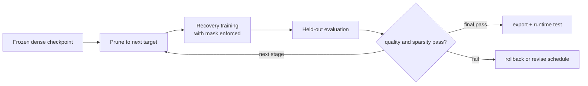

# Lesson 04 — 关闭回路：训练、剪枝、恢复和重新评估

> **谜题：**为什么一个单次70掩码在目标逐渐达到时是否经常失败？

[← 第 02 章](../README.md) · [项目主页](../../../README_ZH.md) · [执行的笔记本](../../../chapters/02-sparsity-structured-pruning/04-prune-finetune-loop/lab.ipynb) · [RTX 5090 结果](../../../chapters/02-sparsity-structured-pruning/04-prune-finetune-loop/artifacts/rtx5090-result.json)

## 为什么这个谜题重要

剪枝改变的是优化问题，而不仅仅是检查点文件。模型必须在剩余权重适应的同时吸收扰动。闭环记录密集状态、剪枝事件、恢复预算、最佳恢复指标、最终掩码以及回滚决策，而不是仅报告目标稀疏度。

## 阅读结果前，先做出预测

1. 预测单次70%剪枝后的即时准确度下降。
2. 预测分阶段剪枝是否会以较小或较大的恢复间隙结束。
3. 命名所需的证据以证明零没有再生。

## 1. 从具体的张量和状态开始

合成但可分离的分类数据集，一个小的MLP，一个密集初始化，一次性和分阶段的剪枝计划，优化器步骤，更新后重新应用掩码，以及保留的准确性构成了实验。

### 三个推理锚点

| # | 本课需要牢记的判断 |
|---:|---|
| 1 | 剪枝是一个状态转换，随后是受约束的优化。 |
| 2 | 口罩必须在恢复期间继续佩戴。 |
| 3 | 一次性和渐进式路径需要相同的初始化和声明预算。 |

## 2. 推导机制

幅度剪枝将权重投影到一个稀疏支持上。一次突然的70%投影可以同时移除几个协同进化路径，并将损失远远移出局部盆地。分阶段的时间表引入了较小的支持变化，随后进行恢复。由于优化器可以重新生长被遮蔽的权重，因此必须在更新后强制执行掩码，除非参数化保证为零。公平性要求两条路径都从相同的密集检查点开始，并消耗声明的恢复预算。

### 机制概览



### 逐步拆解

1. **冻结密集的检查点。
**所有调度从相同的权重、数据顺序和优化器条件开始。
2.**应用已声明的支持更改。**记录在每个事件中删除的权重或结构。
3.**在约束条件下恢复。**更新后重新应用遮罩或结构约束，以防止被剪枝的值悄然再生。
4. **重新评估并决定。**在继续或回滚之前，请检查质量、稀疏性、导出和运行时门控。

## 3. 把理论转化为实验

**实验：**训练一个密集的玩具分类器，然后比较单次学习和分阶段学习。70% 等步长剪枝。

| 实验角色 | 固定定义 |
|---|---|
| 基准 | 一次性的 70% 稀疏度剪枝从冻结的密集检查点 |
| 候选方案 | 三阶段剪枝至同一目标，并进行交错恢复 |
| 保持不变 | 初始检查点，数据集，划分，优化器家族，总恢复步骤，种子，以及最终稀疏度 |
| 测量 | 密集准确度，立即下降，恢复准确度，最终稀疏度，以及最佳恢复步骤 |
| 证据标签 | `pytorch-gpu` |

### 代码导读

实验室训练一个基准模型并在剪枝路径之前克隆它。一个掩码助手选择全局阈值，一个恢复助手在每次优化器步骤后重新应用掩码。两条路径消耗相同的总更新次数；分阶段路径只有在支持被移除时才会改变。这使得时间表成为独立变量。

## 4. 解读仓库内的 RTX 5090 实测结果

**录制环境：**NVIDIA GeForce RTX 5090 计算能力12.0; PyTorch 2.12.0; CUDA 运行时13.0.

| 实测字段 | 已提交值 |
|---|---:|
| 密集准确度 | 93.15% |
| 一次性即时 | 90.48% |
| 一次性恢复 | 91.37% |
| 逐步恢复 | 91.37% |
| 最终稀疏度 | 69.97% |

### 这些数字说明了什么

密集玩具分类器达到了93.2%。一次70%的剪枝立即改变了验证准确率到90.5%，并在36次更新后恢复到91.4%。分阶段路线在相同更新预算下完成于91.4%，并有70.0%的零。这隔离了支持轨迹在一项合成任务上；这不是通用的调度排名。

## 5. 解答谜题并做出决策

> 剪枝结果是一个带有支持约束和恢复预算的轨迹，而不是一次性应用的掩码。

### 验收与回滚门槛

仅在保留的准确率和稀疏性都通过，并且确切的密集检查点仍然可用以回滚时，才接受剪枝后的检查点。

### 这个结论可能如何失效

一个玩具可分离的数据集可以偏向于某种调度，但不预测ImageNet的恢复。比较不等的训练步数、学习率或数据顺序也会使因果声明无效。实验室建立了控制环的机制，而不是一个普遍的调度排名。

## 重现

从仓库根目录：

```bash
python3 -m venv .venv
source .venv/bin/activate
pip install torch jupyterlab nbclient nbformat
jupyter lab chapters/02-sparsity-structured-pruning/04-prune-finetune-loop/lab.ipynb
```

## 扩展实验

使用多个种子和恢复预算重复实验，绘制每次剪枝事件前后的准确率，并添加一个独立控制的蒸馏项作为干预措施。

## 证据边界

**证据标签:** [`pytorch-gpu`](../../../chapters/02-sparsity-structured-pruning/README.md#evidence-labels).

## 参考资料

- [是否剪枝](https://arxiv.org/abs/1710.01878)
- [深度压缩](https://arxiv.org/abs/1510.00149)
