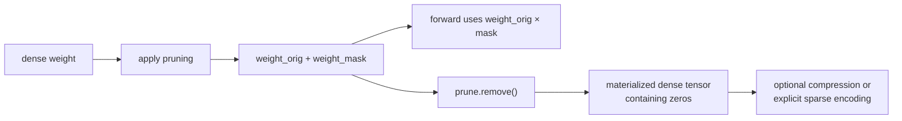

# 第 05 课 — 无结构幅度剪枝，无存储神话

> **谜题：**为什么一个模型可以包含80% 零state_dict变大了吗？

[← 第 02 章](../README.md) · [项目主页](../../../README_ZH.md) · [执行的笔记本](../../../chapters/02-sparsity-structured-pruning/05-unstructured-magnitude-pruning/lab.ipynb) · [RTX 5090 结果](../../../chapters/02-sparsity-structured-pruning/05-unstructured-magnitude-pruning/artifacts/rtx5090-result.json)

## 为什么这个谜题重要

无结构幅度剪枝易于应用，且有助于研究冗余，但 PyTorch 的训练时重参数化存储了原始参数和一个掩码。逻辑零、原始检查点字节、压缩字节和物理稀疏存储是四个不同的量。

## 阅读结果前，先做出预测

1. 预测在 PyTorch 剪枝后立即的state_dict键。
2. 预测原始序列化字节在`prune.remove`后是否缩小。
3. 预测哪种表示方式最有效地被gzip压缩。

## 1. 从具体的张量和状态开始

实验在剪枝前使用了一个线性模块，`l1_unstructured`之后，`prune.remove`之后，以及gzip压缩之后。它检查参数名称、缓冲区、零率、前向等价性和序列化字节计数。

### 三个推理锚点

| # | 本课需要牢记的判断 |
|---:|---|
| 1 | 一个掩码在改变存储格式之前会改变参数化。 |
| 2 | 移除重参数化会将零材料化，但会保留一个密集张量。 |
| 3 | 原始和压缩的检查点大小回答不同的部署问题。 |

## 2. 推导机制

PyTorch 精简操作用 `weight_orig` 替换 `weight`，并通过预钩子计算 `weight_orig × weight_mask`。密集张量仍然占用密集存储，额外的掩码可以使未压缩state_dict 更大。`prune.remove` 实现了掩码权重并删除了重参数化，但没有将其转换为 CSR 或打包非零元素。通用压缩可以利用重复的零字节，这就是为什么压缩文件大小可能会下降而原始张量存储不会下降的原因。

### 机制概览



### 逐步拆解

1. **应用掩码。**PyTorch 存储原始参数和一个掩码，然后通过钩子计算它们的乘积。
2.**审计逻辑稀疏性。**计数零并验证前向行为，而不做存储声明。
3. **移除重参数化。**解码掩码密集张量并确认state_dict键和加载行为。
4. **选择一个实际的存储格式。**压缩、CSR 和后端特定的打包方式回答不同的部署问题。

## 3. 把理论转化为实验

**实验：**追踪一个80% 通过应用、保存、移除和压缩序列化阶段来实现幅度掩码。

| 实验角色 | 固定定义 |
|---|---|
| 基准 | 原始密集线性层state_dict |
| 候选方案 | PyTorch 精简重参数化和材料化掩码权重 |
| 保持不变 | 相同的权重值，剪枝量，序列化器，压缩级别，以及模块形状 |
| 测量 | 零利率，state_dict键，原始字节，gzip字节，以及前向等价性 |
| 证据标签 | `pytorch-gpu` |

### 代码导读

BytesIO将序列化实验保留在内存中，避免路径依赖的伪影。笔记本记录了`remove`前后的关键字，评估模块在转换前后的情况，并压缩相同的字节负载。它不将结果文件称为稀疏运行时格式。

## 4. 解读仓库内的 RTX 5090 实测结果

**录制环境：**NVIDIA GeForce RTX 5090 计算能力12.0; PyTorch 2.12.0; CUDA 运行时13.0.

| 实测字段 | 已提交值 |
|---|---:|
| 逻辑稀疏性 | 80.00% |
| 密集原始字节 | 4,195,945 字节 |
| 剪枝钩子原始字节数 | 8,390,501 字节 |
| 删除原始字节 | 4,195,945 字节 |
| 移除 gzip 字节 | 1,120,583 字节 |
| 移除最大输出漂移 | 0.000000 |

### 这些数字说明了什么

有效重量达到 80.0% 稀疏度。钩子检查点使用了键 ['weight_mask', 'weight_orig'] 并占用 8,390,501 字节，而 `remove` 恢复了一个键 ['weight'] 并占用 4,195,945 字节。Gzip 将实际负载减少到 1,120,583 字节。`remove` 的前向漂移为 0.000e+00，证明了生命周期等价性但不是稀疏存储。

## 5. 解答谜题并做出决策

> 幅度剪枝会产生零；存储压缩和运行时加速需要额外的显式表示。

### 验收与回滚门槛

接受仅当保存的密钥、零速率、加载路径和预期部署表示已明确测试时的掩模生命周期。

### 这个结论可能如何失效

文件系统和zip序列化可能会引入版本相关的开销，因此微小的张量会夸大元数据。Gzip大小不是驻留的GPU 内存，并且与kernel速度无关。声称使用稀疏存储的部署必须识别实际的稀疏编码和加载器。

## 复现

从仓库根目录：

```bash
python3 -m venv .venv
source .venv/bin/activate
pip install torch jupyterlab nbclient nbformat
jupyter lab chapters/02-sparsity-structured-pruning/05-unstructured-magnitude-pruning/lab.ipynb
```

## 扩展实验

将物化矩阵转换为CSR格式，并比较元数据及支持的操作；然后将每个保存的变体加载到一个新的进程中，并在基准测试前验证输出。

## 证据边界

**证据标签:** [`pytorch-gpu`](../../../chapters/02-sparsity-structured-pruning/README.md#evidence-labels).

## 参考资料

- [PyTorch 剪枝教程](https://docs.pytorch.org/tutorials/intermediate/pruning_tutorial.html)
- [深度压缩](https://arxiv.org/abs/1510.00149)
