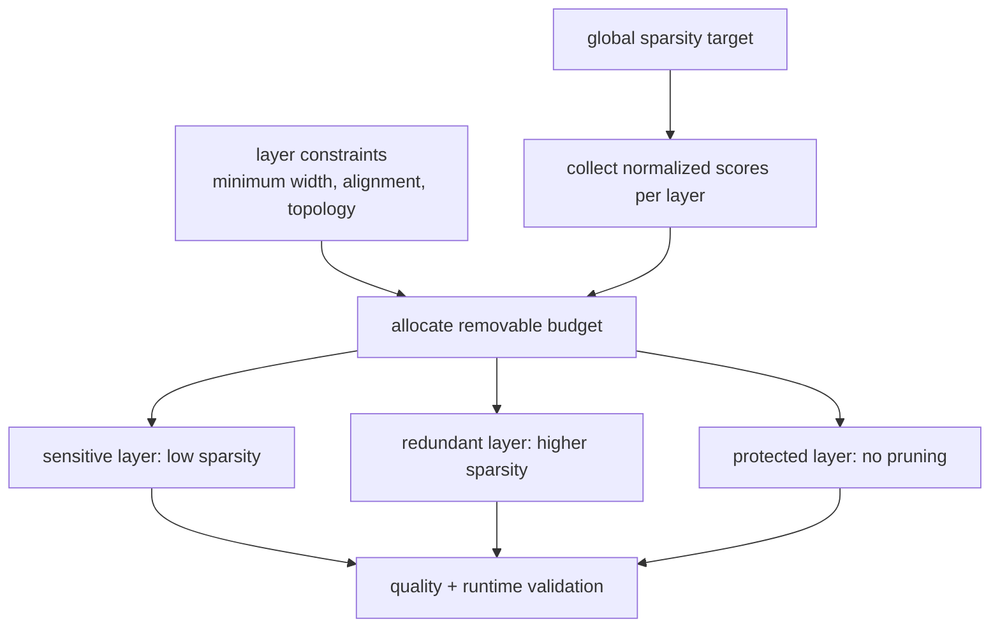

<!-- ai-infra-puzzles-header:start -->
<p align="center">
  
</p>

<h1 align="center">AI Infra Puzzles</h1>

<p align="center">
  <strong>Learn CUDA optimization and LLM inference through hands-on puzzles.</strong>
</p>
<!-- ai-infra-puzzles-header:end -->

# Lesson 06 — 全局稀疏性和层间预算分配

> **谜题：**Should a fixed50% 全局预算：每层按预算剪枝50%?

[← 第 02 章](../README.md) · [项目主页](../../../README_ZH.md) · [执行的笔记本](../../../chapters/02-sparsity-structured-pruning/06-global-layerwise-budgets/lab.ipynb) · [RTX 5090 结果](../../../chapters/02-sparsity-structured-pruning/06-global-layerwise-budgets/artifacts/rtx5090-result.json)

## 为什么这个谜题重要

层转换不同的信号并具有不同的冗余度。全局阈值在权重小的地方花费零，而每层均匀的目标忽略敏感性。预算表应保留总约束，并显示为什么保护或激进的分配被分配。

## 阅读结果前，先做出预测

1. 预测哪一层将通过校准扫描得到保护。
2. 预测均匀和全局幅度掩码是否使用相同的每层速率。
3. 命名用于公平性的质量度量和总预算不变量。

## 1. 从具体的张量和状态开始

三层MLP、校准输入、一个全局幅度掩码、一个均匀的50%掩码和敏感性感知分配在相同的总非零计数下使用留出输出重构进行比较。

### 三个推理锚点

| # | 本课需要牢记的判断 |
|---:|---|
| 1 | 全局稀疏性是对张量的约束，而不是统一的策略。 |
| 2 | 层敏感性必须在代表性的输入上进行测量。 |
| 3 | 预算比较需要相同的总非零数。 |

## 2. 推导机制

对于网络输出`f(x; W)`，一层的剪枝成本不仅取决于其权重直方图，还取决于下游放大和输入分布。一次一阶敏感性扫描可以一次掩蔽一层中的一个小部分，并测量输出变化。然后可以反向分配预算以解决全局非零约束。实验保持总零数不变，因此质量差异来自分配而不是额外容量。

### 机制概览



### 逐步拆解

1. **选择一个全球目标。**总零预算是对整个模型的约束，而不是要求每一层达到相同的速率。
2. **归一化可比分数。**在统一的校准协议下收集重要性值，并在全局排名前考虑层的缩放。
3. **保护受限层。**在分配其余资源之前，请先应用最小宽度、可除性、第一/最后一层、残差以及硬件对齐规则。
4. **验证分配。**将结果层预算与均匀剪枝在质量、物理结构和目标运行时进行比较。

## 3. 把理论转化为实验

**实验：**比较统一、全局幅度和敏感性感知掩码在同一50% 全局零预算。

| 实验角色 | 固定定义 |
|---|---|
| 基准 | 均匀50%幅度剪枝在每一层 |
| 候选方案 | 全局阈值化和敏感度感知的逐层分配 |
| 保持不变 | 密集权重，校准/保留张量，全局零计数，dtype，和种子 |
| 测量 | 逐层稀疏性、总稀疏性、保留的 RMSE、余弦相似度和校准敏感性 |
| 证据标签 | `numerical-model` |

### 代码导读

该笔记本首先单独扰动每一层以获得一个小的校准敏感度分数。然后它构建三个克隆模型，并在测量留出输出误差之前检查确切的总稀疏度。分配启发式故意简单；证据目标是预算原则，而不是最优剪枝的主张。

## 4. 解读仓库内的 RTX 5090 实测结果

**录制环境：**NVIDIA GeForce RTX 5090 计算能力12.0; PyTorch 2.12.0; CUDA 运行时13.0.

| 实测字段 | 已提交值 |
|---|---:|
| 统一 RMSE | 0.067273 |
| 全球 RMSE | 0.062327 |
| 意识到 RMSE | 0.061447 |
| 总稀疏度 | 50.00% |
| 最敏感层 | 4的权重 |

### 这些数字说明了什么

所有候选者使用了大约50.0% 全局稀疏性。保留测试集 RMSE 是0.067273为了统一，0.062327对于全球幅度，和0.061447对于敏感性调整后的分配。校准扫描确定了`4.weight`作为最敏感的。这验证了预算实验的有效性，而非启发式算法的最优性。

## 5. 解答谜题并做出决策

> 全球目标需要一个可测量的分配规则；均匀层速率只是一个候选方案。

### 验收与回滚门槛

只有在总约束完全准确且在保留数据或多个校准切片上排名保持稳定时，才接受层预算。

### 这个结论可能如何失效

使用预留集分配预算会泄露评估。非常小的校准批次会使灵敏度噪声较大，且相等的零计数不能确保各层的元数据或运行时成本相等。硬件感知的成本可能需要不同于参数的预算单位。

## 复现

从仓库根目录：

```bash
python3 -m venv .venv
source .venv/bin/activate
pip install torch jupyterlab nbclient nbformat
jupyter lab chapters/02-sparsity-structured-pruning/06-global-layerwise-budgets/lab.ipynb
```

## 扩展实验

重复跨域扫描，优化延迟加权通道单元预算，并测试在恢复训练后受保护的早期层是否仍然受保护。

## 证据边界

**证据标签:** [`numerical-model`](../../../chapters/02-sparsity-structured-pruning/README.md#evidence-labels).

## 参考资料

- [是否剪枝](https://arxiv.org/abs/1710.01878)
- [PyTorch 剪枝教程](https://docs.pytorch.org/tutorials/intermediate/pruning_tutorial.html)
