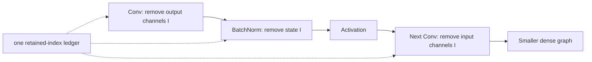

# Lesson 07 — Filter Pruning: 使卷积物理上变窄

> **谜题：**为什么清零滤波器与删除它们不同？

[← 第 02 章](../README.md) · [项目主页](../../../README_ZH.md) · [执行的笔记本](../../../chapters/02-sparsity-structured-pruning/07-filter-pruning/lab.ipynb) · [RTX 5090 结果](../../../chapters/02-sparsity-structured-pruning/07-filter-pruning/artifacts/rtx5090-result.json)

## 为什么这个谜题重要

一个密集卷积库接收输入/输出通道计数、核大小、步长和dtype。将完全的滤波器设置为零保留这些维度。物理滤波器剪枝构建一个较小的卷积，并将选择的通道传递到下一层，允许普通密集核执行更少的工作。

## 阅读结果前，先做出预测

1. 预测被遮蔽和物理剪枝块的输出形状。
2. 预测哪个候选方案能减少分析卷积工作。
3. 确定必须应用于第二个卷积的确切切片。

## 1. 从具体的张量和状态开始

两个连续的卷积形成具体的依赖关系。一个候选掩码遮挡了第一层输出滤波器的一半；另一个则物理上复制了保留的滤波器和第二层卷积的匹配输入通道切片。

### 三个推理锚点

| # | 本课需要牢记的判断 |
|---:|---|
| 1 | 滤波零值保留密集卷积描述符。 |
| 2 | 物理剪枝改变两个耦合通道维度。 |
| 3 | 在提出延迟声明之前，应先进行等价性检查。 |

## 2. 推导机制

对于卷积操作，领先的工作量与 `N × Hout × Wout × Cout × Cin × Kh × Kw` 成正比。一个零化的滤波器在操作描述符中不会改变 Cout。删除它会将第一层的 Cout 和下一层的 Cin 在依赖关系传播时减半。在进行计时之前，复制相同的保留权重可以提供掩码函数和窄化函数之间的等价性检查。

### 机制概览



### 逐步拆解

1. **排序输出通道。**一个滤波器评分选择完整的输出通道，而不是孤立的标量权重。
2. **切割生产者。**移除匹配的Conv输出滤波器及其偏置项。
3.**传播索引集。**切片归一化状态和每个消费层对应的输入通道。
4. **重建并基准测试。**在比较物理上更窄的密集卷积之前，请验证图的形状和输出。

## 3. 把理论转化为实验

**实验：**遮罩并物理上移除相同的卷积滤波器，然后比较等价性、参数。FLOPs, 和 CUDA 延迟。

| 实验角色 | 固定定义 |
|---|---|
| 基准 | 相同形状滤波器-掩码双卷积块 |
| 候选方案 | 物理上窄化的块，带有传播的第二层输入通道 |
| 保持不变 | 输入张量，保留的过滤器索引，复制的权重，批次，空间形状，dtype，以及时间测量。 |
| 测量 | 输出最大误差、参数、分析 FLOPs、中位数延迟以及信道形状。 |
| 证据标签 | `pytorch-gpu` |

### 代码导读

物理模型使用较小的模块尺寸重建，并从掩码模型中接收精确的重量切片。将保留的第一层通道汇总到第二层时不进行近似处理：匹配输入通道轴进行切片。接近零的输出漂移验证了依赖性，然后解释速度和参数数量。

## 4. 解读仓库内的 RTX 5090 实测结果

**录制环境：**NVIDIA GeForce RTX 5090 计算能力12.0; PyTorch 2.12.0; CUDA 运行时13.0.

| 实测字段 | 已提交值 |
|---|---:|
| 掩码参数 | 11,520 |
| 窄参数 | 5,760 |
| FLOP 减少 | 50.00% |
| 最大等价误差 | 0.001953 |
| 掩码中位数 | 0.056320 ms |
| 窄中位数 | 0.044656 ms |

### 这些数字说明了什么

保留 11,520 参数，物理传播将块减少到 5,760，并由 50.0% 的分析卷积工作。复制的窄块与 1.953e-03 的掩码控制匹配。在该形状上，中位延迟从 0.056320 ms 变为 0.044656 ms。

## 5. 解答谜题并做出决策

> 滤波器剪枝仅在通道维度物理重建并传播后，加速普通密集卷积。

### 验收与回滚门槛

仅在所有消费者形状更新、功能漂移得到理解，并且在代表性的空间大小下目标运行时性能提升时，才接受结构过滤器剪枝。

### 这个结论可能如何失效

独立选择相邻卷积中的通道会破坏等价性。BatchNorm、残差连接、分组和拼接引入了在这一两层探针中不存在的额外依赖关系。尽管通道数量不那么理想，但仍然可能降低kernel效率。FLOPs.

## 复现

从仓库根目录：

```bash
python3 -m venv .venv
source .venv/bin/activate
pip install torch jupyterlab nbclient nbformat
jupyter lab chapters/02-sparsity-structured-pruning/07-filter-pruning/lab.ipynb
```

## 扩展实验

插入BatchNorm和残差分支，然后使用依赖图枚举所有耦合切片。扫描与目标卷积后端对齐和不匹配的保留宽度。

## 证据边界

**证据标签:** [`pytorch-gpu`](../../../chapters/02-sparsity-structured-pruning/README.md#evidence-labels).

## 参考资料

- [DepGraph 论文](https://arxiv.org/abs/2301.12900)
- [Torch-Pruning 参考实现](https://github.com/VainF/Torch-Pruning)
