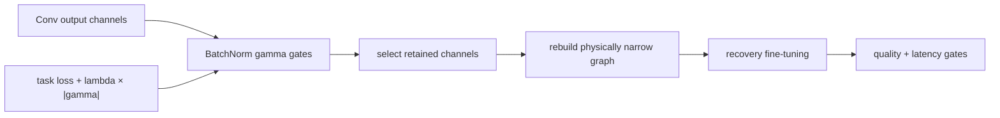

<!-- ai-infra-puzzles-header:start -->
<p align="center">
  
</p>

<h1 align="center">AI Infra Puzzles</h1>

<p align="center">
  <strong>Learn CUDA optimization and LLM inference through hands-on puzzles.</strong>
</p>
<!-- ai-infra-puzzles-header:end -->

# Lesson 08 — 批量归一化缩放因子和网络瘦身

> **谜题：** 当一个小型的BatchNorm gamma成为可移除通道而不是仅仅是一个小的乘数时，它是什么时候？

[← 第 02 章](../README.md) · [项目主页](../../../README_ZH.md) · [执行的笔记本](../../../chapters/02-sparsity-structured-pruning/08-network-slimming/lab.ipynb) · [RTX 5090 结果](../../../chapters/02-sparsity-structured-pruning/08-network-slimming/artifacts/rtx5090-result.json)

## 为什么这个谜题重要

网络瘦身通过正则化BatchNorm缩放因子来创建训练时的排名信号。缩放本身不会单独删除一个通道。部署仍然需要选择索引、重建生成的卷积、分割BatchNorm状态，并将相同的索引传播到每个消费者。

## 阅读结果前，先做出预测

1. 预测当beta不为零时，仅仅将gamma置零是否与物理删除一致。
2. 列出所有必须被切片的BatchNorm张量。
3. 预测适当掩蔽的控制组与缩小模型之间的输出漂移。

## 1. 从具体的张量和状态开始

一个Conv-BN-ReLU-Conv块提供卷积滤镜、BatchNorm的gamma/beta/运行统计、保留的通道索引、一个gamma掩码控制以及一个物理上窄化的副本。

### 三个推理锚点

| # | 本课需要牢记的判断 |
|---:|---|
| 1 | Gamma 是一个重要性信号，而不是结构删除。 |
| 2 | 批归一化、affine 和运行状态张量共享通道轴。 |
| 3 | 消费者权重必须接收相同的保留索引。 |

## 2. 推导机制

BatchNorm 输出每个通道的值是 `y_c = gamma_c (x_c - mu_c)/sqrt(var_c+eps) + beta_c`。一个小的 gamma 可以抑制归一化变异，但 beta 仍然可以贡献一个常数，而下游权重可以放大它。因此，通过 `|gamma|` 排序是一种在稀疏性正则化下学习到的剪枝启发式方法。物理移除仅在所选通道及其所有耦合参数被一致地切片后，并且结果函数被评估时才有效。

### 机制概览



### 逐步拆解

1. **训练通道门。**批量归一化 gamma 值在网络仍以原始物理形状训练的同时，会受到稀疏性惩罚。
2.**在收敛后对通道进行排序。**使用学习到的具有最小宽度和依赖约束的门幅值，而不是任意的训练中期快照。
3.**重建窄网络。**使用一个保留索引账本切分卷积权重、BatchNorm状态、残差伙伴和消费者。
4.**恢复并比较。**微调物理候选方案，然后在新形状下测试质量与密集kernel延迟。

## 3. 把理论转化为实验

**实验：**按伽马值对通道进行排序，创建一个保持语义的掩码控制，并将块重建为一半宽度。

| 实验角色 | 固定定义 |
|---|---|
| 基准 | gamma-掩码全宽卷积-批量归一化-ReLU-卷积块 |
| 候选方案 | 使用相同的保留伽马排名通道物理上缩小了块。 |
| 保持不变 | 输入，保留索引，所有复制的Conv/BN参数，评估模式，dtype，以及计时协议 |
| 测量 | 伽马阈值，保留通道，输出最大误差，参数，以及中位数延迟 |
| 证据标签 | `numerical-model` |

### 代码导读

该笔记本在复制保留的卷积滤波器、BN状态和第二层输入切片之前，将删除的通道设置为控制中的BN后中立值。评估模式冻结运行统计。等价性检查将结构账目与是否伽马排名留出任务质量的单独问题隔离。

## 4. 解读仓库内的 RTX 5090 实测结果

**录制环境：**NVIDIA GeForce RTX 5090 计算能力12.0; PyTorch 2.12.0; CUDA 运行时13.0.

| 实测字段 | 已提交值 |
|---|---:|
| 保留通道 | 12 |
| 伽马阈值 | 0.635652 |
| 输出最大误差 | 0.000244 |
| 全参数 | 4,368 |
| 窄参数 | 2,184 |
| 窄中位数 | 0.044560 ms |

### 这些数字说明了什么

伽马排名保留了12通道，其绝对阈值为0.635652。在卷积切片和每个BatchNorm状态张量之后，窄输出与2.438e-04中的伽马掩码控制相匹配。参数从4,368下降到2,184；在实际任务上的排名质量尚未测量。

## 5. 解答谜题并做出决策

> 网络瘦身将批量归一化缩放转换为排名机制；部署收益仅在一致的结构移除后开始。

### 验收与回滚门槛

只有在保留质量、耦合切片、物理宽度和运行时证据都通过后，才能接受排名。

### 这个结论可能如何失效

小的伽马值在邻近权重上可能具有尺度不变性，而非零的贝塔值会打破朴素的零伽马推理。在没有预期的L1压力下进行训练可能会产生无信息的排名。残差和拼接消费者需要超出这个局部块的依赖图。

## 复现

从仓库根目录：

```bash
python3 -m venv .venv
source .venv/bin/activate
pip install torch jupyterlab nbclient nbformat
jupyter lab chapters/02-sparsity-structured-pruning/08-network-slimming/lab.ipynb
```

## 扩展实验

使用显式的稀疏性惩罚训练伽马值，比较不同种子下的排名，并通过残差模型和图级剪枝工具传播选定的通道。

## 证据边界

**证据标签:** [`numerical-model`](../../../chapters/02-sparsity-structured-pruning/README.md#evidence-labels).

## 参考资料

- [网络瘦身](https://arxiv.org/abs/1708.06519)
- [DepGraph 论文](https://arxiv.org/abs/2301.12900)
