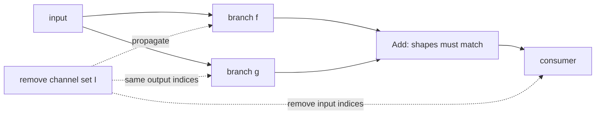

# Lesson 09 — 残差、拼接和依赖图剪枝

> **谜题：** 当一个残差分支失去通道时，哪些张量必须一起改变？

[← 第 02 章](../README.md) · [项目主页](../../../README_ZH.md) · [执行的笔记本](../../../chapters/02-sparsity-structured-pruning/09-dependency-graph-pruning/lab.ipynb) · [RTX 5090 结果](../../../chapters/02-sparsity-structured-pruning/09-dependency-graph-pruning/artifacts/rtx5090-result.json)

## 为什么这个谜题重要

结构化剪枝在合并时会变成一个图问题。加法要求形状相等；连接会改变下游通道偏移；归一化和投影保持相同的通道语义。因此，一个局部低重要性决定会扩展成一个耦合的剪枝组。

## 阅读结果前，先做出预测

1. 预测仅剪枝一个加法分支时产生的异常。
2. 列出与一个输出通道删除相关的张量。
3. 解释 concat 传播与加法传播有何不同。

## 1. 从具体的张量和状态开始

一个带有Conv-BN路径的双分支残差块，包含加法和消费者卷积。实验室记录了单独剪枝一个分支时的失败，然后构建了一个同步的更窄的组。

### 三个推理锚点

| # | 本课需要牢记的判断 |
|---:|---|
| 1 | 合并语义确定依赖规则。 |
| 2 | 根通道决策通过生产者、归一化和消费者传播。 |
| 3 | 一个有效的group在突变前必须检查其形状和过度剪枝。 |

## 2. 推导机制

对于`z = f(x) + g(x)`，两个分支输出必须具有相同的形状。从f中移除输出索引I需要在g中进行兼容的转换，并改变消费者的输入维度。使用拼接，保留的索引映射是偏移并集而不是等式。依赖图编码这些传播规则，使得一个根操作可以产生一个完整的组，并且可以在移除所有通道之前被拒绝。

### 机制概览



### 逐步拆解

1. **选择一个根剪枝操作。**从一个生产者和一个具体的保留通道索引集开始。
2. **遵循合并语义。**加法需要对齐的分支输出；连接需要考虑偏移的索引映射。
3. **更新耦合状态。**通过卷积、批量归一化、残差分支以及下游消费者作为一个整体进行传播。
4. **在突变前先拒绝无效组。**检查维度性、可分性以及过度剪枝约束，然后执行前向形状审计。

## 3. 把理论转化为实验**实验：**触发并捕获未同步的残差形状失败，然后构建同步的窄残差块。

| 实验角色 | 固定定义 |
|---|---|
| 基准 | 一个无效的一分支通道删除被诊断出来 |
| 候选方案 | 跨两个分支、BatchNorm状态和消费者的一次联合删除 |
| 保持不变 | 源代码块，保留索引，输入，评估模式，dtype，以及复制的参数 |
| 测量 | 捕获不匹配，同步输出形状，输出漂移，参数，和延迟 |
| 证据标签 | `pytorch-gpu` |

### 代码导读

无效路径被包裹在try/except中，这样笔记本仍然可以成功执行，同时保留错误消息作为证据。有效的路径重建两个分支，保留相同的索引，并对消费者输入通道进行切片。这是一个手动的依赖组微型版本。

## 4. 解读仓库内的 RTX 5090 实测结果

**录制环境：**NVIDIA GeForce RTX 5090 计算能力12.0; PyTorch 2.12.0; CUDA 运行时13.0.

| 实测字段 | 已提交值 |
|---|---:|
| 捕获到不匹配 | 是的 |
| 保留通道 | 8 |
| 有效的输出通道 | 12 |
| 有效最大误差 | 0.000460 |
| 全参数 | 1,536 |
| 窄参数 | 768 |

### 这些数字说明了什么

只剪枝一个加法分支导致捕捉形状失败：`The size of tensor a (8) must match the size of tensor b (16) at non-singleton dimension 1`。同步组在两个分支、归一化状态和消费者中保留了8通道，生成了12输出通道，并产生了4.603e-04控制漂移。

## 5. 解答谜题并做出决策

> 图合并时的结构剪枝是一个耦合的组操作，绝不是一个孤立的张量切片。

### 验收与回滚门槛

接受结构突变仅当图级前向检查、组大小保护和下游形状审计通过时。

### 这个结论可能如何失效

匹配形状并不能证明语义正确性：不同的分支可能需要协调的重要性分数、分组卷积的可除性，或静态属性更新。动态控制流也可以逃脱基于跟踪的依赖关系图。

## 复现

从仓库根目录：

```bash
python3 -m venv .venv
source .venv/bin/activate
pip install torch jupyterlab nbclient nbformat
jupyter lab chapters/02-sparsity-structured-pruning/09-dependency-graph-pruning/lab.ipynb
```

## 扩展实验

安装 Torch-Pruning，打印等效块的组详情，与手动账簿进行比较，并添加一个 concat 分支以测试偏移映射。

## 证据边界

**证据标签:** [`pytorch-gpu`](../../../chapters/02-sparsity-structured-pruning/README.md#evidence-labels).

## 参考资料

- [DepGraph 论文](https://arxiv.org/abs/2301.12900)
- [Torch-Pruning 参考实现](https://github.com/VainF/Torch-Pruning)
