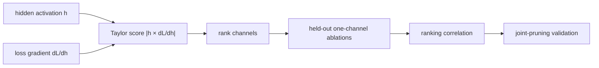

# 第 10 节 — 泰勒重要性：按损失变化排名通道

> **谜题：** 一个小范数通道是否仍然会对损失产生重大影响？

[← 第 02 章](../README.md) · [项目主页](../../../README_ZH.md) · [执行的笔记本](../../../chapters/02-sparsity-structured-pruning/10-taylor-importance/lab.ipynb) · [RTX 5090 结果](../../../chapters/02-sparsity-structured-pruning/10-taylor-importance/artifacts/rtx5090-result.json)

## 为什么这个谜题重要

Magnitude 仅看到参数，但看不到数据或目标。Taylor 剪枝使用激活函数及其损失梯度的局部乘积来估计移除一个通道会如何改变损失。这种近似足够便宜，可以在不为每个结构进行完整重训的情况下对许多结构进行排名。

## 阅读结果前，先做出预测

1. 预测L1和Taylor是否产生相同的排名。
2. 写出零化一个激活通道的一阶项。
3. 选择验证每个排名与实际消融结果相关的相关性。

## 1. 从具体的张量和状态开始

一个小分类器暴露一个隐藏激活张量，其保留的梯度，每通道的L1权重得分，泰勒得分，以及从通道消融中实际增加的保留损失。

### 三个推理锚点

| # | 本课需要牢记的判断 |
|---:|---|
| 1 | 泰勒得分是基于客观数据的。 |
| 2 | 消融损失变化是重要性排名的验证目标。 |
| 3 | 一阶得分忽略交互作用和分布偏移。 |

## 2. 推导机制

如果将通道激活 `h_c` 替换为零，一阶展开将得到 `Delta L_c ≈ |∂L/∂h_c · (-h_c)|`，跨样本和位置聚合。权重 L1 代替排名 `sum |W_c|`。泰勒公式包含当前数据和损失，但保持局部性：通道之间的相互作用和高阶曲率被忽略。与实际单通道消融的关联是解决这个玩具问题的直接诊断。

### 机制概览



### 逐步拆解

1. **捕获相关的激活。**保留隐藏通道 h 及其在代表性校准损失下的梯度。
2. **计算一阶得分。**将每个通道的 h 乘以 dL/dh 的大小进行聚合，并明确说明符号政策。
3. **验证排名。**在保留数据上逐个消除通道，并将预测的重要性与实际损失增加进行比较。
4. **重新检查联合剪枝后的结果。**当多个相互作用的通道一起被移除时，独立的一阶分数可能会失败。

## 3. 把理论转化为实验**实验：**比较L1和泰勒通道排名，通过在保留批次上进行详尽的一通道损失消融实验。

| 实验角色 | 固定定义 |
|---|---|
| 基准 | 按出站/关联权重的L1模量对通道进行排名 |
| 候选方案 | 按绝对激活梯度乘积对通道进行排名 |
| 保持不变 | 训练好的玩具分类器，校准批次，保留的消融批次，通道集，以及损失 |
| 测量 | 斯皮尔曼相关性与实际损失增加、排名靠前的渠道以及损失差值 |
| 证据标签 | `numerical-model` |

### 代码导读

该笔记本保留隐藏激活的梯度，执行一次校准反向传播，并按通道聚合`|h × grad|`。然后，它在保留的输入上进行受控消融，以构建目标排名。比较措施衡量排名一致性，而不是声称有一个生产级的剪枝算法。

## 4. 解读仓库内的 RTX 5090 实测结果

**录制环境：**NVIDIA GeForce RTX 5090 计算能力12.0; PyTorch 2.12.0; CUDA 运行时13.0.

| 实测字段 | 已提交值 |
|---|---:|
| L1 Spearman | 0.867133 |
| 泰勒·斯皮尔曼 | 0.895105 |
| L1顶级通道 | 5 |
| 泰勒顶部通道 | 5 |
| 实际顶级通道 | 7 |
| 基准损失 | 0.126262 |

### 这些数字说明了什么

与全面的留出法消融相比，L1 排序使用了 Spearman 0.8671，而 Taylor 使用了 0.8951。它们的顶级通道是 5 和 5，而最大的实际损失增加来自通道 7。结果测试了一个本地排序在一个校准批次上。

## 5. 解答谜题并做出决策

> 泰勒重要性估计局部损失敏感性；其值由保留的消融协议确定，而不仅仅由公式本身确定。

### 验收与回滚门槛

接受一个重要性度量，仅当其在代表性批次中排名稳定，并在剪枝后改善了声明的质量成本目标时。

### 这个结论可能如何失效

一个校准批次可以反转分数，负值和正值的一阶项根据聚合情况相互抵消，同时移除无效值会无效独立通道估计。微小网络上的相关性不能建立ImageNet行为。

## 复现

从仓库根目录：

```bash
python3 -m venv .venv
source .venv/bin/activate
pip install torch jupyterlab nbclient nbformat
jupyter lab chapters/02-sparsity-structured-pruning/10-taylor-importance/lab.ipynb
```

## 扩展实验

在批次间重复，比较有符号、绝对值和二阶近似值，然后联合剪枝几个通道，并测量稀疏性如何影响排名质量。

## 证据边界

**证据标签:** [`numerical-model`](../../../chapters/02-sparsity-structured-pruning/README.md#evidence-labels).

## 参考资料

- [剪枝卷积神经网络以实现资源高效推理](https://arxiv.org/abs/1611.06440)
- [PyTorch 剪枝教程](https://docs.pytorch.org/tutorials/intermediate/pruning_tutorial.html)
