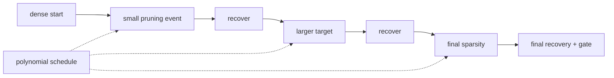

# Lesson 11 — 渐进式剪枝计划与恢复训练

> **谜题：** 多项式稀疏性调度控制了什么，而最终目标没有控制？

[← 第 02 章](../README.md) · [项目主页](../../../README_ZH.md) · [执行的笔记本](../../../chapters/02-sparsity-structured-pruning/11-gradual-pruning-schedule/lab.ipynb) · [RTX 5090 结果](../../../chapters/02-sparsity-structured-pruning/11-gradual-pruning-schedule/artifacts/rtx5090-result.json)

## 为什么这个谜题重要

目标稀疏度说明了训练何时结束；时间表说明了可行参数集如何突然变化。在固定15%恢复预算下，剪枝事件与优化步骤竞争，因此开始步骤、结束步骤、更新频率和学习率轨迹成为结果的一部分。

## 阅读结果前，先做出预测

1. 在立方计划中途计算目标稀疏度。
2. 预测哪条路线具有最大的即时损失冲击。
3. 命名所需的调度字段以重现恢复轨迹。

## 1. 从具体的张量和状态开始

该实验使用一个冻结的密集分类器、即时目标掩码、多项式目标函数、周期性的幅度掩码更新、相同的恢复更新以及保留的准确性轨迹。

### 三个推理锚点

| # | 本课需要牢记的判断 |
|---:|---|
| 1 | 最终的稀疏性无法识别支持轨迹。 |
| 2 | 剪枝频率与交易适应时间与排名刷新之间的关系。 |
| 3 | 学习率和稀疏性调度相互影响。 |

## 2. 推导机制

一个常见的立方计划是在`s(t)=s_f+(s_i-s_f)(1-(t-t0)/(t1-t0))^3`剪枝窗口内。早期更新会移除少量权重，而随着目标接近，后续变化会逐渐减少。该计划不保证恢复；它限制了支持冲击的大小和时间。重新应用新排名的掩码可以移除之前有用的权重，而固定掩码只会训练幸存者。这些政策选择必须冻结。

### 机制概览



### 逐步拆解

1. **定义剪枝窗口。**开始步骤、结束步骤、更新频率和最终目标是实验的一部分。
2. **计算每个中间目标。**多项式调度控制每个支持冲击的大小，而不仅仅是最终的稀疏度。
3.**更新并强制执行掩码。**仅在声明的事件中重新排序，并防止后续优化步骤重新生长移除的权重。
4. **读取质量作为轨迹。**在剪枝前、剪枝后以及恢复后立即比较准确性——不仅在最后。

## 3. 把理论转化为实验

**实验：**在相同的初始化和相同的优化器步长预算下，比较单次和三次渐进的调度方案。

| 实验角色 | 固定定义 |
|---|---|
| 基准 | 一次跳跃到 80% 稀疏度在第一次恢复步骤 |
| 候选方案 | 从0%到80%在相同的恢复窗口内进行三次方更新。 |
| 保持不变 | 密集检查点，数据顺序，优化器，学习率，总步数，目标速率，以及掩码规则 |
| 测量 | 目标/实际稀疏性轨迹，即时损失，最终准确率，以及最佳准确率 |
| 证据标签 | `pytorch-gpu` |

### 代码导读

该笔记本在每次调度更新时记录一行，而不仅仅是端点。两条路线都克隆相同的基线并执行相同的优化器步骤。掩码刷新和重新应用是显式的，这使得区分调度失败和无声的权重再生成为可能。

## 4. 解读仓库内的 RTX 5090 实测结果

**录制环境：**NVIDIA GeForce RTX 5090 计算能力12.0; PyTorch 2.12.0; CUDA 运行时13.0.

| 实测字段 | 已提交值 |
|---|---:|
| 密集准确度 | 88.67% |
| 一次训练最终准确率 | 72.67% |
| 渐进最终准确度 | 74.00% |
| 目标稀疏度 | 80.00% |
| 更新时间表 | 11 |

### 这些数字说明了什么

两条路径都使用了40优化器更新，并在接近80%稀疏度时完成。一次性验证准确率结束于72.7%，而立方路径在11记录了掩码更新后结束于74.0%。保留的轨迹显示了每个支持冲击发生的时间。

## 5. 解答谜题并做出决策

> 渐进式剪枝控制支持变化的顺序；其终点不足以重现或判断恢复。

### 验收与回滚门槛

接受日程安排时，其完整轨迹、最终支持、质量恢复和培训预算必须记录并符合目标卡。

### 这个结论可能如何失效

时间表看起来更好，仅仅是因为它在后期剪枝得更少，并且在密集模型附近花费了更多的步骤。不整合实际的稀疏性轨迹就比较端点，隐藏了这种优势。少量合成数据也使得恢复异常便宜。

## 复现

从仓库根目录：

```bash
python3 -m venv .venv
source .venv/bin/activate
pip install torch jupyterlab nbclient nbformat
jupyter lab chapters/02-sparsity-structured-pruning/11-gradual-pruning-schedule/lab.ipynb
```

## 扩展实验

通过稀疏-时间曲线下的区域匹配候选者，调整更新频率和学习率重启，并在下游任务指标上重复，而非仅凭玩具准确率。

## 证据边界

**证据标签:** [`pytorch-gpu`](../../../chapters/02-sparsity-structured-pruning/README.md#evidence-labels).

## 参考资料

- [是否剪枝](https://arxiv.org/abs/1710.01878)
- [TensorFlow 模型优化剪枝指南](https://www.tensorflow.org/model_optimization/guide/pruning)
