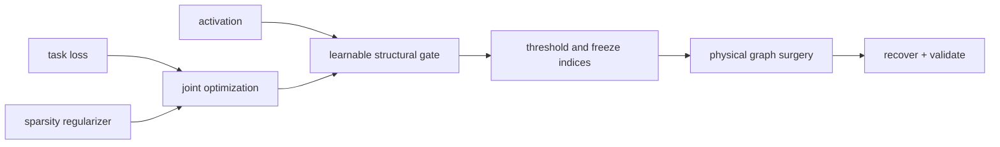

# 第 12 课 — 稀疏正则化和可学习结构门

> **谜题：** 训练能否产生可重复的结构排名，而不是事后选择一个阈值？

[← 第 02 章](../README.md) · [项目主页](../../../README_ZH.md) · [执行的笔记本](../../../chapters/02-sparsity-structured-pruning/12-sparse-regularization-gates/lab.ipynb) · [RTX 5090 结果](../../../chapters/02-sparsity-structured-pruning/12-sparse-regularization-gates/artifacts/rtx5090-result.json)

## 为什么这个谜题重要

可学习的门控单元为每个通道附加一个连续变量，并通过任务进行优化。稀疏性惩罚可以分离有用的和无用的结构，但阈值化仍然会创建一个离散的架构，并且必须进行评估。门控值、惩罚强度、温度和阈值应包含在文件中。

## 阅读结果前，先做出预测

1. 预测在L1惩罚下，sigmoid门是否达到精确零。
2. 预测随着lambda增加，活跃通道和任务损失的变化。
3. 选择一个阈值，使用冻结的验证目标而不是训练批次。

## 1. 从具体的张量和状态开始

冻结特征张量，可训练的门控线性预测器，通道级sigmoid门，任务损失，L1门控惩罚，以及阈值扫描构成了实验室。

### 三个推理锚点

| # | 本课需要牢记的判断 |
|---:|---|
| 1 | 正则化塑造了排名，但不会物理上移除通道。 |
| 2 | 连续目标和阈值目标都必须报告。 |
| 3 | Lambda 和阈值定义了稀疏性权衡的不同部分。 |

## 2. 推导机制

通过门`g_c=sigmoid(a_c)`，一个隐藏功能变为`g_c h_c`。优化`L_task + lambda sum(g_c)`交易适应宽度。Sigmoid门很少变为精确零，因此部署选择一个阈值或top-k预算，并物理重建层。连续最优和离散候选是不同的模型；两者损失都必须测量。门的规模也可以与相邻权重交易，除非这些自由度被控制。

### 机制概览



### 逐步拆解

1. **附加一个可学习的门控单元。**在需要选择的结构单元上放置一个门控单元，例如通道、头部或块。
2. **一起优化任务和稀疏性目标。**跟踪任务损失、正则化压力以及门分布，而不仅仅是最终的零计数。
3.**冻结一个离散结构。**选择并记录一个阈值，然后将软门转换为一个明确的保留索引集。
4. **移除物理上的门控结构。**重建并恢复模型，使其在运行时看到较小的张量，而不是乘以接近零的门。

## 3. 把理论转化为实验

**实验：**在两种正则化强度下训练通道门，并评估冻结阈值扫描。

| 实验角色 | 固定定义 |
|---|---|
| 基准 | 弱门正则化与大部分密集的有效宽度 |
| 候选方案 | 更强的正则化加上离散阈值候选方案 |
| 保持不变 | 功能、目标、预测器初始化、优化器步骤、阈值、种子和验证分割 |
| 测量 | 门限分布，活跃通道，连续损失，阈值损失，以及选择的阈值 |
| 证据标签 | `numerical-model` |

### 代码导读

特征生成器故意只使部分通道具有预测性。两个门模型从相同的logits开始，阈值扫描在不进一步拟合的情况下评估保留损失。这隔离了学习到的排名是否暴露了已知的稀疏结构。

## 4. 解读仓库内的 RTX 5090 实测结果

**录制环境：**NVIDIA GeForce RTX 5090 计算能力12.0; PyTorch 2.12.0; CUDA 运行时13.0.

| 实测字段 | 已提交值 |
|---|---:|
| 弱激活通道 | 6 |
| 强激活通道 | 6 |
| 弱门均值 | 0.468424 |
| 强门均值 | 0.259656 |
| 选定阈值 | 0.200000 |
| 阈值验证均方误差 | 0.019543 |

### 这些数字说明了什么

弱正则化使 6 大门保持在 0.5 之上，平均值为 0.4684；强正则化使 6 保持，平均值为 0.2597。冻结阈值扫描选择了 0.2，激活了 6 个通道，并验证了 MSE 为 0.019543。连续的大门仍然需要物理重建。

## 5. 解答谜题并做出决策

> 可学习的门将结构选择转化为优化，但部署仍需单独验证的离散架构。

### 验收与回滚门槛

只有在阈值选择冻结、保留的品质通过，并且物理模型再现了门控候选时，才接受门控衍生的架构。

### 这个结论可能如何失效

联合可训练的下游权重可以吸收逆门控缩放，使得原始门控变得误导。在最终测试集上选择 lambda 或阈值会泄露评估。硬阈值也可能移除看起来单独较小的交互通道。

## 复现

从仓库根目录：

```bash
python3 -m venv .venv
source .venv/bin/activate
pip install torch jupyterlab nbclient nbformat
jupyter lab chapters/02-sparsity-structured-pruning/12-sparse-regularization-gates/lab.ipynb
```

## 扩展实验

添加硬混凝土或 top-k 门，重建物理窄层，并测试种子和任务切片之间的排名稳定性。

## 证据边界

**证据标签:** [`numerical-model`](../../../chapters/02-sparsity-structured-pruning/README.md#evidence-labels).

## 参考资料

- [网络瘦身](https://arxiv.org/abs/1708.06519)
- [是否剪枝](https://arxiv.org/abs/1710.01878)
