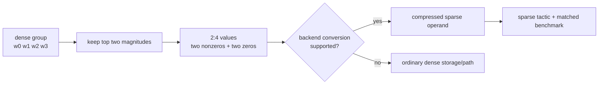

<!-- ai-infra-puzzles-header:start -->
<p align="center">
  
</p>

<h1 align="center">AI Infra Puzzles</h1>

<p align="center">
  <strong>Learn CUDA optimization and LLM inference through hands-on puzzles.</strong>
</p>
<!-- ai-infra-puzzles-header:end -->

# 第 13 课 — N:M 半结构化稀疏性和 2:4 合同

> **谜题：**一个张量50% 零值符合稀疏矩阵条件Tensor Core执行？

[← 第 02 章](../README.md) · [项目主页](../../../README_ZH.md) · [执行的笔记本](../../../chapters/02-sparsity-structured-pruning/13-nm-2-4-sparsity/lab.ipynb) · [RTX 5090 结果](../../../chapters/02-sparsity-structured-pruning/13-nm-2-4-sparsity/artifacts/rtx5090-result.json)

## 为什么这个谜题重要

NVIDIA的2:4路径施加了一个局部模式：在每个所需维度的四值组中，至少有两个值为零，并且表示必须压缩以支持稀疏 GEMM。全局稀疏性、模式合规性、后端转换和选定策略是分开的门。

## 阅读结果前，先做出预测

1. 预测随机50%面罩的合规性。
2. 证明 top-2-of-4 遮罩达到确切的 50% 稀疏度。
3. 在合规后列出所需的加速证据。

## 1. 从具体的张量和状态开始

一个 BF16 权重矩阵，一个随机的50%遮罩，一个基于幅度的确切2:4遮罩，一个局部合规检查器，普通密集计时，以及一个可选的 PyTorch 半结构化转换探针被记录。

### 三个推理锚点

| # | 本课需要牢记的判断 |
|---:|---|
| 1 | 2:4 在本地组中检查，而不是在整个张量上检查。 |
| 2 | 模式合规性先于后端压缩和战术选择。 |
| 3 | 密集路径时序无法建立稀疏 Tensor Core 执行。 |

## 2. 推导机制

将合同维度划分为每组四个，并保留每组中两个最大的值。这保证了每组恰好有 2 个非零元素，同时在全球范围内保留了 50% 的数据。随机一半掩码只能满足部分组。即使是一个合规的张量在转换为后端的压缩格式之前仍然是密集存储，硬件/库组合必须支持其形状和 dtype。

### 机制概览



### 逐步拆解

1. **沿合同轴排列。**将支持的权重维度重塑为连续的四组。
2. **保留两个值。**Top-2magnitude selection creates50% 全局稀疏性和100% 当地2:4合规。
3. **转换为后台表示。**一个符合规范的稠密张量还不是 cuSPARSELt 或TensorRT稀疏操作数。
4. **证明所选策略的有效性。**验证输出，捕捉稀疏操作符或策略，并与匹配的密集基准进行比较。

## 3. 把理论转化为实验**实验：**比较随机和精确2:4掩码后，尝试进行原生半结构化转换，而不隐藏不兼容性。

| 实验角色 | 固定定义 |
|---|---|
| 基准 | 随机全局50% 稀疏性通过普通稠密矩阵乘法执行 |
| 候选方案 | 确切幅度 2:4 稀疏度加上可选的原生转换探针 |
| 保持不变 | 源权重、形状、dtype、输入、零预算、GPU 和计时协议 |
| 测量 | 全局稀疏性，局部合规性，密集路径延迟，转换可用性，以及转换误差 |
| 证据标签 | `compatibility-probe` |

### 代码导读

合规函数将K维度重塑为四组，并计算非零元素。本地转换尝试被包装并存储为成功的稀疏结果或确切的异常文本。常规密集型计时保持不变，并从未被重新标记为稀疏kernel基准。

## 4. 解读仓库内的 RTX 5090 实测结果

**录制环境：**NVIDIA GeForce RTX 5090 计算能力12.0; PyTorch 2.12.0; CUDA 运行时13.0.

| 实测字段 | 已提交值 |
|---|---:|
| 随机遮罩合规性 | 37.45% |
| 2:4 合规 | 100.00% |
| 2:4 稀疏性 | 50.00% |
| 密集基线中位数 | 0.018544 ms |
| 2:4 密集路径中位数 | 0.018512 ms |
| 本地转换 | 否 |

### 这些数字说明了什么

随机50% 避免实现37.4% 当地合规性，而顶级2-的-4到达100.0% 在50.0% 稀疏性。普通密集路径中位数是0.018544并且0.018512ms. Native 半结构化转换成功为 False；保留的探针消息是`RuntimeError: cuSPARSELt not supported on your machine.`.

## 5. 解答谜题并做出决策

> 精确的 2:4 值是必要的数据不变量；原生表示和战术证据完成执行声明。

### 验收与回滚门槛

接受2:4的速度声明，前提是合规性、支持的压缩、稀疏操作跟踪、数值验证以及匹配的密集基准都通过。

### 这个结论可能如何失效

零可以沿着错误的轴排列，形状可能违反对齐，库可能会退回到密集策略。一个栈中的 PyTorch 转换失败并不意味着 GPU 缺乏所有 2:4 支持；它仅限于该 API 路径。

## 复现

从仓库根目录：

```bash
python3 -m venv .venv
source .venv/bin/activate
pip install torch jupyterlab nbclient nbformat
jupyter lab chapters/02-sparsity-structured-pruning/13-nm-2-4-sparsity/lab.ipynb
```

## 扩展实验

通过 cuSPARSELt 或 TensorRT 运行相同的合规权重，保留构建日志和kernel名称，并扫支持的形状和 FP16/BF16/INT8 dtype。

## 证据边界

**证据标签:** [`compatibility-probe`](../../../chapters/02-sparsity-structured-pruning/README.md#evidence-labels).

## 参考资料

- [NVIDIA cuSPARSELt 文档](https://docs.nvidia.com/cuda/cusparselt/)
- [TensorRT 稀疏性要求](https://docs.nvidia.com/deeplearning/tensorrt/latest/inference-library/data-formats-tensors.html)
