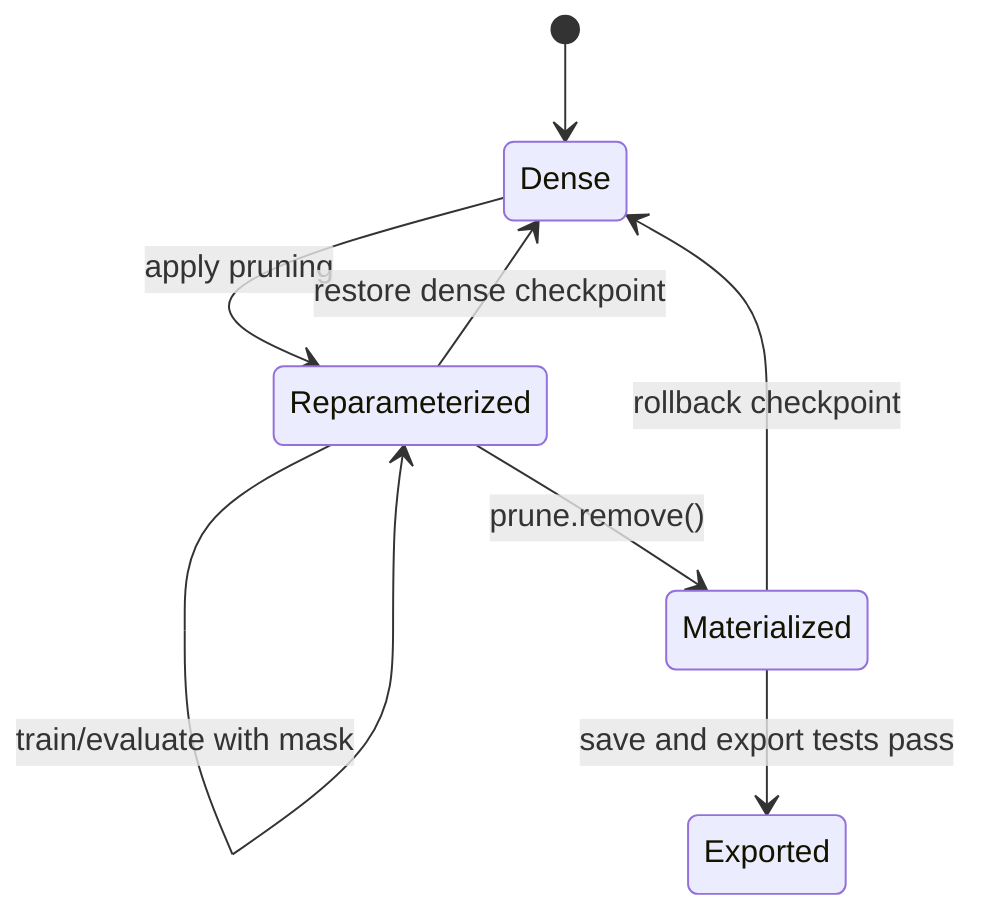

# Lesson 14 — PyTorch 剪枝 API 及完整的掩码生命周期

> **谜题：**模块在前后有什么变化`prune.remove`, 以及一个回滚加载器需要知道什么？

[← 第 02 章](../README.md) · [项目主页](../../../README_ZH.md) · [执行的笔记本](../../../chapters/02-sparsity-structured-pruning/14-pytorch-mask-lifecycle/lab.ipynb) · [RTX 5090 结果](../../../chapters/02-sparsity-structured-pruning/14-pytorch-mask-lifecycle/artifacts/rtx5090-result.json)

## 为什么这个谜题重要

PyTorch pruning 是一个重参数化生命周期：应用一种方法，组合或更新掩码，训练时保留掩码，序列化预期的键，可选地使用 `remove` 材质化，然后验证加载。将挂钩式检查点与材质化检查点混淆会破坏可再现性。

## 阅读结果前，先做出预测

1. 预测第一个掩码之后的参数和缓冲区名称。
2. 预测经过两次迭代的25%剪枝调用后的稀疏性。
3. 预测`remove`是否恢复了删除的权重。

## 1. 从具体的张量和状态开始

一个 CUDA 线性层在五个点上进行检查：密集、第一个掩码、迭代掩码、优化器更新和移除。捕获了命名参数、缓冲区、前向预钩子、稀疏性和输出漂移。

### 三个推理锚点

| # | 本课需要牢记的判断 |
|---:|---|
| 1 | 参数和缓冲区名称编码了检查点生命周期阶段。 |
| 2 | 迭代掩码默认情况下组成而不是重置。 |
| 3 | 移除使剪枝在密集参数中永久化。 |

## 2. 推导机制

剪枝后，`weight_orig` 是一个参数，`weight_mask` 是一个缓存；可见的 `weight` 在前向传播前计算。迭代剪枝通过剪枝容器将掩码组合起来。梯度更新 `weight_orig`，因此即使底层值改变，有效掩码值在前向传播时仍保持为零。`remove` 用一个实际的 `weight` 参数替换这对，并删除钩子；这不会撤销剪枝。

### 机制概览



### 逐步拆解

1. **在剪枝前检查模块。**记录参数名称、缓冲区、钩子和确切的检查点标识。
2.**应用一种剪枝方法。**API 安装weight_orig，weight_mask，以及一个向前的预钩子。
3. **使用激活掩码进行训练或评估。**审查优化器行为，确保有效权重保留预期的零值。
4.**最终确认。**当需要一个材料化的密集零张量时，使用 prune.remove，然后分别测试保存、加载、导出和回滚。

## 3. 把理论转化为实验**实验：**应用迭代 PyTorch 掩码，进行一次训练步骤，移除重参数化，并审计每个状态转换。

| 实验角色 | 固定定义 |
|---|---|
| 基准 | 密集模块和单掩码状态 |
| 候选方案 | 迭代剪枝、训练和材料化模块 |
| 保持不变 | 模块，优化器规则，输入/目标，剪枝调用，种子，和检查点 |
| 测量 | 有效稀疏性，参数名称，缓冲区名称，钩子计数，损失，以及移除漂移 |
| 证据标签 | `pytorch-gpu` |

### 代码导读

该笔记本查询公共模块检查API，而不是从打印的张量中推断状态。它记录了优化器步骤前后有效的权重，然后在`remove`周围立即比较前向输出。这生成了一个加载器导向的生命周期跟踪。

## 4. 解读仓库内的 RTX 5090 实测结果

**录制环境：**NVIDIA GeForce RTX 5090 计算能力12.0; PyTorch 2.12.0; CUDA 运行时13.0.

| 实测字段 | 已提交值 |
|---|---:|
| First-mask稀疏性 | 25.00% |
| 迭代稀疏性 | 43.75% |
| 参数在移除前 | 偏差，weight_orig |
| 缓冲区在移除前 | weight_mask |
| 钩子在删除前 | 1 |
| 移除最大漂移 | 0.000000 |

### 这些数字说明了什么

第一次调用产生了25.0%的稀疏性，第二次调用组成了43.8%。在删除之前，参数是`bias,weight_orig`，缓冲区是`weight_mask`，且1预钩子处于激活状态。`remove`留下漂移0.000e+00，并恢复了一个材料化的`weight`参数。

## 5. 解答谜题并做出决策

> PyTorch 面罩是可审计的训练状态；`remove` 将其物化但不创建稀疏运行时格式。

### 验收与回滚门槛

接受检查点时，仅在预期生命周期阶段、键模式、加载程序、屏蔽策略和回滚文件已文档化并测试后才接受。

### 这个结论可能如何失效

将钩子检查点加载到普通模块中会导致缺失或意外的键。优化器状态可以指向重参数化的对象。过早移除可能会允许零在后续的无约束训练中重新生长。这些都是状态管理失败，而不是剪枝得分失败。

## 复现

从仓库根目录：

```bash
python3 -m venv .venv
source .venv/bin/activate
pip install torch jupyterlab nbclient nbformat
jupyter lab chapters/02-sparsity-structured-pruning/14-pytorch-mask-lifecycle/lab.ipynb
```

## 扩展实验

保存并重新加载两个生命周期变体的最新模块，测试优化器恢复，并为结构化元数据添加一个版本号。

## 证据边界

**证据标签:** [`pytorch-gpu`](../../../chapters/02-sparsity-structured-pruning/README.md#evidence-labels).

## 参考资料

- [PyTorch 剪枝教程](https://docs.pytorch.org/tutorials/intermediate/pruning_tutorial.html)
- [PyTorch 可再现性注释](https://docs.pytorch.org/docs/stable/notes/randomness.html)
