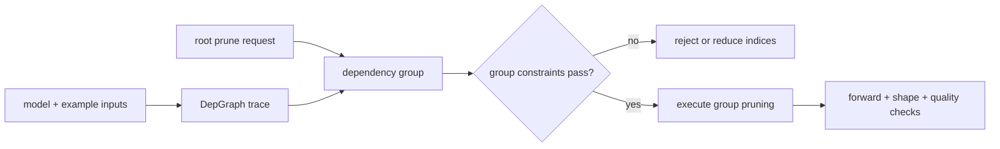

# Lesson 15 — Torch-Pruning DepGraph: 结构化剪枝兼容性实验室

> **谜题：** 在这个环境中，依赖图能否识别出每一个与通道删除相关的张量？

[← 第 02 章](../README.md) · [项目主页](../../../README_ZH.md) · [执行的笔记本](../../../chapters/02-sparsity-structured-pruning/15-depgraph-structured-pruning/lab.ipynb) · [RTX 5090 结果](../../../chapters/02-sparsity-structured-pruning/15-depgraph-structured-pruning/artifacts/rtx5090-result.json)

## 为什么这个谜题重要

DepGraph 将本地根操作转换为剪枝组。这正是结构剪枝手册通常会忽略的地方。一个可信的实验室必须区分图的概念、手动的 CUDA 控制，以及是否在记录的堆栈中成功执行了可选的 Torch-Pruning 包。

## 阅读结果前，先做出预测

1. 预测哪些模块加入以第一个卷积为根的组。
2. 当可选包缺失时，预测结果。
3. 模块形状被修改后，必须保存什么内容。

## 1. 从具体的张量和状态开始

一个残差子网络，一个通道索引集，一个手动同步的窄副本，一个导入/版本探测器，以及当可用时的一个真实 `DependencyGraph` 组是具体的对象。

### 三个推理锚点

| # | 本课需要牢记的判断 |
|---:|---|
| 1 | DepGraph 将耦合的剪枝操作从根决策中分组。 |
| 2 | 示例输入和启用自动微分定义了追踪依赖路径。 |
| 3 | 包兼容性证据与手动结构正确性是不同的。 |

## 2. 推导机制

Torch-Pruning启用 autograd 后跟踪一个向前传播的例子，然后通过模块和张量依赖性映射一个根剪枝函数。分组验证防止删除整个维度。该包会修改模块结构，因此保存一个简单的密集定义state_dict，除非重建架构元数据，否则字典不足。手动控制证明了预期的形状传播，独立于包的可用性。

### 机制概览



### 逐步拆解

1. **使用具有代表性的输入进行跟踪。**依赖关系发现必须看到预期执行路径中使用的操作符、合并和形状。
2. **请求一次根剪枝操作。**选择一层、剪枝函数和具体的索引集，而不是直接编辑张量。
3.**检查生成的组。**审查所有耦合操作，并拒绝违反最小通道、分组或模型接口的组。
4. **执行并验证突变。**运行前，请先进行参数、形状、导出和质量检查。DepGraph结果作为可用。

## 3. 把理论转化为实验

**实验：**建一个真正的DepGraph当可用时分组并始终执行手动操作 CUDA 结构控制路径。

| 实验角色 | 固定定义 |
|---|---|
| 基准 | 手动同步剪枝残差微型网络的账本 |
| 候选方案 | Torch-Pruning当包可用时的依赖组和突变 |
| 保持不变 | 模型，示例输入，根模块，通道索引，评估模式，和GPU |
| 测量 | 包可用性/版本，组有效性/大小，输出形状，参数，以及捕获的异常 |
| 证据标签 | `compatibility-probe` |

### 代码导读

该笔记本首先运行手动控制，以便在 PyTorch 安装最少的情况下保持课程信息。然后它会探查`torch_pruning`，构建图谱而不使用`no_grad`，请求剪枝组，验证它，并记录组详细信息，而不是将导入失败转换为成功的后端声明。

## 4. 解读仓库内的 RTX 5090 实测结果

**录制环境：**NVIDIA GeForce RTX 5090 计算能力12.0; PyTorch 2.12.0; CUDA 运行时13.0.

| 实测字段 | 已提交值 |
|---|---:|
| Torch-Pruning 可用 | 否 |
| 组建立 | 否 |
| 组有效 | 否 |
| 手动输出通道 | 6 |
| 手动参数 | 368 |
| 探测消息 | torch_pruning未安装 |

### 这些数字意味着什么

手动依赖控制将模型从552参数减少到368参数，并产生了6输出通道。Torch-Pruning可用性为False；组构建/有效为False/False。这是在可选包缺失时的有限兼容性结果。

## 5. 解答谜题并做出决策

> 依赖图在观察到其真实组、突变和保存/加载路径时才有价值，而不是当其名称出现在计划中时。

### 验收与回滚门槛

当组有效、转发和质量检查通过，并且变异的架构具有测试过的保存/加载合同时，才接受自动化的路由。

### 这个结论可能如何失效

成功的跟踪可能会遗漏数据依赖的控制流或在张量操作之外使用的静态属性。包的导入并不能证明关于特定模型组的任何事情。相反，包的缺失并不否定DepGraph方法；它只是让那个本地路径未被执行。

## 复现

从仓库根目录：

```bash
python3 -m venv .venv
source .venv/bin/activate
pip install torch jupyterlab nbclient nbformat
jupyter lab chapters/02-sparsity-structured-pruning/15-depgraph-structured-pruning/lab.ipynb
```

本课的可选/原生后端路径需要：

```bash
pip install torch-pruning
```

## 扩展实验

安装固定版本的 Torch-Pruning，再次运行笔记本，比较打印出的分组操作与手动账本，并测试整个模型的序列化和重新加载。

## 证据边界

**证据标签:** [`compatibility-probe`](../../../chapters/02-sparsity-structured-pruning/README.md#evidence-labels).

## 参考资料

- [Torch-Pruning 参考实现](https://github.com/VainF/Torch-Pruning)
- [DepGraph 论文](https://arxiv.org/abs/2301.12900)
