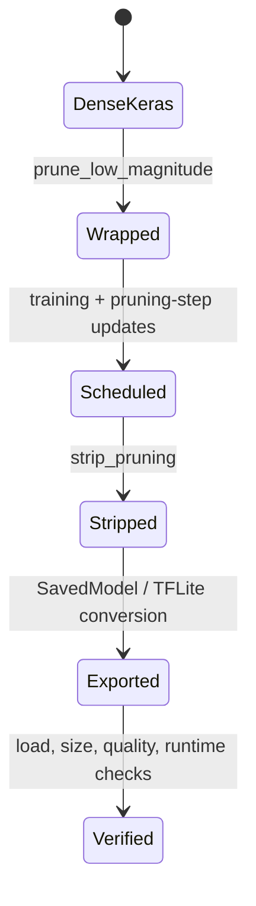

<!-- ai-infra-puzzles-header:start -->
<p align="center">
  
</p>

<h1 align="center">AI Infra Puzzles</h1>

<p align="center">
  <strong>Learn CUDA optimization and LLM inference through hands-on puzzles.</strong>
</p>
<!-- ai-infra-puzzles-header:end -->

# 第 16 课 — TensorFlow MOT 和 Keras 裁剪/导出生命周期

> **谜题：**为什么训练时的Keras稀疏性无法减少可部署的TFLite artifact？

[← 第 02 章](../README.md) · [项目主页](../../../README_ZH.md) · [执行的笔记本](../../../chapters/02-sparsity-structured-pruning/16-keras-pruning-lifecycle/lab.ipynb) · [RTX 5090 结果](../../../chapters/02-sparsity-structured-pruning/16-keras-pruning-lifecycle/artifacts/rtx5090-result.json)

## 为什么这个谜题重要

TensorFlow Model Optimization 用掩码、阈值和剪枝步骤状态包装 Keras 层。导出需要在训练过程中更新剪枝步骤，达到计划，剥离包装器，转换，并检查最终表示。这个环境可能不提供 TensorFlow，因此可用性是一个明确的结果而不是虚构输出的借口。

## 阅读结果前，先做出预测

1. 预测在多项式窗口之前、期间和之后的目标稀疏度。
2. 预测 `strip_pruning` 删除了什么以及保留了什么。
3. 列出在声称获得TFLite大小优势之前所需的文件。

## 1. 从具体的张量和状态开始

实验室记录 TensorFlow 和 TFMOT 包的可用性，评估 CUDA 上的多项式调度公式，构建所需的生命周期状态机，并仅在存在依赖时运行一个微小的本地剥离/导出探针。

### 三个推理锚点

| # | 本课需要牢记的判断 |
|---:|---|
| 1 | 进度安排取决于优化器步骤和更新回调。 |
| 2 | 去壳操作会移除训练包装器，但不一定移除密集存储。 |
| 3 | TensorFlow/TFMOT 可用性是可复现后端证据的一部分。 |

## 2. 推导机制

多项式衰减通过优化器步骤控制目标稀疏性。包装器包含训练变量，回调更新其步骤。`strip_pruning` 删除包装器并保留稀疏权重；它不保证更小的无压缩格式或加速的稀疏运行时。TFLite 转换和可选压缩是分开的步骤。因此，原生实验必须保留版本、包装器状态、精简模型、转换字节和输出一致性。

### 机制概览



### 逐步拆解

1. **在训练前封装模型。**剪枝封装器拥有掩码和调度状态；它不等同于一个永久较小的 Keras 层。
2.**加快剪枝步骤。**回调或显式更新必须保持与优化器步骤的同步。
3.**移除仅用于训练的包装器。**训练完成后，将掩码权重材料化并移除包装器状态，然后再导出。
4. **验证部署包。**加载精简模型，转换为目标格式，并分别测量压缩大小和运行时行为。

## 3. 把理论转化为实验**实验：**探测Keras剪枝堆栈，并执行计划/生命周期合同，而不捏造缺失的原生后端。

| 实验角色 | 固定定义 |
|---|---|
| 基准 | CUDA 评估的多项式调度和未剥离的生命周期状态 |
| 候选方案 | 当可用时使用 native TFMOT wrapper/strip probe，否则使用有限兼容性结果。 |
| 保持不变 | 环境，时间表，端点，步骤，目标速率，生命周期转换，以及种子 |
| 测量 | 包可用性、时间表值、原生探测状态和生命周期门限 |
| 证据标签 | `compatibility-probe` |

### 代码导读

该笔记本使用已发布的多项式形式来生成确定性的目标速率，并检查在训练和包装器移除之前，剥离/导出不能被标记为完成。条件导入将缺失的包保留在结构化的字段中。当堆栈不存在时，不会合成Keras延迟或TFLite大小的数字。

## 4. 解读仓库内的 RTX 5090 实测结果

**录制环境：**NVIDIA GeForce RTX 5090 计算能力12.0; PyTorch 2.12.0; CUDA 运行时13.0.

| 实测字段 | 已提交值 |
|---|---:|
| TensorFlow可用 | 否 |
| TFMOT 可用 | 否 |
| 中期调度稀疏性 | 70.00% |
| 最终时间表稀疏性 | 80.00% |
| 本地探针执行 | 否 |
| 生命周期就绪 | 否 |

### 这些数字说明了什么

立方计划从0.0%在步骤10移动到70.0%在步骤30和80.0%在步骤50。TensorFlow/TFMOT可用性为False/False，因此本地包装器剥离执行=False。缺失的本地阶段保持为false而不是推断出。

## 5. 解答谜题并做出决策

> Keras pruning 是一个版本化的训练-剪枝-转换生命周期；缺失的原生堆栈必须保持可见的未执行状态。

### 验收与回滚门槛

仅在本地训练、`UpdatePruningStep`、`strip_pruning`、TFLite 转换、输出一致性以及目标设备测量均通过后，接受 Keras 剪枝交付。

### 这个结论可能如何失效

数值调度不是TensorFlow的执行。在没有兼容GPU堆栈的情况下安装TensorFlow可能会将计算转移到CPU。精简后的模型可以保留包含零的密集张量，而zip压缩可能会被误认为是运行时内存节省。

## 复现

从仓库根目录：

```bash
python3 -m venv .venv
source .venv/bin/activate
pip install torch jupyterlab nbclient nbformat
jupyter lab chapters/02-sparsity-structured-pruning/16-keras-pruning-lifecycle/lab.ipynb
```

本课的可选/原生后端路径需要：

```bash
pip install tensorflow tensorflow-model-optimization
```

## 扩展实验

在钉住的 TensorFlow/TFMOT 环境中运行笔记本，保留包装器和精简后的摘要，转换为 TFLite，并在确切的目标设备上进行基准测试。

## 证据边界

**证据标签:** [`compatibility-probe`](../../../chapters/02-sparsity-structured-pruning/README.md#evidence-labels).

## 参考资料

- [TensorFlow 模型优化剪枝指南](https://www.tensorflow.org/model_optimization/guide/pruning)
- [TensorFlow strip_ pruning API](https://www.tensorflow.org/model_optimization/api_docs/python/tfmot/sparsity/keras/strip_pruning)
