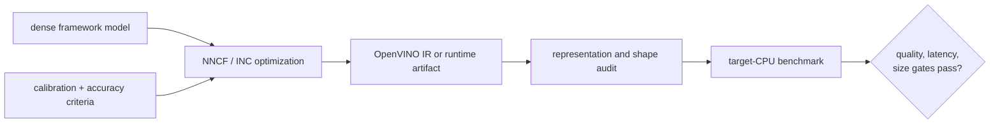

# 本课17 — OpenVINO, NNCF, 和 Intel 运行时稀疏性

> **谜题：**为什么通用稀疏检查点会错过优化的CPU路径？

[← 第 02 章](../README.md) · [项目主页](../../../README_ZH.md) · [执行的笔记本](../../../chapters/02-sparsity-structured-pruning/17-cpu-runtime-sparsity/lab.ipynb) · [RTX 5090 结果](../../../chapters/02-sparsity-structured-pruning/17-cpu-runtime-sparsity/artifacts/rtx5090-result.json)

## 为什么这个谜题重要

CPU部署的收益取决于目标OpenVINO/oneDNN堆栈支持的模式、图转换、精度和操作符实现。NNCF或Intel Neural Compressor配置是可执行文件的一部分；单独的 PyTorch 零率不是。

## 阅读结果前，先做出预测

1. 预测哪些包探测在记录的GPU环境中成功。
2. 解释为什么物理上更窄的形状在没有稀疏 CPU 核心的情况下仍然有用。
3. 列出用于公平基准测试所需的CPU特定字段。

## 1. 从具体的张量和状态开始

该笔记本探查 OpenVINO、NNCF 和 Neural Compressor 包，对 CUDA 创建无结构和过滤剪枝控制，并记录部署闸门矩阵，而不从 GPU 证据中断言 CPU 速度。

### 三个推理锚点

| # | 本课需要牢记的判断 |
|---:|---|
| 1 | 框架零不是OpenVINO执行计划。 |
| 2 | 过滤器移除和无结构编码暴露不同的CPU机会。 |
| 3 | GPU控制结果不能替代CPU运行时测量。 |

## 2. 推导机制

无结构的零值保留密集张量维度，除非选择稀疏编码和稀疏操作。NNCF滤波器剪枝可以传播结构变化并导出较小的图，而后训练稀疏性工具可能针对运行时特定的模式。CPU SIMD利用、线程、缓存行为和量化与宽度相互作用。因此，正确的交接包括模型格式、模式、运行时版本、线程设置和操作日志。

### 机制概览



### 逐步拆解

1. **首先选择 CPU 运行时。**OpenVINO, NNCF, 并且 Intel Neural Compressor 支持不同的模型、稀疏模式和优化工作流。
2.**使用代表性的数据进行优化。**校准或精度感知调优必须使用与基准相同的预处理和任务契约。
3. **检查导出的表示。**验证IR或序列化后的大小、形状、精度，以及运行时是否保留了有用的稀疏模式。
4. **在目标CPU上进行基准测试。**针脚、kernel、批次、热身和延迟模式；GPU 侧的零模式不是 CPU 性能证据。

## 3. 把理论转化为实验

**实验：**探测Intel压缩/运行时包，并在有限的证据标签下对比值的稀疏性与物理宽度。

| 实验角色 | 固定定义 |
|---|---|
| 基准 | 相同形状的无结构零掩码表示为密集的 PyTorch 张量 |
| 候选方案 | 物理上更窄的密集控制和可选的OpenVINO/NNCF原生路径 |
| 保持不变 | 源张量，零预算，输入，环境，包名，决策门 |
| 测量 | 包可用性、逻辑稀疏性、物理宽度、输出漂移和原生运行状态 |
| 证据标签 | `compatibility-probe` |

### 代码导读

The experiment keeps itsCUDA 数控与包矩阵分离。条件导入记录确切可用性；结论依然如此。`not_run`forOpenVINO除非进行本地模型转换和CPU工作负载执行，否则不会影响性能。这防止了一般的剪枝结果被洗白为Intel部署声明。

## 4. 解读仓库内的 RTX 5090 实测结果

**录制环境：**NVIDIA GeForce RTX 5090 计算能力12.0; PyTorch 2.12.0; CUDA 运行时13.0.

| 实测字段 | 已提交值 |
|---|---:|
| OpenVINO 可用 | 否 |
| NNCF 可用 | 否 |
| 神经压缩器可用 | 否 |
| 逻辑稀疏性 | 75.00% |
| 物理宽度减少 | 75.00% |
| 本地CPU运行 | 否 |

### 这些数字说明了什么

密集值控制达到了75.0%的逻辑稀疏度，而其1024宽的输出没有改变；物理控制将宽度更改为256。OpenVINO/NNCF/Neural Compressor可用性为False/False/False。未报告CPU延迟，因为没有执行原生CPU路径。

## 5. 解答谜题并做出决策

> Intel稀疏性是一个运行时特定的图和kernel决策；CUDA 零值仅提供数值控制。

### 验收与回滚门槛

在转换、图形检查、CPU线程绑定、质量一致性以及重复的目标CPU延迟/吞吐量证据之后，才能接受Intel部署。

### 这个结论可能如何失效

包的存在性比运营商的支持要弱，笔记本电脑CPU的结果可能不会转移到生产SKU。窄通道计数会损害向量对齐，而无结构压缩可以在不提供运行时好处的情况下减少磁盘大小。

## 复现

从仓库根目录：

```bash
python3 -m venv .venv
source .venv/bin/activate
pip install torch jupyterlab nbclient nbformat
jupyter lab chapters/02-sparsity-structured-pruning/17-cpu-runtime-sparsity/lab.ipynb
```

本课的可选/原生后端路径需要：

```bash
pip install openvino nncf neural-compressor
```

## 扩展实验

创建一个钉住的OpenVINO/NNCF环境，导出两个候选者，检查IR维度和操作符，然后在实际的CPU目标上对几个线程和批次设置进行基准测试。

## 证据边界

**证据标签:** [`compatibility-probe`](../../../chapters/02-sparsity-structured-pruning/README.md#evidence-labels).

## 参考资料

- [OpenVINO模型优化指南](https://docs.openvino.ai/2023.3/openvino_docs_model_optimization_guide.html)
- [NNCF 参考实现](https://github.com/openvinotoolkit/nncf)
