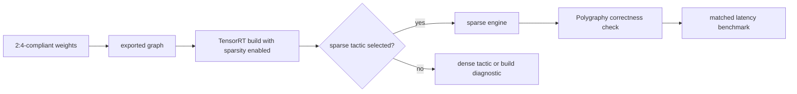

# 第 18 课 — TensorRT 稀疏部署和 Polygraphy 证据

> **谜题：**What must the build log show before`--sparsity=enable`成为加速主张？

[← 第 02 章](../README.md) · [项目主页](../../../README_ZH.md) · [执行的笔记本](../../../chapters/02-sparsity-structured-pruning/18-tensorrt-sparsity-gates/lab.ipynb) · [RTX 5090 结果](../../../chapters/02-sparsity-structured-pruning/18-tensorrt-sparsity-gates/artifacts/rtx5090-result.json)

## 为什么这个谜题重要

TensorRT 评估结构稀疏性和战术盈利能力。一个2:4兼容的ONNX权重加上一个稀疏性标志使一层合格；构建者仍然可以选择密集型战术。Polygraphy可以帮助检查和转换模型，但只有引擎日志和匹配基准才能确定执行。

## 阅读结果前，先做出预测

1. 预测一个合规的权重是否足以证明稀疏策略运行。
2. 列出验收所需的日志行和数值检查。
3. 解释为什么强制剪枝必须被视为一个新的模型候选。

## 1. 从具体的张量和状态开始

实验室创建了一个符合规范的卷积/线性风格的权重，检查模式和dtype门，探测TensorRT和Polygraphy包以及`trtexec`，并生成一个资格与选择矩阵。

### 三个推理锚点

| # | 本课需要牢记的判断 |
|---:|---|
| 1 | 资格和战术选择是分开的日志事件。 |
| 2 | 强迫模式是一种需要质量验证的模型变异。 |
| 3 | 引擎版本、标志、配置文件和定时缓存标识构建。 |

## 2. 推导机制

TensorRT 的结构稀疏性要求文档中记录的局部权重模式以及支持的 FP16 或 INT8 执行。构建器将合格层与选择稀疏策略的层分开报告。`--sparsity=force` 风格的突变会改变权重，因此影响质量；启用模式应消耗已符合规范的权重。强类型、形状、工作区和版本会影响策略搜索。

### 机制概览



### 逐步拆解

1. **验证源权重。**证明2:4在发动机制造前，确保在正确的轴上进行符合性检查。
2. **导出而不破坏合约。**保留支持的dtype、形状和权重布局。ONNX或构建输入。
3. **检查构建证据。**捕获TensorRT并且Polygraphy日志、战术选择以及任何密集的后备理由。
4. **测试构建的引擎。**将数值输出和延迟与从冻结的密集基线构建的引擎进行比较。

## 3. 把理论转化为实验**实验：**构建完整的预工程资格账簿并探查原生TensorRT/PolygraphyRTX 上的工具5090主机

| 实验角色 | 固定定义 |
|---|---|
| 基准 | 2:4兼容的 BF16/FP16 权重和密集 PyTorch 数控 |
| 候选方案 | 本地的TensorRT构建/tactic路径，当包和`trtexec`可用 |
| 保持不变 | 权重，分组轴，dtype门，环境，包探针，以及所需的构建字段 |
| 测量 | 2:4 合规性，dtype资格，TensorRT/Polygraphy/trtexec 可用性，以及原生引擎状态 |
| 证据标签 | `compatibility-probe` |

### 代码导读

该笔记本可以证明数据侧不变性在 CUDA 上，并可以证明是否存在原生工具。它不能从 PyTorch 的定时推断出TensorRT引擎。门字典在没有实际发生这些事件的情况下，将引擎构建和稀疏策略选择标记为假。

## 4. 解读仓库内的 RTX 5090 实测结果

**录制环境：**NVIDIA GeForce RTX 5090 计算能力12.0; PyTorch 2.12.0; CUDA 运行时13.0.

| 实测字段 | 已提交值 |
|---|---:|
| 2:4 合规 | 100.00% |
| dtype资格 | 是的 |
| TensorRT 可用 | 否 |
| Polygraphy 可用 | 否 |
| TRTexec 可用 | 否 |
| 稀疏引擎构建完成 | 否 |

### 这些数字说明了什么

通过了 100.0% 的精确 2:4 组，在 50.0% 的稀疏度下，并使用了 dtype=True 的有效dtype。TensorRT/Polygraphy/trtexec 的可用性为 False/False/False。因为没有构建引擎，稀疏策略选择仍然为 false。

## 5. 解答谜题并做出决策

> TensorRT 稀疏性由资格、选定战术、正确性和基准证据证明，而不是通过一个标志。

### 验收与回滚门槛

接受 TensorRT 稀疏性仅在有效引擎、明确符合条件和选定稀疏策略日志、输出一致性以及匹配的密集/稀疏引擎基准测试时。

### 这个结论可能如何失效

一个构建标志可以被不合格的层忽略，或者失去战术搜索以更快的密集kernel。动态配置文件可能会选择不同的战术，而在A100上成功的构建并不在 RTX 5090 上建立行为。

## 复现

从仓库根目录：

```bash
python3 -m venv .venv
source .venv/bin/activate
pip install torch jupyterlab nbclient nbformat
jupyter lab chapters/02-sparsity-structured-pruning/18-tensorrt-sparsity-gates/lab.ipynb
```

本课的可选/原生后端路径需要：

```bash
pip install tensorrt polygraphy
```

## 扩展实验

使用TensorRT功能的容器，导出合规的模型，保留Polygraphy检查以及详细的构建日志，并对每个生产优化配置文件进行基准测试。

## 证据边界

**证据标签:** [`compatibility-probe`](../../../chapters/02-sparsity-structured-pruning/README.md#evidence-labels).

## 参考资料

- [TensorRT 稀疏性要求](https://docs.nvidia.com/deeplearning/tensorrt/latest/inference-library/data-formats-tensors.html)
- [NVIDIA cuSPARSELt 文档](https://docs.nvidia.com/cuda/cusparselt/)
