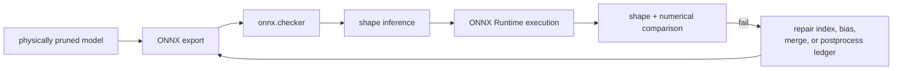

<!-- ai-infra-puzzles-header:start -->
<p align="center">
  
</p>

<h1 align="center">AI Infra Puzzles</h1>

<p align="center">
  <strong>Learn CUDA optimization and LLM inference through hands-on puzzles.</strong>
</p>
<!-- ai-infra-puzzles-header:end -->

# Lesson 19 — ONNX 导出、图形修复和形状一致性

> **谜题：** 剪枝后的 PyTorch 模型在导出的图中携带不一致的通道元数据时，能否正确运行？

[← 第 02 章](../README.md) · [项目主页](../../../README_ZH.md) · [执行的笔记本](../../../chapters/02-sparsity-structured-pruning/19-onnx-shape-consistency/lab.ipynb) · [RTX 5090 结果](../../../chapters/02-sparsity-structured-pruning/19-onnx-shape-consistency/artifacts/rtx5090-result.json)

## 为什么这个谜题重要

物理剪枝会改变权重、偏置、归一化、重塑、拼接和后处理节点的维度。ONNX导出成功仅序列化了追踪路径；检查器、形状推断、ONNX Runtime一致性以及显式维度审计建立了一个可部署的图。

## 阅读结果前，先做出预测

1. 预测物理切片后的输出通道维度。
2. 解释 ONNX 形状推断可以和不能确定什么。
3. 选择独立运行时输出的校验容限。

## 1. 从具体的张量和状态开始

一个小型物理剪枝的多输入模型被导出到内存/磁盘上，通过ONNX进行检查，通过形状推理，当可用时使用ONNX Runtime执行，并与 CUDA/PyTorch 输出进行比较。

### 三个推理锚点

| # | 本课需要牢记的判断 |
|---:|---|
| 1 | 导出、检查、推理和运行时一致性是不同的门。 |
| 2 | 物理 channel变化必须达到初始化器和消费者形状。 |
| 3 | 动态符号不能弥补已知尺寸不一致的情况。 |

## 2. 推导机制

静态tensor shape编码已知维度，而动态轴使用符号参数。形状推断传播操作符模式可以证明的内容，但无法解决所有数据依赖的重塑。`onnx.checker.check_model(..., full_check=True)` 验证图结构和类型；ONNX Runtime 提供独立执行路径。删除通道后，每个初始化器和消费者维度必须符合新的图合同。

### 机制概览



### 逐步拆解

1. **建立索引账本。**对于每个移除的通道，记录受影响的权重、偏置、归一化、合并和消费者维度。
2. **导出结构候选方案。**使用代表性的输入和明确的动态轴规则，而不是将导出成功作为验证。
3.**运行图检查按顺序进行。**应用ONNX检查器、形状推断和已知输入的运行时执行。
4. **比较语义。**在接受图之前，将输出名称、形状和数值与候选框架进行匹配。

## 3. 把理论转化为实验

**实验：**导出物理剪枝的 CUDA 模型，运行ONNX检查和形状推断，并进行比较ONNX Runtime输出。

| 实验角色 | 固定定义 |
|---|---|
| 基准 | PyTorch 输出并声明剪枝后的形状账本 |
| 候选方案 | 检查/推断 ONNX 图表加上 ONNX Runtime 执行 |
| 保持不变 | 权重，保留索引，输入，操作集，动态轴策略，dtype，和容差 |
| 测量 | 导出状态、检查器状态、推断形状、初始化维度、运行时状态和最大误差。 |
| 证据标签 | `native-backend` |

### 代码导读

该笔记本将 ONNX 模型写入课程作业目录，调用全面检查，记录推断出的值形状，并通过 ONNX Runtime 运行相同的输入。异常被捕获到结构化字段中，但成功需要每个门和数值一致性，而不仅仅是导出。

## 4. 解读仓库内的 RTX 5090 实测结果

**录制环境：**NVIDIA GeForce RTX 5090 计算能力12.0; PyTorch 2.12.0; CUDA 运行时13.0.

| 实测字段 | 已提交值 |
|---|---:|
| ONNX 可用 | 是的 |
| 导出成功 | 是的 |
| 检查通过 | 是的 |
| 形状推断通过 | 是的 |
| ORT 执行 | 是的 |
| 最大误差 | 0.000000 |
| ONNX 字节 | 1,722 字节 |

### 这些数字说明了什么

ONNXexport/checker/shape-inference gates were True/True/True;ONNX Runtime执行状态=True，最大误差5.960e-08. 图表占用1,722字节并保留了物理宽度7通过输入投影和输出消费者。

## 5. 解答谜题并做出决策

> 剪枝后的ONNX图在经过结构检查并独立的运行时一致性确认新形状合同后才能交付。

### 验收与回滚门槛

只有当检查器、形状推断审核、初始化器维度和目标运行时一致性都通过时，才接受导出的图。

### 这个结论可能如何失效

跟踪器警告和常量折叠可能会隐藏数据依赖的行为。形状推断可能仍然是不完整的，ONNX Runtime 成功并不保证 TensorRT 支持。多配置文件生产形状必须单独测试。

## 复现

从仓库根目录：

```bash
python3 -m venv .venv
source .venv/bin/activate
pip install torch jupyterlab nbclient nbformat
jupyter lab chapters/02-sparsity-structured-pruning/19-onnx-shape-consistency/lab.ipynb
```

本课的可选/原生后端路径需要：

```bash
pip install onnx onnxruntime
```

## 扩展实验

添加动态批处理和序列轴，故意破坏一个初始化器以验证审核失败，然后在最终部署运行时测试修复后的图。

## 证据边界

**证据标签:** [`native-backend`](../../../chapters/02-sparsity-structured-pruning/README.md#evidence-labels).

## 参考资料

- [ONNX 检查器 API](https://onnx.ai/onnx/api/checker.html)
- [ONNX 形状推断](https://onnx.ai/onnx/repo-docs/ShapeInference.html)
