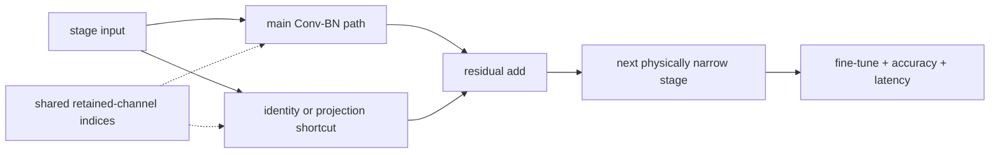

# Lesson 20 — CNN Case Study: ResNet Channel Pruning

> **谜题：**为什么ResNet-like块在未达到预期吞吐量时会丢失参数？

[← 第 02 章](../README.md) · [项目主页](../../../README_ZH.md) · [执行的笔记本](../../../chapters/02-sparsity-structured-pruning/20-resnet-channel-pruning/lab.ipynb) · [RTX 5090 结果](../../../chapters/02-sparsity-structured-pruning/20-resnet-channel-pruning/artifacts/rtx5090-result.json)

## 为什么这个谜题重要

残差网络将通道宽度与加法和投影捷径联系起来。一个安全的案例研究必须重建一个整个阶段兼容的块，保留加法合同，更新分类器或下游消费者，并基准测试几个批次。移除的通道百分比只是起点。

## 阅读结果前，先做出预测

1. 预测每个模块维度的变化，通过将阶段宽度减半。
2. 预测百分比 FLOP 和延迟减少是否完全匹配。
3. 选择特定批次的门控器用于交互式和吞吐量服务。

## 1. 从具体的张量和状态开始

构建了一个紧凑的ResNet风格的茎部，带有投影的残差块、全局池化和分类器。权重通过保留的索引进行复制，当函数对齐时，测量结构FLOPs、参数、输出误差和延迟。

### 三个推理锚点

| # | 本课需要牢记的判断 |
|---:|---|
| 1 | 残差加法保持相同的输出宽度。 |
| 2 | 剪枝传播到后续层和分类器。 |
| 3 | FLOP 减少和吞吐量增益需要分别测量。 |

## 2. 推导机制

在一个基本的残差块中，主路径的最终卷积和快捷投影产生相同的通道数。缩小阶段会改变后续的卷积和分类器输入。FLOPs大致与通道乘积成正比，但延迟也取决于卷积算法、内存布局、启动开销和批次。一个批次-1的结果和一个批次-64的吞吐量结果回答不同的部署问题。

### 机制概览



### 逐步拆解

1. **选择残差阶段的通道数。**ResNet通道决策必须在每次加法时尊重主路径和快捷路径输出的兼容性。
2.**通过块传播索引。**切片 Conv、BatchNorm、投影捷径以及下游输入通道作为一个耦合变换。
3.**从保留索引账本重建。**明确更新模块尺寸，以便参数和 FLOP 减少成为物理可检视的。
4.**完整恢复并基准测试端到端。**从密集检查点微调，评估准确性和时间目标图像工作负载，而不是仅一个卷积。

## 3. 把理论转化为实验**实验：**构建完整的和半宽的ResNet-like模型，并比较结构、奇偶控制和批处理-1延迟，和批次-64吞吐量。

| 实验角色 | 固定定义 |
|---|---|
| 基准 | 全宽的ResNet风格阶段 |
| 候选方案 | 物理上半宽阶段，同步主、捷径和分类器维度 |
| 保持不变 | 输入分辨率，茎，深度，保留索引，dtype，GPU，热身，重复次数，批次 |
| 测量 | 参数、分析卷积/线性FLOPs、批处理1延迟、批处理64吞吐量，以及输出漂移 |
| 证据标签 | `pytorch-gpu` |

### 代码导读

该模型故意设计得足够小，以便在重复的笔记本中进行，同时保留了使 ResNet 裁剪非局部的依赖模式。结构计数器读取实际模块形状。计时在两个批次中使用相同的 CUDA 事件助手；笔记本没有从这个小型网络中投影出 ImageNet Top-1 或 ResNet-50 的速度。

## 4. 解读仓库内的 RTX 5090 实测结果

**录制环境：**NVIDIA GeForce RTX 5090 计算能力12.0; PyTorch 2.12.0; CUDA 运行时13.0.

| 实测字段 | 已提交值 |
|---|---:|
| 全参数 | 20,650 |
| 窄参数 | 5,466 |
| FLOP 减少 | 73.94% |
| 批处理-1 全部中位数 | 0.121744 ms |
| 批量-1 窄中位数 | 0.095600 ms |
| 批量-64 加速 | 1.007x |

### 这些数字说明了什么

Halving stage width reduced parameters from 20,650 to 5,466 and analytical work by 73.9%. Batch-1 medians were 0.121744 versus 0.095600 ms; batch-64 measured a 1.007x ratio. Random weights make this a systems/shape case study, not a Top-1 result.

## 5. 解答谜题并做出决策

> ResNet通道剪枝是一种阶段级图转换，其益处必须在每个目标工作负载中进行衡量。

### 验收与回滚门槛

只接受在阶段依赖性、任务质量、目标批次和端到端运行时都与确切的基准修订版本一致的情况下，才接受 ResNet 精简候选方案。

### 这个结论可能如何失效

随机权重玩具使得输出漂移成为一个账务信号而非质量评分。宽度可以跨越库对齐阈值，数据加载或后处理可能主导生产服务。一个小块不能证明ResNet-50的吞吐量。

## 复现

从仓库根目录：

```bash
python3 -m venv .venv
source .venv/bin/activate
pip install torch jupyterlab nbclient nbformat
jupyter lab chapters/02-sparsity-structured-pruning/20-resnet-channel-pruning/lab.ipynb
```

## 扩展实验

将相同的账本应用于预训练的 torchvision ResNet，根据真实数据校准重要性，微调，并在生产批次中分析操作形状。

## 证据边界

**证据标签:** [`pytorch-gpu`](../../../chapters/02-sparsity-structured-pruning/README.md#evidence-labels).

## 参考资料

- [深度残差学习用于图像识别](https://arxiv.org/abs/1512.03385)
- [DepGraph 论文](https://arxiv.org/abs/2301.12900)
