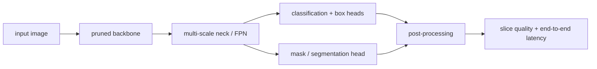

<!-- ai-infra-puzzles-header:start -->
<p align="center">
  
</p>

<h1 align="center">AI Infra Puzzles</h1>

<p align="center">
  <strong>Learn CUDA optimization and LLM inference through hands-on puzzles.</strong>
</p>
<!-- ai-infra-puzzles-header:end -->

# Lesson 21 — 安全剪枝用于检测和分割

> **谜题：** 一个不变的平均指标是否可以掩盖小对象上的大量退化或稀有掩码类别的显著下降？

[← 第 02 章](../README.md) · [项目主页](../../../README_ZH.md) · [执行的笔记本](../../../chapters/02-sparsity-structured-pruning/21-detection-segmentation-safety/lab.ipynb) · [RTX 5090 结果](../../../chapters/02-sparsity-structured-pruning/21-detection-segmentation-safety/artifacts/rtx5090-result.json)

## 为什么这个谜题重要

检测和分割头消耗多尺度特征，业务风险在大小和类别上通常不均匀。一个剪枝候选可以保留一个聚合代理，同时降级负责小物体的特征金字塔层级。因此，安全需要切片度量和每分支预算。

## 阅读结果前，先做出预测

1. 预测哪个金字塔分支对小对象代理最敏感。
2. 构建一个例子，其中均方误差下降但最差切片误差上升。
3. 选择聚合级和切片级的回滚门。

## 1. 从具体的张量和状态开始

一个三级特征金字塔玩具头，合成大/中/小目标，均匀剪枝候选，保护高分辨率候选，以及每片重建误差构成受控实验室。

### 三个推理锚点

| # | 本课需要牢记的判断 |
|---:|---|
| 1 | 多尺度分支有不同的语义责任。 |
| 2 | 聚合质量可以通过，而受保护的切片失败。 |
| 3 | 风险加权预算需要明确的切片阈值。 |

## 2. 推导机制

高分辨率金字塔特征携带更多的空间位置，通常用于小物体。如果聚合损失均匀地对张量元素或样本进行加权，大分支可能会主导，而稀有切片可能会消失在平均值中。定义`E_slice`分别地和一个接受规则，例如`max slice regression <= tau`除了总变化。预算分配则成为风险加权而非纯粹参数加权。

### 机制概览



### 逐步拆解

1. **绘制整个任务图。**检测和分割将骨干特征耦合到颈部尺度、头部、锚点、掩码和后处理维度。
2. **保护任务敏感接口。**保持特征金字塔通道协议、空间分辨率、类别输出和掩码几何的有效性。
3. **评估任务切片。**测量小、中、大型对象或类和边界切片——不仅是一个综合评分。
4. **包括预处理和后处理。**部署门使用端到端延迟，因为 NMS、缩放和掩码解码可能在剪枝后占主导地位。

## 3. 把理论转化为实验**实验：**将均匀通道剪枝与高分辨率保护预算在相同总保留通道数下进行比较。

| 实验角色 | 固定定义 |
|---|---|
| 基准 | 在三个特征金字塔分支上进行均匀剪枝 |
| 候选方案 | 风险加权剪枝，保护高分辨率/小目标分支 |
| 保持不变 | 特征张量、目标、保留通道预算、头部权重、种子和切片定义 |
| 测量 | 聚合误差，大/中/小切片误差，最差切片回归，以及保留通道 |
| 证据标签 | `numerical-model` |

### 代码导读

该笔记本构建目标输出，使得每个切片最强烈地依赖于其对应的尺度。两个候选者花费相同的总通道预算，但分配方式不同。在每个切片旁边报告总和，可以揭示保护策略是否以平均误差为代价换取更安全的最坏情况。

## 4. 解读仓库内的 RTX 5090 实测结果

**录制环境：**NVIDIA GeForce RTX 5090 计算能力12.0; PyTorch 2.12.0; CUDA 运行时13.0.

| 实测字段 | 已提交值 |
|---|---:|
| 统一聚合 RMSE | 3.688635 |
| 受保护的聚合 RMSE | 2.925958 |
| 均匀小片 RMSE | 5.187524 |
| 受保护的小切片 RMSE | 2.448860 |
| 最差均匀切片 | 小 |
| 保留的总通道数 | 36 |

### 这些数字说明了什么

两个策略在三个分支中保留了36通道。均匀分配产生了聚合的 RMSE 3.688635和小切片的 RMSE 5.187524；保护高分辨率分支产生了2.925958和2.448860，分别。单个切片表——而不是单独的聚合——决定了风险交易是否可接受。

## 5. 解答谜题并做出决策

> 安全剪枝将最差的关键切片视为一等约束，而不是依赖于聚合指标。

### 验收与回滚门槛

只接受当聚合检测/分割质量以及每个业务关键的大小/类别切片都保持在冻结阈值内的情况。

### 这个结论可能如何失效

合成重建代理不是COCO AP、掩码AP、召回率或校准。在观察到失败后选择的切片定义可能会过度拟合报告。特征通道在实际架构中也会在颈部和头部之间相互作用。

## 复现

从仓库根目录：

```bash
python3 -m venv .venv
source .venv/bin/activate
pip install torch jupyterlab nbclient nbformat
jupyter lab chapters/02-sparsity-structured-pruning/21-detection-segmentation-safety/lab.ipynb
```

## 扩展实验

在真实的检测器上运行策略，使用 COCO `AP`, `AP_S`, `AP_M`, `AP_L`, 类召回率和掩码指标，然后将每个门绑定到回滚动作。

## 证据边界

**证据标签:** [`numerical-model`](../../../chapters/02-sparsity-structured-pruning/README.md#evidence-labels).

## 参考资料

- [COCO 评估](https://cocodataset.org/#detection-eval)
- [DepGraph 论文](https://arxiv.org/abs/2301.12900)
