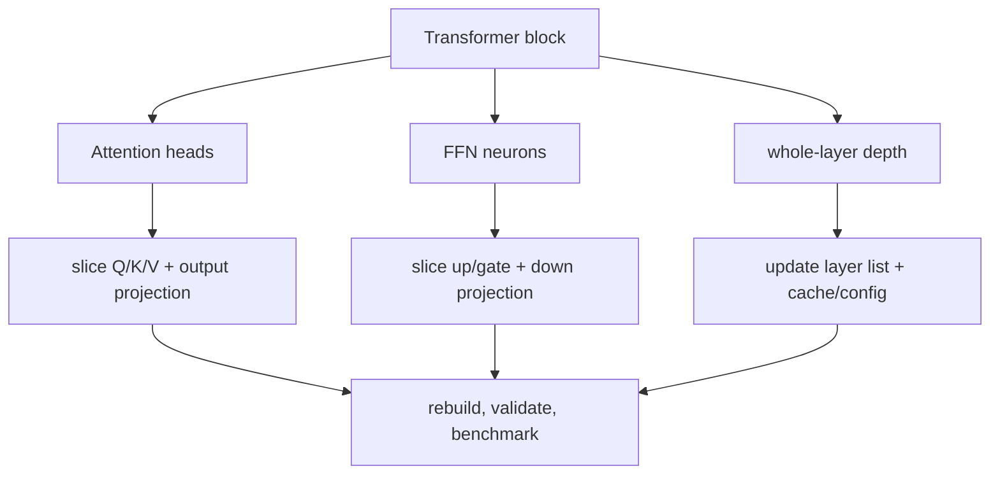

<!-- ai-infra-puzzles-header:start -->
<p align="center">
  
</p>

<h1 align="center">AI Infra Puzzles</h1>

<p align="center">
  <strong>Learn CUDA optimization and LLM inference through hands-on puzzles.</strong>
</p>
<!-- ai-infra-puzzles-header:end -->

# Lesson 22 — 剪枝Transformer头、FFN神经元和层

> **谜题：** 哪个结构单元改变了 Transformer 的计算，而不仅仅是屏蔽值？

[← 第 02 章](../README.md) · [项目主页](../../../README_ZH.md) · [执行的笔记本](../../../chapters/02-sparsity-structured-pruning/22-transformer-structure-pruning/lab.ipynb) · [RTX 5090 结果](../../../chapters/02-sparsity-structured-pruning/22-transformer-structure-pruning/artifacts/rtx5090-result.json)

## 为什么这个谜题重要

注意头、FFN中间神经元、隐藏维度以及整个层是不同的依赖单元。掩码一个头会保留打包的QKV和输出投影形状，而物理上减少FFN宽度会改变密集的 GEMMs。整个层的移除会改变深度和残差组成。每条路径都需要自己的质量和延迟证据。

## 阅读结果前，先做出预测

1. 预测哪些候选者会改变物理参数数量。
2. 估计所选 S、D 和 D_ff 的相对注意力和 FFN 工作量。
3. 预测在恢复前哪条路径的输出漂移最大。

## 1. 从具体的张量和状态开始

一个紧凑的预归一化Transformer块暴露了头输出、FFN中间层、残差以及一个两块堆栈。实验室比较了头掩码、半宽度物理FFN以及在 CUDA 工作负载下的层跳过。

### 三个推理锚点

| # | 本课需要牢记的判断 |
|---:|---|
| 1 | attention head mask并不自动成为更窄的注意力操作符。 |
| 2 | FFN宽度直接控制两个密集矩阵乘法。 |
| 3 | 层剪枝改变深度和残差变换。 |

## 2. 推导机制

对于sequence length S 和隐藏宽度 D，注意力投影大致与 `S D²` 成正比，分数/值工作与 `S² D` 成正比；FFN 工作量与 `S D D_ff` 成正比。移除一个逻辑头但保留打包的 D 宽度投影可能会使大部分工作量保持不变。将 D_ff 减半直接减少了两个 GEMM 维度。移除一个块会删除注意力和 FFN 工作，但会产生更大的功能扰动。结构声明必须指定哪些维度发生了变化。

### 机制概览



### 逐步拆解

1. **选择结构单元。**注意头、隐藏通道、FFN神经元和全层改变不同的维度和接口。
2. **传播耦合维度。**头部移除影响 Q/K/V 和输出投影切片；FFN 移除耦合上下投影。
3.**重建可执行图。**配置字段、缓存形状、残差维度和导出元数据必须与新结构一致。
4.**测量剩余瓶颈。**一个较小的注意力块在FFN、内存流量或启动开销占主导时，可能不会改善端到端延迟。

## 3. 把理论转化为实验

**实验：**测量头部遮罩、物理FFN窄化和整个层跳过。CUDATransformer.

| 实验角色 | 固定定义 |
|---|---|
| 基准 | 全块/堆栈和相同形状的注意力头掩码 |
| 候选方案 | 物理上缩小的FFN和一层更短的堆栈 |
| 保持不变 | 权重、可比性、输入、sequence length、批量、隐藏宽度、dtype、评估模式和计时 |
| 测量 | 物理参数，输出 RMSE/cosine，中位延迟，以及理论工作组件 |
| 证据标签 | `pytorch-gpu` |

### 代码导读

该块返回一个不重写压缩投影的头部掩码路径，使其未改变的物理形状可见。FFN候选者将选择的中间行/列复制到较小的线性模块中。层跳过重用第一个块的输出。这些控制保持三个剪枝单元在概念上分开。

## 4. 解读仓库内的 RTX 5090 实测结果

**录制环境：**NVIDIA GeForce RTX 5090 计算能力12.0; PyTorch 2.12.0; CUDA 运行时13.0.

| 实测字段 | 已提交值 |
|---|---:|
| 全参数 | 49,984 |
| FFN 窄参数 | 33,472 |
| attention head mask RMSE | 0.037988 |
| FFN-narrow RMSE | 0.146989 |
| 层跳过 RMSE | 0.227471 |
| 全中位数 | 0.153360 ms |
| FFN-narrow median | 0.211440 ms |

### 这些数字说明了什么

掩码四个头中的两个，保留49,984参数，并测量0.159792毫秒与0.153360毫秒对于整个块。物理FFN窄化将参数减少到33,472，测量0.211440毫秒，并引入 RMSE 0.146989。层跳过在恢复前有 RMSE 0.227471。

## 5. 解答谜题并做出决策

> 剪枝必须命名结构单元并证明其物理计算路径；仅靠掩码是不够的。

### 验收与回滚门槛

只有在任务/困惑度门和运行时跟踪确认预期的维度或深度发生改变后，才接受Transformer结构。

### 这个结论可能如何失效

随机权重不会揭示头部冗余。融合注意力核可能需要固定头部维度或分组查询布局，而KV-cache形状将注意力结构耦合到服务内存。层的移除会改变归一化统计和生成行为。

## 复现

从仓库根目录：

```bash
python3 -m venv .venv
source .venv/bin/activate
pip install torch jupyterlab nbclient nbformat
jupyter lab chapters/02-sparsity-structured-pruning/22-transformer-structure-pruning/lab.ipynb
```

## 扩展实验

重复使用预训练的编码器或解码器，评估任务质量/困惑度和KV缓存字节，并使用支持显式变量头或窄FFN的后端。

## 证据边界

**证据标签:** [`pytorch-gpu`](../../../chapters/02-sparsity-structured-pruning/README.md#evidence-labels).

## 参考资料

- [十六个脑袋真的比一个好吗？](https://arxiv.org/abs/1905.10650)
- [DepGraph 论文](https://arxiv.org/abs/2301.12900)
