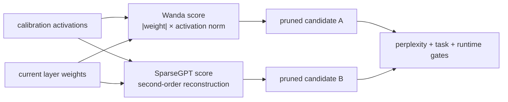

# Lesson 23 — 一次性LLM剪枝：SparseGPT和Wanda机制

> **谜题：**为什么校准激活会改变哪些LLM权重幸存下来？

[← 第 02 章](../README.md) · [项目主页](../../../README_ZH.md) · [执行的笔记本](../../../chapters/02-sparsity-structured-pruning/23-sparsegpt-wanda/lab.ipynb) · [RTX 5090 结果](../../../chapters/02-sparsity-structured-pruning/23-sparsegpt-wanda/artifacts/rtx5090-result.json)

## 为什么这个谜题重要

一次性的LLM剪枝必须选择一个支持，而无需完全重新训练。Magnitude忽略输入使用；Wanda结合了权重幅度与激活范数；SparseGPT使用了二阶重建信息和顺序补偿。一个小层可以暴露这些目标，而无需假装重现一个70B运行。

## 阅读结果前，先做出预测

1. 预测一个输入特征缩放后如何影响Wanda，但不改变其大小排名。
2. 解释SparseGPT中对对角曲率代理所忽略的内容。
3. 选择校准和保留分割以进行公平的一次性比较。

## 1. 从具体的张量和状态开始

宽线性投影、故意不均匀特征尺度的校准标记、保留标记、幅度分数、Wanda分数、对角曲率代理和等稀疏重构输出构成了实验室。

### 三个推理锚点

| # | 本课需要牢记的判断 |
|---:|---|
| 1 | 校准激活定义单次剪枝的特征重要性。 |
| 2 | Wanda评分和SparseGPT补偿不是相同的算法。 |
| 3 | 玩具层重构无法达到70B困惑度或速度。 |

## 2. 推导机制

对于`Y=XW^T`，Wanda评分通过`|w_ij| ||X_:j||`对`w_ij`进行加权，因此，对频繁激活特征的适度权重可能高于未使用的较大权重。SparseGPT则通过近似海森矩阵最小化层重构，并在剪枝列时更新剩余权重。对角线`X^T X`代理可以说明敏感性，但忽略了逆海森序列算法。比较时需要相同的稀疏性和留出输出误差。

### 机制概览



### 逐步拆解

1. **冻结一个代表性的校准集。**两种方法都依赖于层间剪枝过程中看到的激活值。
2.**计算特定计算方法的分数。**Wanda结合了权重幅度和激活规范。SparseGPT使用了二阶重建近似。
3.**剪枝一层并传递激活值。**后续层必须接收来自已剪枝前缀的输出。
4.**超越困惑。**比较稀疏性、困惑度、零样本任务、运行时表示和实际推理性能分别。

## 3. 把理论转化为实验

**实验：**比较大小。Wanda, 和对角曲率掩码在相同的50% 在保留层输出上的稀疏性。

| 实验角色 | 固定定义 |
|---|---|
| 基准 | 平滑幅度单次剪枝 |
| 候选方案 | Wanda激活感知评分和对角曲率敏感性代理 |
| 保持不变 | 权重、校准token、保留token、稀疏性、分组策略和种子 |
| 测量 | 保留测试集 RMSE,余弦相似度,支持重叠,稀疏性,以及校准特征尺度 |
| 证据标签 | `numerical-model` |

### 代码导读

该笔记本构建了能量不等的校准特征，使得激活感知方法能够产生可测量的信号。每个评分规则每行保留相同数量的权重。输出指标是在单独保留的标记上计算的。该缺陷明确地将曲率路径标记为代理，而不是SparseGPT。

## 4. 解读仓库内的 RTX 5090 实测结果

**录制环境：**NVIDIA GeForce RTX 5090 计算能力12.0; PyTorch 2.12.0; CUDA 运行时13.0.

| 实测字段 | 已提交值 |
|---|---:|
| 幅度 RMSE | 20.097502 |
| Wanda RMSE | 4.029922 |
| 曲率代理 RMSE | 6.004300 |
| 余弦相似度 | 0.962958 |
| Wanda余弦 | 0.998537 |
| 支持重叠 | 66.47% |

### 这些数字说明了什么

在50.0%稀疏度下，Wanda/曲率代理保留的 RMSE 值为20.097502/4.029922/6.004300。在100倍校准特征尺度范围内，Wanda保留支持的幅度和重叠为66.5%。曲率得分是一个对角线的OBS风格代理，而不是SparseGPT的顺序算法。

## 5. 解答谜题并做出决策

> 激活感知的支持选择可以减少单次重建误差，但官方算法和全模型证据仍保持为独立门。

### 验收与回滚门槛

在完成冻结校准、全模型困惑度/零样本门、序列化以及支持的稀疏推理路径测量后，才接受LLM剪枝方法。

### 这个结论可能如何失效

校准域可能偏倚激活规范，而逐行玩具掩码省略了块状顺序补偿。较低层 RMSE 可能无法保留生成、稀有功能或安全性。无结构的零可能仍然运行密集。

## 复现

从仓库根目录：

```bash
python3 -m venv .venv
source .venv/bin/activate
pip install torch jupyterlab nbclient nbformat
jupyter lab chapters/02-sparsity-structured-pruning/23-sparsegpt-wanda/lab.ipynb
```

## 扩展实验

运行官方的SparseGPT和Wanda实现于固定开放模型上，扫面校准域和稀疏模式，然后单独基准一个命名的稀疏运行时与质量。

## 证据边界

**证据标签:** [`numerical-model`](../../../chapters/02-sparsity-structured-pruning/README.md#evidence-labels).

## 参考资料

- [SparseGPT](https://arxiv.org/abs/2301.00774)
- [Wanda](https://arxiv.org/abs/2306.11695)
