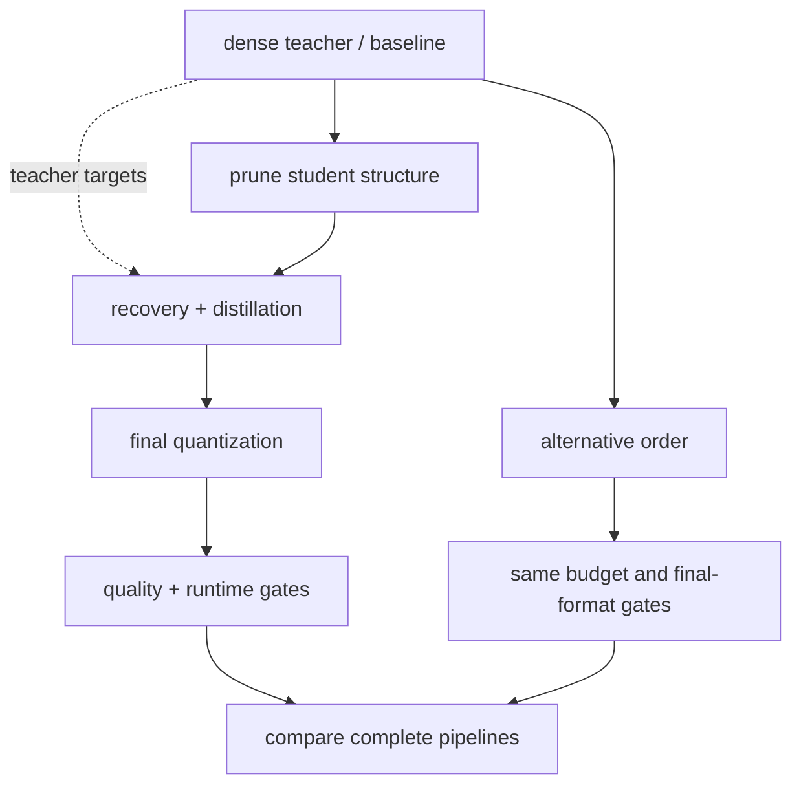

# Lesson 24 — 训练蒸馏、量化和剪枝

> **谜题：**在量化之前剪枝和在量化之后剪枝，产生的量化模型是否相同？

[← 第 02 章](../README.md) · [项目主页](../../../README_ZH.md) · [执行的笔记本](../../../chapters/02-sparsity-structured-pruning/24-compression-order/lab.ipynb) · [RTX 5090 结果](../../../chapters/02-sparsity-structured-pruning/24-compression-order/artifacts/rtx5090-result.json)

## 为什么这个谜题重要

压缩操作符一般不交换。剪枝改变分布和结构；量化冻结尺度或代码本；蒸馏改变恢复目标。组合路线图应比较在同一存储/计算预算下的明确顺序，而不是将技术名称串联起来。

## 阅读结果前，先做出预测

1. 预测密集校准和剪枝校准的 INT8 比例是否匹配。
2. 写出两个操作符的组合，并识别它们的不同状态。
3. 选择何时教师损失应观察压缩学生。

## 1. 从具体的张量和状态开始

线性教师、学生权重、校准输入、保留输入、幅度剪枝、对称 INT8 假量化、两种操作顺序以及可选的短知识蒸馏恢复进行比较。

### 三个推理锚点

| # | 本课需要牢记的判断 |
|---:|---|
| 1 | 剪枝和校准量化通常是不交换的。 |
| 2 | 每个订单都需要自己的校准和恢复协议。 |
| 3 | 组合公平性要求最终预算和保留指标相同。 |

## 2. 推导机制

让 P 表示剪枝，Q_s 表示 scale 为 s 的量化。如果 s 在稠密 W 上校准，则 `P(Q_s(W))` 使用一个受后来删除值影响的范围。`Q_{s'}(P(W))` 在剪枝后重新校准，并且可以使用不同的步长。它们在特殊掩码和缩放下才相等。蒸馏在教师输出上添加了一个损失，如果目的是恢复那个候选者，那么应该在学生实际压缩约束生效时进行，

### 机制概览



### 逐步拆解

1. **命名每个方法的作用。**蒸馏转移行为，剪枝减少容量，量化改变数值表示。
2. **从约束中选择一个顺序。**如果可以重新训练，请在最终量化前进行剪枝；如果教师固定，可以伴随恢复进行蒸馏。
3. **冻结中间检查点。
**每次转换后评估质量，以便回归问题的根源可定位。
4. **比较完整的管道。**在测试替代顺序时，保持总训练预算、最终格式、运行时和评估套件固定。

## 3. 把理论转化为实验

**实验：**比较 prune-then-quantize、quantize-then-prune 和受约束的精简恢复在最终稀疏度/位预算下的表现。

| 实验角色 | 固定定义 |
|---|---|
| 基准 | 量化密集权重并使用密集校准的缩放因子，然后剪枝。 |
| 候选方案 | 先剪枝，再重新校准 INT8，并可选地在教师输出下恢复。 |
| 保持不变 | 教师，学生，校准/保留张量，稀疏性，量化器，恢复步骤，以及种子 |
| 测量 | 量化尺度、保留的 RMSE/cosine、最终稀疏度以及恢复改进 |
| 证据标签 | `numerical-model` |

### 代码导读

该笔记本存储了缩放因子和掩码，因此顺序是可审计的。短恢复优化了已实现的剪枝/量化模拟与教师输出，并重新应用了掩码。这说明了组合依赖性，而不是完整的量化训练或生产级蒸馏。

## 4. 解读仓库内的 RTX 5090 实测结果

**录制环境：**NVIDIA GeForce RTX 5090 计算能力12.0; PyTorch 2.12.0; CUDA 运行时13.0.

| 实测字段 | 已提交值 |
|---|---:|
| 量化-先缩放 | 0.107549 |
| 先剪枝再缩放 | 0.107549 |
| 量化先行 RMSE | 10.841832 |
| 先剪枝的 RMSE | 10.841832 |
| 恢复 RMSE | 11.202020 |
| 最终稀疏度 | 60.00% |

### 这些数字说明了什么

密集校准量化使用的缩放0.107549; 回归校准后剪枝使用0.107549. 保留 RMSE 是10.841832对于量化后剪枝和10.841832用于剪枝后量化。35- 约束教师恢复完成11.202020在60.0% 稀疏性

## 5. 解答谜题并做出决策

> 压缩顺序是模型配方的一部分，因为剪枝、校准和恢复状态不交换。

### 验收与回滚门槛

接受压缩命令之前，必须对其校准数据、恢复目标、最终表示、质量以及运行时进行测试，以形成一个不可更改的配方。

### 这个结论可能如何失效

允许一条路径重新校准或恢复，而另一条路径不能，会使顺序比较不公平。伪量化没有建立 INT8kernel。一个微小的师生层无法预测端到端任务的准确性。

## 复现

从仓库根目录：

```bash
python3 -m venv .venv
source .venv/bin/activate
pip install torch jupyterlab nbclient nbformat
jupyter lab chapters/02-sparsity-structured-pruning/24-compression-order/lab.ipynb
```

## 扩展实验

创建一个因子实验，涉及顺序、校准源和恢复；然后将每个最终候选者导出到相同的后端，并比较存储、质量、延迟和操作复杂性。

## 证据边界

**证据标签:** [`numerical-model`](../../../chapters/02-sparsity-structured-pruning/README.md#evidence-labels).

## 参考资料

- [知识蒸馏神经网络](https://arxiv.org/abs/1503.02531)
- [深度压缩](https://arxiv.org/abs/1510.00149)
