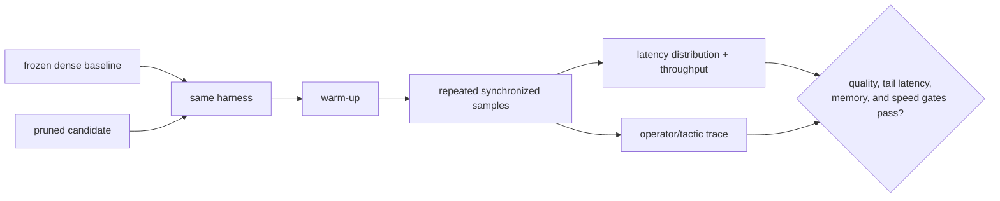

# 第 25 节 — 稀疏性基准测试：证明实际加速

> **谜题：** 哪个基准测试可以防止较低的平均值掩盖不变的 p99 或内存峰值？

[← 第 02 章](../README.md) · [项目主页](../../../README_ZH.md) · [执行的笔记本](../../../chapters/02-sparsity-structured-pruning/25-sparsity-benchmarking/lab.ipynb) · [RTX 5090 结果](../../../chapters/02-sparsity-structured-pruning/25-sparsity-benchmarking/artifacts/rtx5090-result.json)

## 为什么这个谜题重要

稀疏加速是一个运行时声明。该协议必须冻结形状、批次、dtype、warmup、同步、样本窗口、电源状态和后端。它应该报告分布和吞吐量，以及内存和操作符证据，而不是单一的平均值。

## 阅读结果前，先做出预测

1. 预测哪些候选者会改变密集操作符维度。
2. 解释为什么20样本是p99的弱证据。
3. 在阅读结果之前，请选择一个warmup和采样协议。

## 1. 从具体的张量和状态开始

密集、形状相同的掩码和物理上窄化的线性块在批次1和批次64中使用保留的每迭代 CUDA 事件样本进行计时。计算中位数、p95、p99、吞吐量和峰值内存。

### 三个推理锚点

| # | 本课需要牢记的判断 |
|---:|---|
| 1 | 基准身份包括工作负载、后端和时间语义。 |
| 2 | 平均值、中位数和尾部延迟可以对候选者进行不同的排名。 |
| 3 | 掩码密集且物理上狭窄的控制区分零和较少的工作。 |

## 2. 推导机制

GPU工作是异步的，因此在没有同步措施的情况下，主机计时会吸收队列成本。warmup吸收了初始化和算法选择。百分位数需要排序重复样本；`p99`在点数太少时不稳定。吞吐量是单位时间内完成的工作负载量，应该在服务批次中测量，而不是从峰值FLOPs中推导出来。峰值内存必须在每个候选者周围重置。

### 机制概览



### 逐步拆解

1. **冻结基准标识。**模型、运行时、硬件、输入形状、批处理/并发、线程、warmup和采样窗口。
2. **证明操作符身份。**捕获图表或策略证据，显示预期的稀疏或较小的操作符实际上运行了。
3.**测量分布。**保留重复样本，并分别报告p50、p95、p99、吞吐量、内存和初始化。
4. **需要留出高于噪声的余量。**只接受当置信区间或重复运行的散布小于声称的改进时。

## 3. 把理论转化为实验**实验：**在延迟和吞吐量批次中保留样本，对密集、掩码和窄化候选者进行基准测试。

| 实验角色 | 固定定义 |
|---|---|
| 基准 | 密集全宽且形状相同的75%-掩码密集执行 |
| 候选方案 | 物理上四分之一宽度密集执行 |
| 保持不变 | GPU, 观察到的时钟频率，形状，权重，dtype，批次，热身，样本，以及同步。 |
| 测量 | p50/p95/p99 延迟，吞吐量，峰值内存，形状，以及加速比 |
| 证据标签 | `pytorch-gpu` |

### 代码导读

定时助手在测量前分配张量，对每个候选者进行warmup，并记录单独的 CUDA 事件持续时间。汇总函数保留JSON产物中的原始样本。一个单独的大批次可以防止单次请求延迟伪装成服务吞吐量。

## 4. 解读仓库内的 RTX 5090 实测结果

**录制环境：**NVIDIA GeForce RTX 5090 计算能力12.0; PyTorch 2.12.0; CUDA 运行时13.0.

| 实测字段 | 已提交值 |
|---|---:|
| 密集 p50 | 0.017056 ms |
| 密集 p99 | 0.022265 ms |
| 遮罩 p50 | 0.017136 ms |
| 窄p50 | 0.013856 ms |
| 窄p99 | 0.015994 ms |
| 批量-64 加速 | 0.982x |
| 样本 | 80 |

### 这些数字说明了什么

在批次1中，密集的p50/p99值为0.017056/0.022265毫秒，相同形状的掩码候选值为0.017136/0.018128毫秒，物理窄候选值为0.013856/0.015994毫秒。在批次64中，窄/全中位数比为0.982倍。

## 5. 解答谜题并做出决策

> 稀疏性加速是一种在预期执行路径上测量的分布，而不是零计数或最佳情况样本。

### 验收与回滚门槛

只有当匹配的基准、尾部门、吞吐量门、内存门以及operator/形状证据都符合冻结协议时，才接受加速。

### 这个结论可能如何失效

共享GPU负载、动态时钟、分配器历史和不足的样本会移动尾巴。微基准测试省略数据移动和服务队列。一个更窄的玩具层无法证明端到端模型的收益。

## 复现

从仓库根目录：

```bash
python3 -m venv .venv
source .venv/bin/activate
pip install torch jupyterlab nbclient nbformat
jupyter lab chapters/02-sparsity-structured-pruning/25-sparsity-benchmarking/lab.ipynb
```

## 扩展实验

在隔离的进程中重复执行，捕获Nsight或Profileroperator名称，添加置信区间，并运行具有请求到达的代表性的端到端服务负载。

## 证据边界

**证据标签:** [`pytorch-gpu`](../../../chapters/02-sparsity-structured-pruning/README.md#evidence-labels).

## 参考资料

- [PyTorch 基准工具](https://docs.pytorch.org/docs/stable/benchmark_utils.html)
- [PyTorch 采样器文档](https://docs.pytorch.org/docs/stable/profiler.html)
