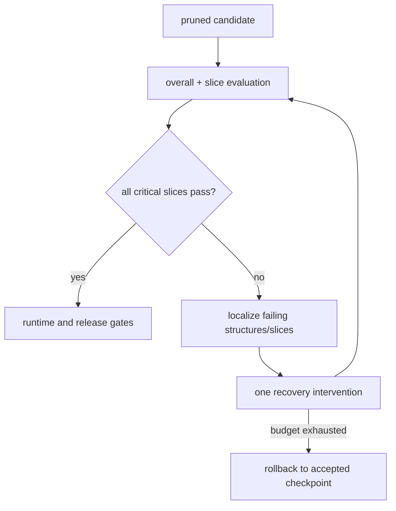

# Lesson 26 — 准确性恢复、回滚和切片错误分析

> **谜题：** 当总体准确率恢复，但一个长尾类仍低于其回滚阈值时，应该发生什么？

[← 第 02 章](../README.md) · [项目主页](../../../README_ZH.md) · [执行的笔记本](../../../chapters/02-sparsity-structured-pruning/26-accuracy-recovery-rollback/lab.ipynb) · [RTX 5090 结果](../../../chapters/02-sparsity-structured-pruning/26-accuracy-recovery-rollback/artifacts/rtx5090-result.json)

## 为什么这个谜题重要

恢复不是一个单一的指标。一个剪枝后的模型可能会通过偏好常见类别的方法恢复整体准确率，而一个稀有或高风险类别的准确率仍然会下降。发布的制品必须保留密集的基线、剪枝后的检查点身份、混淆矩阵、切片差异、接受阈值以及确定性的回滚决策。

## 阅读结果前，先做出预测

1. 预测哪个类对整体准确率贡献最少。
2. 从混淆矩阵的一行计算召回率。
3. 编写一个两部分的接受规则来保护尾部。

## 1. 从具体的张量和状态开始

一个不平衡的三类 CUDA 分类任务，密集检查点，幅度剪枝候选，短恢复，混淆矩阵，每类召回率，综合准确率，以及冻结最差类门控形式构成实验。

### 三个推理锚点

| # | 本课需要牢记的判断 |
|---:|---|
| 1 | 聚合恢复可能会掩盖少数类回归。 |
| 2 | 阈值必须在候选者被评估之前冻结。 |
| 3 | 回滚是一个基于不可变基线的衍生决策。 |

## 2. 推导机制

准确性权重每个示例相等，因此一个5%类别的分数可能会急剧下降，而总和的变化却不到一个点。每个类别的召回率`TP_c/(TP_c+FN_c)`和混淆矩阵揭示了这种变化。门控机制可能需要`accuracy_drop <= a`和`min recall_drop >= -r`。恢复仅在验证标准上选择最佳检查点；回滚修订保持不变。

### 机制概览



### 逐步拆解

1. **比较相同的评估切片。**总体准确率可能会掩盖稀有类别的回归问题、长输入或安全关键group的问题。
2. **定位错误。**使用混淆矩阵、每片差值以及代表性的失败来识别剪枝行为发生变化的位置。
3.**应用一个恢复干预措施。**应分别测试微调、蒸馏、较低的剪枝目标或选择性恢复。
4.**在预定义的阈值上回滚。**在恢复过程中，保持密集检查点和最后一个接受的稀疏检查点始终可加载。

## 3. 把理论转化为实验**实验：**剪枝和恢复不平衡分类器，然后从聚合和单个类门限中推导发布或回滚。

| 实验角色 | 固定定义 |
|---|---|
| 基准 | 密集检查点与冻结验证混淆矩阵 |
| 候选方案 | 70%-剪枝后的恢复检查点在相同的划分下进行评估 |
| 保持不变 | 数据集，不平衡，检查点，掩码，恢复步骤，种子，阈值，以及评估代码 |
| 测量 | 聚合准确率，每类召回率，最差召回率下降，混淆矩阵，以及回滚决策 |
| 证据标签 | `pytorch-gpu` |

### 代码导读

该笔记本训练一个紧凑的基础模型，冻结它，剪枝一个克隆，并记录即时和恢复的指标。混淆矩阵在GPU预测上显式计算并存储为列表。最终决策是通过预声明的聚合和尾部阈值程序化得出的。

## 4. 解读仓库内的 RTX 5090 实测结果

**录制环境：**NVIDIA GeForce RTX 5090 计算能力12.0; PyTorch 2.12.0; CUDA 运行时13.0.

| 实测字段 | 已提交值 |
|---|---:|
| 密集准确度 | 100.00% |
| 剪枝后即时准确率 | 99.19% |
| 恢复的准确率 | 100.00% |
| 最差召回率下降 | 0.00% |
| 需要回滚 | 否 |
| 最终稀疏度 | 70.02% |

### 这些数字说明了什么

密集、立即剪枝并恢复后的聚合准确率分别为 100.0%，99.2%，和 100.0%。恢复后的最差类召回率变化为 0.0%；在冻结的 3 点聚合和 10 点召回门限下，rollback_required=False。

## 5. 解答谜题并做出决策

> 只有当聚合和受保护的切片通过预定义的门并带有测试的回滚路径时，恢复才完成。

### 验收与回滚门槛

只有当所有冻结的聚合体和关键切片门都通过时才能发布；否则选择记录的密集修订作为回滚。

### 这个结论可能如何失效

玩具类不平衡不是生产分类，召回单独忽略精度或校准。在看到候选无效后选择阈值会无效化门限。在最终测试分割上的恢复会泄露评估。

## 复现

从仓库根目录：

```bash
python3 -m venv .venv
source .venv/bin/activate
pip install torch jupyterlab nbclient nbformat
jupyter lab chapters/02-sparsity-structured-pruning/26-accuracy-recovery-rollback/lab.ipynb
```

## 扩展实验

添加精度、校准和领域切片；分离训练/验证/测试；在金丝雀期间练习实际的模型注册回滚，并监控相同的闸门。

## 证据边界

**证据标签:** [`pytorch-gpu`](../../../chapters/02-sparsity-structured-pruning/README.md#evidence-labels).

## 参考资料

- [PyTorch 可再现性注释](https://docs.pytorch.org/docs/stable/notes/randomness.html)
- [深度压缩](https://arxiv.org/abs/1510.00149)
