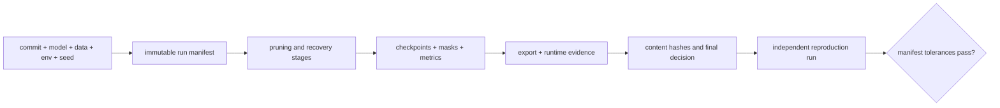

# 第 27 课 — 自动化实验管理与可重复剪枝记录

> **谜题：** 哪些字段可以由其他人复现一个剪枝掩码？

[← 第 02 章](../README.md) · [项目主页](../../../README_ZH.md) · [执行的笔记本](../../../chapters/02-sparsity-structured-pruning/27-reproducible-experiments/lab.ipynb) · [RTX 5090 结果](../../../chapters/02-sparsity-structured-pruning/27-reproducible-experiments/artifacts/rtx5090-result.json)

## 为什么这个谜题重要

稀疏度数不能识别运行。复现需要数据和模型修订、种子、评分规则、并列行为、目标、掩码字节或哈希、优化器/恢复计划、软件、硬件、导出命令以及测量产物。只有在这些字段被记录时，跟踪系统才有帮助。

## 阅读结果前，先做出预测

1. 预测在相同种子运行中匹配的哈希值。
2. 预测不同的种子是否能在改变掩码的同时保持稀疏性。
3. 列出另一台机器需要重复结果的最小字段。

## 1. 从具体的张量和状态开始

使用一个种子执行一次确定性剪枝函数，使用另一个种子执行一次。在小运行记录中，比较配置 JSON、权重初始化、掩码、输出和 SHA-256 消息摘要。

### 三个推理锚点

| # | 本课需要牢记的判断 |
|---:|---|
| 1 | 稀疏性等式弱于掩码身份。 |
| 2 | Canonical configuration 和 binary artifacts 需要分开计算哈希值。 |
| 3 | 跟踪用户界面无法弥补缺失的来源字段。 |

## 2. 推导机制

随机种子控制初始化和采样数据，但确定性算法和稳定排序也很重要。哈希标准化 JSON 捕捉配置漂移；哈希连续掩码字节标识确切的支持。代码提交和环境完成来源。用不同的掩码重现相同的全局稀疏性不是同一个实验。

### 机制概览



### 逐步拆解

1. **创建一个不可变的运行标识。**在执行前绑定代码提交、模型修订、数据分割、环境、种子和配置。
2.**记录剪枝轨迹。**存储每阶段的稀疏性、掩码或保留索引、恢复检查点和评估切片。
3. **附加部署证据。**保留与同一运行相关的导出日志、运行时版本、operator跟踪、原始计时样本和内存测量。
4.**在推广前进行复现。**第二次运行应重建相同的候选方案，并达到在规范中定义的公差，而不仅仅是产生一个相似的指标标题。

## 3. 把理论转化为实验**实验：**运行剪枝管道两次，完全相同，然后一次使用更改后的种子，然后比较配置、掩码和输出哈希。

| 实验角色 | 固定定义 |
|---|---|
| 基准 | 两次执行具有相同的标准配置和种子 |
| 候选方案 | 一次执行，仅改变种子 |
| 保持不变 | 算法代码，配置模式，维度，目标稀疏度，dtype，哈希方法，以及环境捕获 |
| 测量 | 配置哈希，掩码哈希，输出哈希，稀疏性，相同种子相等性，以及不同种子差异性 |
| 证据标签 | `pytorch-gpu` |

### 代码导读

该笔记本在哈希前将配置序列化为按排序键排序并使用紧凑分隔符。掩码作为连续字节移动到CPU，以获得稳定的摘要。注册表行包括适合MLflow或W&B的环境和结论字段，但不需要外部服务来重现核心证据。

## 4. 解读仓库内的 RTX 5090 实测结果

**录制环境：**NVIDIA GeForce RTX 5090 计算能力12.0; PyTorch 2.12.0; CUDA 运行时13.0.

| 实测字段 | 已提交值 |
|---|---:|
| 相同的种子配置匹配 | 是的 |
| 同种子掩码匹配 | 是的 |
| 相同种子输出匹配 | 是的 |
| 不同种子的掩码不同 | 是的 |
| 稀疏性 | 75.00% |
| Mask SHA-256 | `89bdaa05855b` |

### 这些数字说明了什么

相同种子的运行匹配了 config/mask/output 哈希=True/True/True 在 75.0% 稀疏度。仅改变种子就改变了 mask=True。记录的支撑摘要以 `89bdaa05855b` 开始。

## 5. 解答谜题并做出决策

> 可再现的剪枝识别出确切的配置、支持、环境和输出——而不仅仅是最终的零百分比。

### 验收与回滚门槛

仅在独立重跑结果与声明的配置、掩码或有界度量以及环境敏感容差相匹配时，才接受复制品声明。

### 这个结论可能如何失效

种子不能保证在所有设备、库版本或非确定性kernel之间实现位元级相等。仅对文件名或稀疏性进行哈希会忽略内容更改。私有路径和凭据永远不能进入公共制品。

## 复现

从仓库根目录：

```bash
python3 -m venv .venv
source .venv/bin/activate
pip install torch jupyterlab nbclient nbformat
jupyter lab chapters/02-sparsity-structured-pruning/27-reproducible-experiments/lab.ipynb
```

## 扩展实验

将相同的模式记录到 MLflow 或 W&B，再在第二台机器上重新运行，定义哪些字段必须完全匹配，哪些字段允许在一定范围内偏差，并添加检查点/导出哈希。

## 证据边界

**证据标签:** [`pytorch-gpu`](../../../chapters/02-sparsity-structured-pruning/README.md#evidence-labels).

## 参考资料

- [PyTorch 可再现性注释](https://docs.pytorch.org/docs/stable/notes/randomness.html)
- [MLflow跟踪文档](https://mlflow.org/docs/latest/ml/tracking/)
