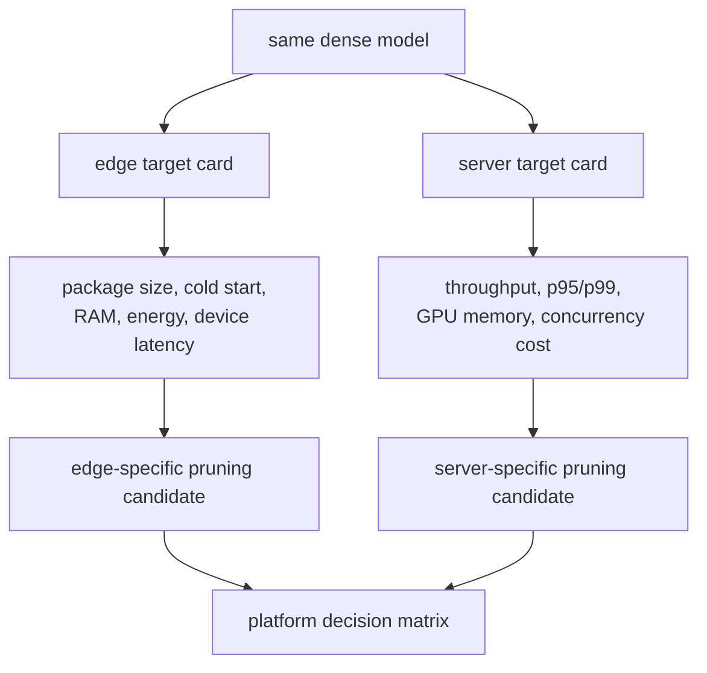

# 课程 28 — 为什么边缘和服务器部署需要不同的剪枝策略

> **谜题：** 在手机和GPU服务上，是否可以期望一个稀疏检查点获胜？

[← 第 02 章](../README.md) · [项目主页](../../../README_ZH.md) · [执行的笔记本](../../../chapters/02-sparsity-structured-pruning/28-edge-vs-server/lab.ipynb) · [RTX 5090 结果](../../../chapters/02-sparsity-structured-pruning/28-edge-vs-server/artifacts/rtx5090-result.json)

## 为什么这个谜题重要

边缘设备通常优先考虑包字节、冷启动、峰值内存、能耗和标准移动运营商。GPU服务优先考虑批量吞吐量、尾部延迟、并发性和kernel支持。相同的零可以在一个平台上压缩得很好，并在另一个平台上作为不变的密集操作符执行。

## 阅读结果前，先做出预测

1. 预测哪个候选者具有最小的压缩重量负载。
2. 预测哪些候选者会改变GPU密集型 GEMM 维度。
3. 为边缘应用和批量GPU服务分别编写独立的验收门。

## 1. 从具体的张量和状态开始

最终的实验结合了测量到的 RTX 5090 批次-1/batch-64 的密集、掩码和物理窄化候选者的时延，同时使用透明存储账本和平台决策矩阵。边缘运行时数据未进行测量。

### 三个推理锚点

| # | 本课需要牢记的判断 |
|---:|---|
| 1 | 平台目标对存储、延迟、吞吐量和能耗给予不同的权重。 |
| 2 | 压缩后的字节数不能预测GPU密集路径的速度。 |
| 3 | 未测量的边缘指标必须保持`not run`在决策矩阵中。 |

## 2. 推导机制

掩码密集矩阵可以减少压缩字节，因为零具有低熵，同时在GPU上保留M、N和K。物理上狭窄的模型减少了密集算术和激活宽度，但改变了架构，可能需要更多的恢复。在边缘设备上，支持的TFLite/OpenVINO操作和冷启动内存可能占主导地位；在服务器上，批处理可以摊销启动开销并暴露 GEMM 效率。因此，每个平台都有不同的门限，可以选择不同的候选方案。

### 机制概览



### 逐步拆解

1. **每个平台写一张目标卡。**边缘和服务器部署有不同的工作负载、运行时、内存限制、能源约束和成本目标。
2.**选择仅支持的结构。**A format useful toTensorRT在GPU上进行的操作在TFLite或移动CPU运行时可能没有好处。
3. **在每个真实路径上进行基准测试。**在边缘设备上测量冷启动和能耗；在服务器上测量并发性、尾部延迟和容量。
4.**允许不同的获胜者。**不要强迫一个检查点同时赢得两个矩阵，当平台特定的候选者更诚实地达到其目标时。

## 3. 把理论转化为实验

**实验：**在交互式和吞吐量批次中测量GPU候选者，计算存储表示，并根据平台特定情况做出决策，而无需发明边缘基准。

| 实验角色 | 固定定义 |
|---|---|
| 基准 | 全宽密集且形状相同的75%-掩码权重 |
| 候选方案 | 物理上四分之一宽度密集候选加上分离边缘/服务器决策行 |
| 保持不变 | 源权重，输入宽度，dtype，压缩方法，GPU计时，批次，以及平台门定义 |
| 测量 | 原始/GZIP字节，batch-1延迟，batch-64吞吐量，物理尺寸，边缘证据状态，以及平台决策 |
| 证据标签 | `capacity-model` |

### 代码导读

该笔记本将相同的候选权重序列化为原始内存负载，并对其进行gzip压缩，然后测量 CUDA 操作符。它填充边缘行以存储事实，但不执行设备延迟和能耗。服务器行仅使用测量的 RTX 5090 证据。这防止了跨平台投影。

## 4. 解读仓库内的 RTX 5090 实测结果

**录制环境：**NVIDIA GeForce RTX 5090 计算能力12.0; PyTorch 2.12.0; CUDA 运行时13.0.

| 实测字段 | 已提交值 |
|---|---:|
| 密集的gzip字节 | 6,646,281 字节 |
| 掩码gzip字节 | 2,789,948 字节 |
| 窄压缩字节 | 1,661,842 字节 |
| GPU 批量-1 密集 | 0.018304 ms |
| GPU 批处理-1 窄 | 0.014224 ms |
| GPU批处理-64 加速 | 0.981x |
| 边缘运行时测量 | 否 |

### 这些数字说明了什么

密集/掩码/窄gzip负载为6,646,281/2,789,948/1,661,842字节。在 RTX 5090 中，批量1中位数为0.018304/0.017760/0.014224毫秒，批量64物理宽度比为0.981x。边缘延迟和能耗尚未测量，因此边缘决策明确待定。

## 5. 解答谜题并做出决策

> 稀疏性策略是平台特定的：存储证据、边缘执行和服务器执行必须在各自被测量之前保持分离。

### 验收与回滚门槛

只有当该平台所需的每个指标都有原生证据时，才选择一个平台候选；否则，将决定保留为待定状态，并保留密集回滚。

### 这个结论可能如何失效

Gzip不是TFLite稀疏编码，RTX计时不是手机计时，一个服务器批次不代表并发。物理上狭窄的形状也可能不被固定移动图支持或在GPUkernel中对齐。

## 复现

从仓库根目录：

```bash
python3 -m venv .venv
source .venv/bin/activate
pip install torch jupyterlab nbclient nbformat
jupyter lab chapters/02-sparsity-structured-pruning/28-edge-vs-server/lab.ipynb
```

## 扩展实验

将所有候选者导出到 TFLite/OpenVINO 和服务器后端，对实际的手机/CPU/GPU 目标进行基准测试，包括能耗和并发性，然后比较总成本，而不是传输代理结果。

## 证据边界

**证据标签:** [`capacity-model`](../../../chapters/02-sparsity-structured-pruning/README.md#evidence-labels).

## 参考资料

- [TensorFlow Lite 模型优化](https://www.tensorflow.org/lite/performance/model_optimization)
- [TensorRT 稀疏性要求](https://docs.nvidia.com/deeplearning/tensorrt/latest/inference-library/data-formats-tensors.html)
