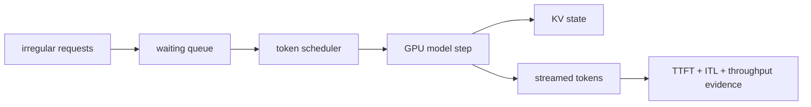

# 第 01 课 — 推理服务瓶颈

> **谜题：** 为什么一个快速单个提示仍然会变成不可靠的并发服务？

[← 第 03 章](../README.md) · [项目主页](../../../README_ZH.md) · [执行的笔记本](../../../chapters/03-vllm-inference-serving/01-inference-service-bottleneck/lab.ipynb) · [RTX 5090 结果](../../../chapters/03-vllm-inference-serving/01-inference-service-bottleneck/artifacts/rtx5090-result.json)

## 为什么这个谜题重要

一个模型演示在warmup后测量一个请求。一个服务拥有一个队列、接纳政策、缓存预算、批处理政策和延迟目标。相关的问题不是模型是否能生成文本，而是服务层能否在不牺牲尾部延迟的情况下将不规则的到达转化为有用的GPU工作。

## 阅读结果前，先做出预测

1. 预测四个短提示的输出token throughput。
2. 一个离线批次无法建立的结论是哪一个？
3. 在设置在线SLO之前，请选择所需的附加跟踪。

## 1. 从具体的请求开始并陈述

实验室使用安装的 vLLM 引擎，一个本地 Qwen2.5检查点，四个提示，生成的token计数，wall-clock 时间，以及 CUDA 内存观察。它记录一个本地批次，而不是从框架名称推断服务行为。

### 三个推理锚点

| # | 本课需要牢记的判断 |
|---:|---|
| 1 | 单请求延迟不是并发结果。 |
| 2 | 调度创造机会；工作负载的形状决定了它们是否存在。 |
| 3 | 服务决策需要有用的token throughput和尾部延迟门限。 |

## 2. 推导机制

自回归推理交替进行计算密集型提示传递与重复的one-token step。独立请求在不同时间到达这些阶段。服务引擎可以将就绪的token步骤一起调度并管理它们的KV状态，但没有到达模型，任何调度器都无法删除模型工作或保证SLO。因此，吞吐量、延迟和排队形成不同的证据轴。

### 机制概览



### 逐步拆解

1. **分离阶段。**将提示处理和token 生成视为不同的工作负载。
2.**使请求可调度。**将就绪工作暴露给一个引擎，而不是孤立的模型循环。
3.**衡量有用的工作。**在耗时和内存旁边计数提示和生成的token。
4. **限定结论边界。**在承诺服务目标之前，添加在线排队证据。

## 3. 把理论转化为实验**实验：**运行一个真实的 vLLM 离线批处理并保留引擎版本、token计数、墙时和GPU 内存。

| 实验角色 | 固定定义 |
|---|---|
| 基准 | 一个冻结的 Qwen2.5 模型和四个独立的提示 |
| 候选方案 | vLLM 本地离线批量处理这些提示 |
| 保持不变 | 模型路径，采样，提示集，最大输出，种子，和 GPU |
| 测量 | 请求次数，提示/输出token数，耗时秒数，输出tok/s，以及内存 |
| 证据标签 | `native-backend` |

### 代码导读

实验加载一次检查点，生成所有请求在一个调用中，并从每个 RequestOutput 读取 token ID。它故意报告批次耗时，而不是从离线 API 制造每个请求的 TTFT。

## 4. 解读仓库内的 RTX 5090 实测结果

**录制环境：**NVIDIA GeForce RTX 5090 计算能力12.0; PyTorch 2.13.0+cu130;CUDA 运行时13.0; vLLM 0.27.1.

| 实测字段 | 已提交值 |
|---|---:|
| vLLM 版本 | 0.27.1 |
| 请求 | 4 |
| prompt tokens | 29 |
| output tokens | 96 |
| 已用时 | 0.225945 |
| 输出吞吐量 | 424.9/s |
| 峰值分配 | 0.000 MiB |

### 这些数字说明了什么

vLLM 0.27.1 已完成 4 请求，并在 0.226 秒内输出了 96 个token（424.9 token/秒）。这是本地离线执行，不是在线队列或网络证据。

## 5. 解答谜题并做出决策

> 本地运行证明了这个 vLLM 构建为 RTX 5090 提供冻结批次；它没有证明生产并发SLO。

### 验收与回滚门槛

只有在线到达测试也满足TTFT、ITL、错误率和内存门限后，才采用 vLLM 作为测量服务候选。

### 这个结论可能如何失效

warmup、编译、提示长度、采样和模型大小可以逆转观察到的速率。离线批次不包含网络、分词器、队列或流式延迟。

## 复现

仓库内记录的固定版本为 vLLM 和 0.27.1，以及本地 Qwen2.5-1.5B-Instruct 检查点。在 Linux CUDA 主机上，创建一个干净的环境，并将 `CH3_MODEL` 指向你的本地检查点：

```bash
uv venv .venv --python 3.12
source .venv/bin/activate
uv pip install vllm==0.27.1 nbclient nbformat ipykernel requests pyyaml --torch-backend=auto
export CH3_MODEL=/path/to/Qwen2.5-1.5B-Instruct
jupyter lab chapters/03-vllm-inference-serving/01-inference-service-bottleneck/lab.ipynb
```

## 扩展实验

使用OpenAI端点回放带有时间戳的生产级到达轨迹，并将p50/p95的TTFT和ITL与相同版本的模型进行比较。

## 证据边界

**证据标签:** [`native-backend`](../../../chapters/03-vllm-inference-serving/README.md#evidence-labels). 命名的 vLLM 运行时在记录的GPU/模型/工作负载上执行。结果不会转移到另一个版本、模型、端点或流量分布。

## 参考资料

- [vLLM 文档](https://docs.vllm.ai/en/latest/)
- [vLLM 快速启动](https://docs.vllm.ai/en/latest/getting_started/quickstart/)
