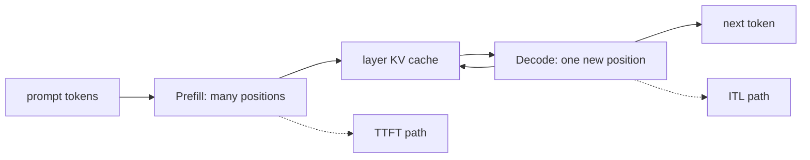

<!-- ai-infra-puzzles-header:start -->
<p align="center">
  
</p>

<h1 align="center">AI Infra Puzzles</h1>

<p align="center">
  <strong>Learn CUDA optimization and LLM inference through hands-on puzzles.</strong>
</p>
<!-- ai-infra-puzzles-header:end -->

# 第 02 课 — Prefill, Decode, 和 KV Cache

> **谜题：**哪一阶段拥有TTFT, 哪个阶段拥有ITL, 为什么上下文会保持驻留？

[← 第 03 章](../README.md) · [项目主页](../../../README_ZH.md) · [执行的笔记本](../../../chapters/03-vllm-inference-serving/02-prefill-decode-kv-cache/lab.ipynb) · [RTX 5090 结果](../../../chapters/03-vllm-inference-serving/02-prefill-decode-kv-cache/artifacts/rtx5090-result.json)

## 为什么这个谜题重要

长提示和长回答会强调引擎的不同部分。将它们合并成一个每秒请求数隐藏了是否是提示的注意力、重复的Decode步骤，还是KV容量是限制因素。

## 阅读结果前，先做出预测

1. 按预期运行时间对四个工作负载单元进行排序。
2. 计算哪些单元格保留了最多的KV位置。
3. State whether offline RequestOutput metrics expose true network-observedTTFT.

## 1. 从具体的请求开始并陈述

实验创建了带有短和长提示的短和长输出限制的请求，通过一个本地引擎运行，并在安装的 API 需要时保留请求指标。token 计数提供备用账本。

### 三个推理锚点

| # | 本课需要牢记的判断 |
|---:|---|
| 1 | 提示长度主要改变初始计算和缓存分配。 |
| 2 | 输出长度重复 Decode 并且每次增加缓存一个词。 |
| 3 | 累计耗时无法识别TTFT，除非首先进行第一token计时。 |

## 2. 推导机制

Prefill 将所有提示标记映射到模型，并为每一层生成键/值向量。Decode 重用该状态，并在每一步追加一个位置。对于标准解码器，KV字节大约与 `2 × layers × tokens × kv_heads × head_dim × bytes_per_element` 成比例。TTFT 包含队列加上提示工作；ITL 反映了 Decode 调度和执行事件的顺序。

### 机制概览



### 逐步拆解

1. **首先进行分词。**提示词-分词数量定义了初始工作和缓存位置。
2.**材料化可重用状态。**Prefill 每一层都写入键和值。
3.**在Decode.**期间，生成的每个token都会扩展该状态并触发另一个模型步骤。
4. **选择正确的度量标准。**使用 TTFT 进行初始工作，使用 ITL 进行重复生成。

## 3. 把理论转化为实验**实验：**测量一个2×2通过prompt/output网格 vLLM 保留token和请求时间字段。

| 实验角色 | 固定定义 |
|---|---|
| 基准 | 简短提示，带有八个词的回复 |
| 候选方案 | 长提示和/或32token答案 |
| 保持不变 | 引擎，模型，dtype，种子，采样模式，以及GPU |
| 测量 | 提示词数，输出词数，耗时，以及可用请求指标 |
| 证据标签 | `native-backend` |

### 代码导读

每次工作负载在一次warmup后作为单独的原生请求运行。代码反向解析元数据对象，而不是假设特定版本的属性，因此缺失的字段保持明确而非虚构。

## 4. 解读仓库内的 RTX 5090 实测结果

**录制环境：**NVIDIA GeForce RTX 5090 计算能力12.0; PyTorch 2.13.0+cu130;CUDA 运行时13.0; vLLM 0.27.1.

| 实测字段 | 已提交值 |
|---|---:|
| 短/短时间间隔 | 0.084925 |
| 长/短持续时间 | 54.500730 |
| 短/长持续时间 | 0.255930 |
| 长时间 | 0.268379 |
| 最长提示词 | 914 |
| 最长输出token | 32 |

### 这些数字说明了什么

使用长提示时使用了914token，而非8短token；长答案产生了32token。耗时结合了各个阶段，仅非空的原生请求字段作为阶段计时证据。

## 5. 解答谜题并做出决策

> Prefill, Decode 和 KV 增长是不同的机制；这次运行测量它们的联合原生请求成本，并仅暴露 API 实际返回的计时字段。

### 验收与回滚门槛

仅在对应该阶段的指标在代表性负载下移动后，才使用特定阶段的优化。

### 这个结论可能如何失效

墙钟测量包括 Python 和调度器开销。重复的语句可能在分词时与预期不同，且离线的第一个分词时间戳不是客户端观察到的流式延迟。

## 复现

仓库内记录的固定版本为 vLLM 和 0.27.1，以及本地 Qwen2.5-1.5B-Instruct 检查点。在 Linux CUDA 主机上，创建一个干净的环境，并将 `CH3_MODEL` 指向你的本地检查点：

```bash
uv venv .venv --python 3.12
source .venv/bin/activate
uv pip install vllm==0.27.1 nbclient nbformat ipykernel requests pyyaml --torch-backend=auto
export CH3_MODEL=/path/to/Qwen2.5-1.5B-Instruct
jupyter lab chapters/03-vllm-inference-serving/02-prefill-decode-kv-cache/lab.ipynb
```

## 扩展实验

在流式 API 上运行相同的网格，在客户端对每个块进行时间戳，并将引擎时间戳与网络观察结果进行比较。

## 证据边界

**证据标签:** [`native-backend`](../../../chapters/03-vllm-inference-serving/README.md#evidence-labels). 命名的 vLLM 运行时在记录的GPU/模型/工作负载上执行。结果不会转移到另一个版本、模型、端点或流量分布。

## 参考资料

- [PagedAttention 论文](https://arxiv.org/abs/2309.06180)
- [生产指标](https://docs.vllm.ai/en/latest/usage/metrics/)
