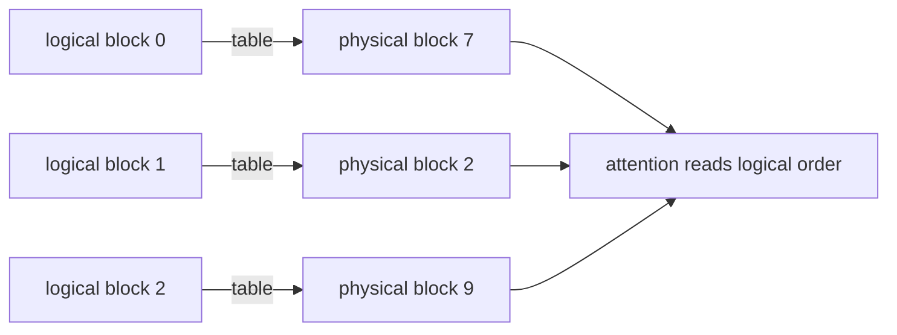

<!-- ai-infra-puzzles-header:start -->
<p align="center">
  
</p>

<h1 align="center">AI Infra Puzzles</h1>

<p align="center">
  <strong>Learn CUDA optimization and LLM inference through hands-on puzzles.</strong>
</p>
<!-- ai-infra-puzzles-header:end -->

# Lesson 03 — PagedAttention and Block Tables

> **谜题：**非连续的KV块如何在不改变注意力语义的情况下减少浪费？

[← 第 03 章](../README.md) · [项目主页](../../../README_ZH.md) · [执行的笔记本](../../../chapters/03-vllm-inference-serving/03-pagedattention-block-tables/lab.ipynb) · [RTX 5090 结果](../../../chapters/03-vllm-inference-serving/03-pagedattention-block-tables/artifacts/rtx5090-result.json)

## 为什么这个谜题重要

请求的结束长度不可预测。为每个请求保留一个连续的最大长度的内存块会将内存锁定，而移动活动缓存条目以修复碎片化则代价高昂。PagedAttention 引入了一种间接机制，使得逻辑token位置映射到物理块。

## 阅读结果前，先做出预测

1. 计算提供的长度分布的计算片浪费。
2. 预测块大小变化对浪费和元数据的影响。
3. 随机物理放置后验证重建结果。

## 1. 从具体的请求开始并陈述

该笔记本运行一个确定性的分配器模型，用于混合长度批次。它比较最大长度的块、精确变量分配和固定大小的块，然后验证一个打乱的块表是否可以重建相同的逻辑顺序。

### 三个推理锚点

| # | 本课需要牢记的判断 |
|---:|---|
| 1 | 内部碎片化由每个序列的一个部分块所限。 |
| 2 | 外部碎片化通过分配任何空闲物理块来处理。 |
| 3 | 块表在物理ID被打乱时仍保持逻辑顺序。 |

## 2. 推导机制

对于块大小`B`，长度为`L`的请求拥有`ceil(L/B)`个块，并且浪费少于`B`个token槽。块表将每个逻辑块号映射到一个物理块。在读取键和值时注意该映射；物理邻近性是不必要的。这改变了分配和寻址，而不是数学上的注意权重。

### 机制概览



### 逐步拆解

1. **分区逻辑位置。**将组token位置划分为等大小的逻辑块。
2. **从池中分配。**将每个逻辑块分配给任何可用的物理块。
3. **遵循表格。**在注意力中按逻辑顺序收集物理块。
4. **考虑尾部。**每个请求的最后一个块可以部分未用。

## 3. 把理论转化为实验**实验：**模拟 slab 和 block 的分配，然后通过随机化的 block 表重建逻辑 token ID。

| 实验角色 | 固定定义 |
|---|---|
| 基准 | 一次请求只能预订一个连续的最大序列。 |
| 候选方案 | 固定大小的分页块从共享池分配 |
| 保持不变 | 请求长度、元素足迹、种子和逻辑负载 |
| 测量 | 保留的token槽，浪费比率，区块计数，以及重建相等性 |
| 证据标签 | `numerical-model` |

### 代码导读

代码将每个token槽视为可见的整数，将块放置在非连续的物理ID上，并通过表收集它们。这使得地址转换可以被检查，而无需声称 CUDAkernel跟踪。

## 4. 解读仓库内的 RTX 5090 实测结果

**录制环境：**NVIDIA GeForce RTX 5090 计算能力12.0; PyTorch 2.13.0+cu130;CUDA 运行时13.0; vLLM 0.27.1.

| 实测字段 | 已提交值 |
|---|---:|
| 预留槽位 | 8,192 |
| 分页保留token | 2,800 |
| 块料废料 | 66.75% |
| 分页垃圾 | 2.71% |
| 物理块 | 175 |
| 重建精确 | 是的 |

### 这些数字说明了什么

预留的块8,192保留了66.7%的浪费；16-token页面预留了2,800，保留了2.7%的浪费。非连续重建是精确的；这是一个分配器模型，而不是kernel基准。

## 5. 解答谜题并做出决策

> 每请求绑定的分页块尾部浪费和允许非连续放置；数值重建证明了映射不变性，而非原生PagedAttention速度。

### 验收与回滚门槛

在评估目标分布上的碎片化和调度器/kernel限制后，再选择块大小。

### 这个结论可能如何失效

分配器模型省略了写时复制、前缀共享、淘汰、块元数据字节、对齐以及kernel执行。它教授不变量但无法预测原生延迟。

## 复现

仓库内记录的固定版本为 vLLM 和 0.27.1，以及本地 Qwen2.5-1.5B-Instruct 检查点。在 Linux CUDA 主机上，创建一个干净的环境，并将 `CH3_MODEL` 指向你的本地检查点：

```bash
uv venv .venv --python 3.12
source .venv/bin/activate
uv pip install vllm==0.27.1 nbclient nbformat ipykernel requests pyyaml --torch-backend=auto
export CH3_MODEL=/path/to/Qwen2.5-1.5B-Instruct
jupyter lab chapters/03-vllm-inference-serving/03-pagedattention-block-tables/lab.ipynb
```

## 扩展实验

收集实时请求长度和引擎缓存指标，扫除支持的块大小，并添加前缀缓存共享及淘汰事件。

## 证据边界

**证据标签:** [`numerical-model`](../../../chapters/03-vllm-inference-serving/README.md#evidence-labels). 一个透明的分配器、调度器、网关或策略模型被执行。它建立了声明的不变量，而不是原生的。vLLM 性能

## 参考资料

- [PagedAttention 论文](https://arxiv.org/abs/2309.06180)
- [vLLM 引擎参数](https://docs.vllm.ai/en/latest/configuration/engine_args/)
