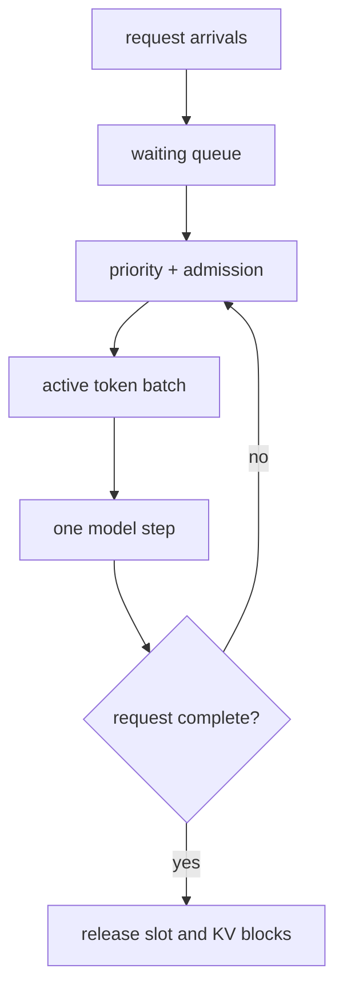

<!-- ai-infra-puzzles-header:start -->
<p align="center">
  
</p>

<h1 align="center">AI Infra Puzzles</h1>

<p align="center">
  <strong>Learn CUDA optimization and LLM inference through hands-on puzzles.</strong>
</p>
<!-- ai-infra-puzzles-header:end -->

# Lesson 04 — 持续批处理、吞吐量和公平性

> **谜题：** 新到达的短请求何时应进入GPU批次？

[← 第 03 章](../README.md) · [项目主页](../../../README_ZH.md) · [执行的笔记本](../../../chapters/03-vllm-inference-serving/04-continuous-batching/lab.ipynb) · [RTX 5090 结果](../../../chapters/03-vllm-inference-serving/04-continuous-batching/artifacts/rtx5090-result.json)

## 为什么这个谜题重要

静态批处理等待组中每个序列都完成。自回归序列很少一起完成，因此完成的行变成空闲工作，而新到达的行仍然排队。迭代级调度可以重新填充这些槽位，但不受约束的吞吐量策略可能会饿死旧的或大的请求。

## 阅读结果前，先做出预测

1. 预测哪个调度器能最小化周转时间。
2. 识别哪个策略伤害了最老的长请求。
3. 选择一个可观测的饥饿门。

## 1. 从具体的请求开始并陈述

离散事件调度器在静态组、最短剩余token优先级和年龄感知连续批处理下重放相同的到达和token需求。它保留了每个请求的完成时间。

### 三个推理锚点

| # | 本课需要牢记的判断 |
|---:|---|
| 1 | 批量成员资格在每次模型步骤后可能会改变。 |
| 2 | 相同的token容量在不同的优先级下可以产生不同的尾部延迟。 |
| 3 | 公平性必须编码为调度规则，并按请求进行测量。 |

## 2. 推导机制

在每个Decode时刻，连续批处理选择最多`C`个活跃序列，每个序列向前推进一个token，释放完成的序列，并接纳更多的工作。最短剩余token优先级降低平均延迟，但可以推迟长期任务。添加年龄项或服务类会将目标从纯粹的token throughput转变为声明的公平政策。

### 机制概览



### 逐步拆解

1. **观察到达情况。**记录每个请求何时变得合格。
2. **应用命名优先级。**使用剩余的token、年龄或类别选择活跃的工作。
3. **进行一次迭代。**为每个预定序列生成一个token。
4.**测量个体。**保留完成时间和等待时间，而不是仅汇总token。

## 3. 把理论转化为实验

**实验：**通过三个调度器重放一个到达轨迹，并比较完成时间、p95完成时间和最大等待时间。

| 实验角色 | 固定定义 |
|---|---|
| 基准 | 静态组，在接纳新工作之前会先耗尽。 |
| 候选方案 | 持续最短剩余时间和年龄感知调度 |
| 保持不变 | 到达轨迹，每请求token，tick容量，以及并列解决 |
| 测量 | 最短完成时间，平均/95%延迟，最大等待时间和完成顺序 |
| 证据标签 | `numerical-model` |

### 代码导读

该模拟基于显式token量子运行，并保持每请求的时间线。其目的是使政策后果可见；它不替代原生调度器性能分析。

## 4. 解读仓库内的 RTX 5090 实测结果

**录制环境：**NVIDIA GeForce RTX 5090 计算能力12.0; PyTorch 2.13.0+cu130;CUDA 运行时13.0; vLLM 0.27.1.

| 实测字段 | 已提交值 |
|---|---:|
| 静态作业完成时间 | 28.000000 |
| 连续作业时间 | 15.000000 |
| 年龄感知的最短完成时间 | 15.000000 |
| 静态 p95 | 22.500000 |
| 最短最大等待时间 | 0.000000 |
| 年龄感知最大等待 | 0.000000 |

### 这些数字说明了什么

静态/最短/年龄感知的最短时间间隔是28/15/15个时间间隔。即使容量相同，请求的等待优先级也会改变；时间间隔的持续时间被建模。

## 5. 解答谜题并做出决策

> 连续批处理可以立即回收完成的槽位，而优先级规则——不仅仅是批处理——决定了公平性。

### 验收与回滚门槛

选择尾部和饥饿度量符合服务类门限的策略，同时在可接受的吞吐量成本下。

### 这个结论可能如何失效

真实Prefill步骤的成本不相等。CUDA 批次不是固定时长的tick，内存压力可能会阻止接纳。此跟踪示例而非容量预测。

## 复现

仓库内记录的固定版本为 vLLM 和 0.27.1，以及本地 Qwen2.5-1.5B-Instruct 检查点。在 Linux CUDA 主机上，创建一个干净的环境，并将 `CH3_MODEL` 指向你的本地检查点：

```bash
uv venv .venv --python 3.12
source .venv/bin/activate
uv pip install vllm==0.27.1 nbclient nbformat ipykernel requests pyyaml --torch-backend=auto
export CH3_MODEL=/path/to/Qwen2.5-1.5B-Instruct
jupyter lab chapters/03-vllm-inference-serving/04-continuous-batching/lab.ipynb
```

## 扩展实验

从实际引擎中重放生产到达时间戳，包括提示长度、流媒体时长、优先级类、取消情况以及每步成本测量。

## 证据边界

**证据标签:** [`numerical-model`](../../../chapters/03-vllm-inference-serving/README.md#evidence-labels). 一个透明的分配器、调度器、网关或策略模型被执行。它建立了声明的不变量，而不是原生的。vLLM 性能

## 参考资料

- [vLLM 文档](https://docs.vllm.ai/en/latest/)
- [PagedAttention 论文](https://arxiv.org/abs/2309.06180)
