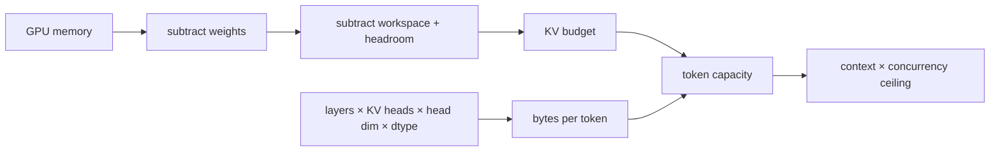

<!-- ai-infra-puzzles-header:start -->
<p align="center">
  
</p>

<h1 align="center">AI Infra Puzzles</h1>

<p align="center">
  <strong>Learn CUDA optimization and LLM inference through hands-on puzzles.</strong>
</p>
<!-- ai-infra-puzzles-header:end -->

# 第 05 课 — KV 缓存内存预算

> **谜题：** 在模型权重和运行时预留之后，可以容纳多少个并发长上下文请求？

[← 第 03 章](../README.md) · [项目主页](../../../README_ZH.md) · [执行的笔记本](../../../chapters/03-vllm-inference-serving/05-kv-memory-budget/lab.ipynb) · [RTX 5090 结果](../../../chapters/03-vllm-inference-serving/05-kv-memory-budget/artifacts/rtx5090-result.json)

## 为什么这个谜题重要

一个模型可以成功加载，但在累积上下文时仍会失败。容量规划必须在分配剩余空间给KV缓存之前，为权重、运行时工作区、非Torch分配和不确定性保留空间。

## 阅读结果前，先做出预测

1. 计算本地检查点每token的 BF16 KV 字节。
2. 预测从 BF16 到 FP8 缓存的容量变化。
3. 理论上的并发性超过了操作限制的原因是什么？

## 1. 从具体的请求开始并陈述

该笔记本读取本地模型配置和实际GPU 内存，从层/头几何结构中推导出每词的KV字节，并计算几种上下文长度和缓存dtype下的保守并发度。

### 三个推理锚点

| # | 本课需要牢记的判断 |
|---:|---|
| 1 | KV 几何来自模型配置。 |
| 2 | 上下文和并发增加了token足迹。 |
| 3 | 安全预算在除法前减去权重、工作区和余量。 |

## 2. 推导机制

对于分组查询注意力机制，一个标记存储 `num_key_value_heads` 的键值对，而不是所有查询头。一个一阶解码器缓存每标记使用 `2 × layers × kv_heads × head_dim × element_bytes`。将声明的键值预算除以该占用量得到标记容量；再次除以上下文长度仅给出理论并发上限。

### 机制概览



### 逐步拆解

1. **读取模型几何。**使用KV头和头维度，而不仅是参数数量。
2. **声明非KV储备。**权重和工作空间仅保留部分VRAM用于上下文状态。
3. **计算token容量。**将可用字节除以每个标记的内存占用量。
4. **请在天花板以下验证。**本地分配和延迟测试确定操作极限。

## 3. 把理论转化为实验

**实验：**将测量的GPU 内存与模型几何形状和声明的预留量相结合，以计算上下文/并发单元。

| 实验角色 | 固定定义 |
|---|---|
| 基准 | BF16 固定内存预算下的KV存储 |
| 候选方案 | FP8KV 存储和多个上下文长度 |
| 保持不变 | 模型配置，GPU总数，权重估计，预留比例，以及利用率上限 |
| 测量 | KV字节/token，token容量和理论并发序列 |
| 证据标签 | `capacity-model` |

### 代码导读

代码仅解析本地配置字段，显示所有减法，并输出完整的容量表。结果中不插入任何隐藏的分配器效率。

## 4. 解读仓库内的 RTX 5090 实测结果

**录制环境：**NVIDIA GeForce RTX 5090 计算能力12.0; PyTorch 2.13.0+cu130;CUDA 运行时13.0; vLLM 0.27.1.

| 实测字段 | 已提交值 |
|---|---:|
| GPU 总量 | 32,110.938 MiB |
| BF16 每个词的字节数 | 28,672 字节 |
| FP8 每个词的字节数 | 14,336 字节 |
| BF16 token容量 | 778,161 |
| FP8 token容量 | 1,556,323 |
| BF16 8K concurrency | 94 |

### 这些数字说明了什么

模型几何结构产生28,672 BF16 并且14,336 FP8 每词KB字节。声明的预算给出了一个 BF168K 天花板94序列；本地分配和延迟必须设定操作限制。

## 5. 解答谜题并做出决策

> KV 容量是一个基于模型几何的预算方程；其结果是一个规划上限，直到原生并发测试通过。

### 验收与回滚门槛

设置准入限制低于计算出的上限，并使用原生负载、碎片化和尾部延迟测试进行验证。

### 这个结论可能如何失效

滑动窗口注意力、混合状态空间层、缓存对齐、CUDA 图、前缀共享和引擎预留可以改变原生分配。模型文件字节与驻留权重内存不完全相同。

## 复现

仓库内记录的固定版本为 vLLM 和 0.27.1，以及本地 Qwen2.5-1.5B-Instruct 检查点。在 Linux CUDA 主机上，创建一个干净的环境，并将 `CH3_MODEL` 指向你的本地检查点：

```bash
uv venv .venv --python 3.12
source .venv/bin/activate
uv pip install vllm==0.27.1 nbclient nbformat ipykernel requests pyyaml --torch-backend=auto
export CH3_MODEL=/path/to/Qwen2.5-1.5B-Instruct
jupyter lab chapters/03-vllm-inference-serving/05-kv-memory-budget/lab.ipynb
```

## 扩展实验

在选定的利用率限制下启动引擎，执行长上下文并发扫描，并将引擎缓存块指标与一阶账本进行对账。

## 证据边界

**证据标签:** [`capacity-model`](../../../chapters/03-vllm-inference-serving/README.md#evidence-labels). 测量环境事实提供明确的规划算术。假设的拓扑、需求、带宽和预留字段在本地部署测试之前仍为假设。

## 参考资料

- [vLLM 引擎参数](https://docs.vllm.ai/en/latest/configuration/engine_args/)
- [量化 KV 缓存](https://docs.vllm.ai/en/latest/features/quantization/quantized_kvcache/)
